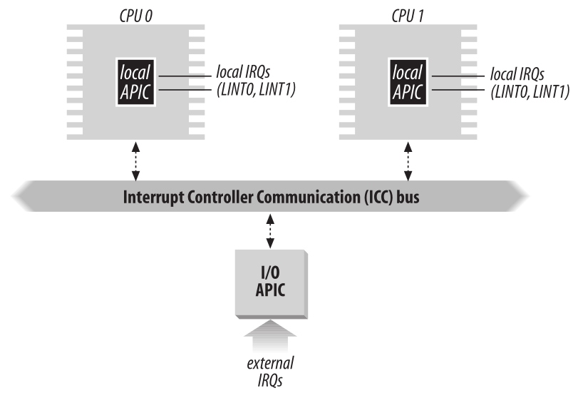
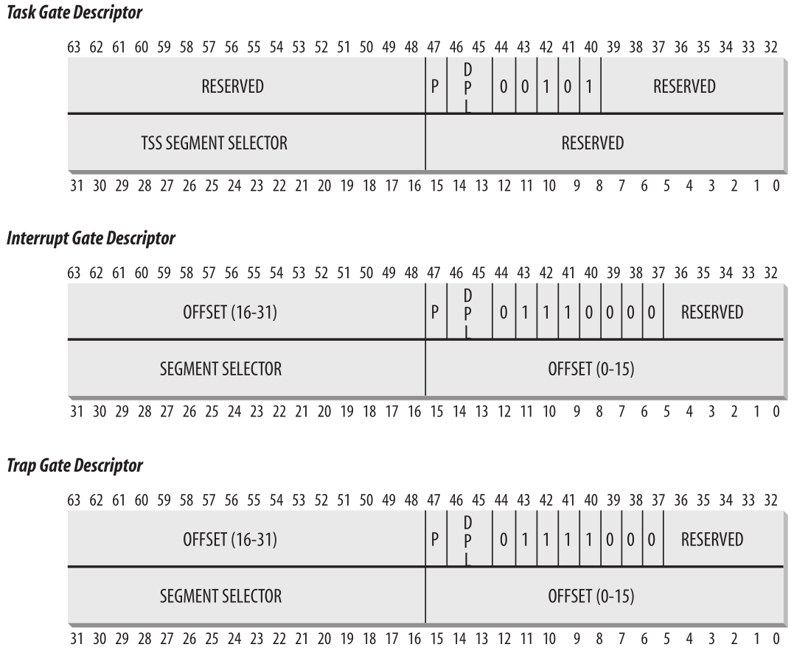
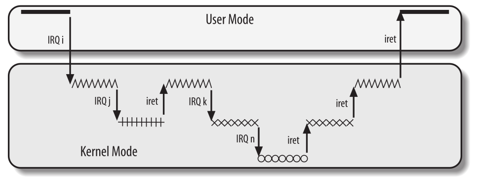
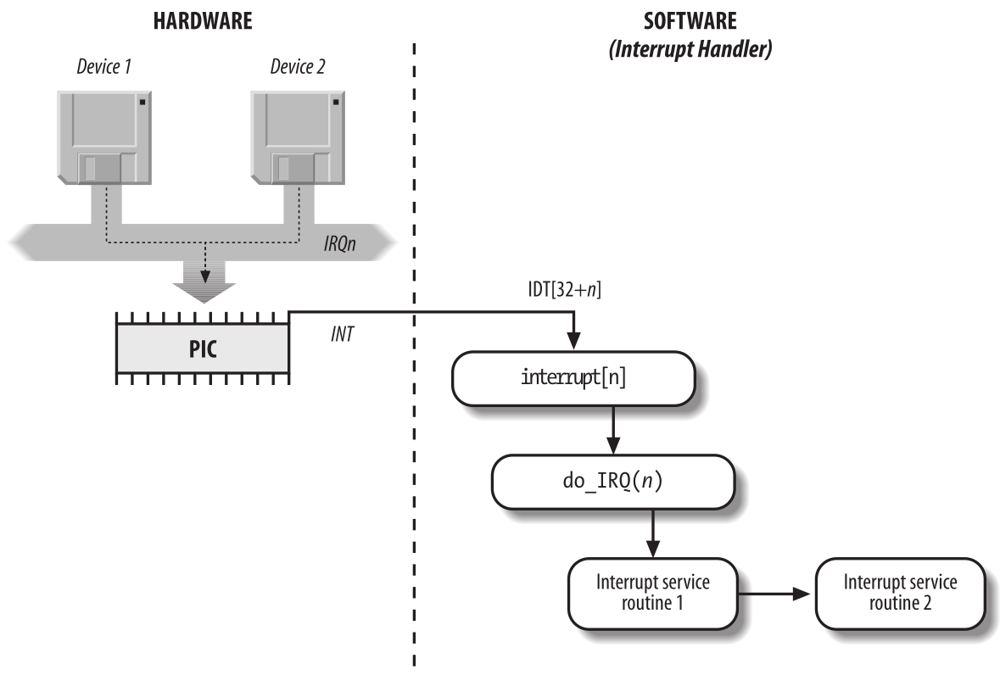
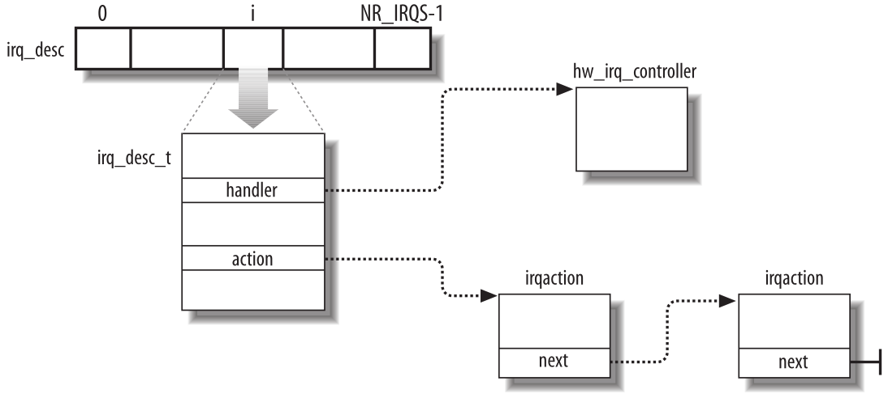

Interrupciones y Excepciones
============================

Una *interrupción* se define generalmente como un evento que altera la secuencia de instrucciones ejecutadas por un procesador. Dichos eventos corresponden a señales eléctricas generadas por circuitos de hardware tanto dentro como fuera del chip de la CPU.

Las interrupciones a menudo se dividen en +*sincrónicas* y *asincrónicas*:

- Las interrupciones *sincrónicas* son producidas por la unidad de control de la CPU mientras ejecuta instrucciones y se denominan sincrónicas porque la unidad de control las emite solo después de terminar la ejecución de una instrucción.
- Las interrupciones *asincrónicas* son generadas por otros dispositivos de hardware en momentos arbitrarios con respecto a las señales del reloj de la CPU.

Intel denomina a las interrupciones sincrónicas y asincrónicas como *excepciones* e *interrupciones*, respectivamente. Adoptaremos esta clasificación, aunque ocasionalmente usaremos el término "señal de interrupción" para designar ambos tipos juntos (sincrónicos y asincrónicos).

Las interrupciones son emitidas por temporizadores de intervalos y dispositivos de E/S; por ejemplo, la pulsación de una tecla del teclado por parte de un usuario activa una interrupción.

Las excepciones, por otra parte, son causadas por errores de programación o por condiciones anómalas que deben ser manejadas por el núcleo. En el primer caso, el núcleo maneja la excepción entregando al proceso actual una de las señales conocidas por cualquier programador de Unix. En el segundo caso, el núcleo realiza todos los pasos necesarios para recuperarse de la condición anómala, como un fallo de página o una solicitud (a través de una instrucción en lenguaje ensamblador como *int* o *sysenter*) para un servicio del núcleo (llamada al sistema).

Antes de continuar: solo cubrimos las interrupciones “clásicas” comunes a todos los PC; no cubrimos las interrupciones no estándar de algunas arquitecturas.

El rol de las señales de interrupción
-------------------------------------
Como sugiere el nombre, las señales de interrupción proporcionan una forma de desviar el procesador hacia un código que está fuera del flujo de control normal. Cuando llega una señal de interrupción, la CPU debe detener lo que está haciendo en ese momento y cambiar a una nueva actividad; lo hace guardando el valor actual del contador de programa (es decir, el contenido de los registros *eip* y *cs*) en la pila del kernel y colocando una dirección relacionada con el tipo de interrupción en el contador de programa.

Algunas cosas te recordarán el cambio de contexto descrito, que se lleva a cabo cuando un kernel sustituye un proceso por otro. Pero hay una diferencia clave entre el manejo de interrupciones y el cambio de proceso: el código ejecutado por una interrupción o por un manejador de excepciones no es un proceso. Más bien, es un *camino de control del kernel* que se ejecuta en nombre del mismo proceso que se estaba ejecutando cuando ocurrió la interrupción. Como camino de control del núcleo, el manejador de interrupciones es más ligero que un proceso (tiene menos contexto y requiere menos tiempo para configurarlo o desmantelarlo).

El manejo de interrupciones es una de las tareas más sensibles que realiza el núcleo, porque debe satisfacer las siguientes restricciones:

- Las interrupciones pueden aparecer en cualquier momento, cuando el núcleo puede estar finalizando algo más que estaba tratando de hacer. El objetivo del núcleo es, por lo tanto, atender la interrupción lo antes posible y diferir tanto procesamiento como sea posible. Por ejemplo, supongamos que un bloque de datos ha llegado a una línea de red. Cuando el hardware interrumpe el núcleo, podría simplemente marcar la presencia de datos, regresar al procesador a lo que estaba ejecutándose antes y hacer el resto del procesamiento más tarde (como mover los datos a un búfer donde su proceso receptor pueda encontrarlos y luego reiniciar el proceso). Las actividades que el núcleo necesita realizar en respuesta a una interrupción se dividen así en una parte crítica *urgente* que el núcleo ejecuta de inmediato y una parte *diferible* que se deja para más tarde.
- Debido a que las interrupciones pueden venir en cualquier momento, el núcleo puede estar manejando una de ellas mientras ocurre otra (de un tipo diferente). Esto debe permitirse tanto como sea posible, porque mantiene ocupados los dispositivos de E/S. Como resultado, los manejadores de interrupciones deben estar codificados de modo que los hilos del núcleo correspondientes puedan ejecutarse de manera anidada. Cuando termina el último hilo del núcleo, el núcleo debe poder reanudar la ejecución del proceso interrumpido o cambiar a otro proceso si la señal de interrupción ha causado una actividad de replanificación (*schedule*).
- Aunque el núcleo puede aceptar una nueva señal de interrupción mientras maneja una anterior, existen algunas regiones críticas dentro del código del núcleo donde las interrupciones deben estar deshabilitadas. Dichas regiones críticas deben limitarse tanto como sea posible porque, de acuerdo con el requisito anterior, el núcleo, y particularmente los manejadores de interrupciones, deben ejecutarse la mayor parte del tiempo con las interrupciones habilitadas.

Interrupciones y Excepciones
----------------------------
Intel clasifica las interrupciones y excepciones de la siguiente manera:

- Interrupciones:
    *Interrupciones enmascarables*
        Todas las solicitudes de interrupción (IRQ) emitidas por dispositivos de E/S dan lugar a interrupciones enmascarables. Una interrupción enmascarable puede estar en dos estados: *enmascarada* o *desenmascarada*; la unidad de control ignora una interrupción enmascarada mientras permanezca enmascarada.
    *Interrupciones no enmascarables*
        Solo unos pocos eventos críticos (como fallos de hardware) dan lugar a interrupciones no enmascarables. La CPU siempre reconoce las interrupciones no enmascarables

- Excepciones:
    *Excepciones detectadas por el procesador*
        Generadas cuando la CPU detecta una condición anómala mientras ejecuta una instrucción. Estas se dividen a su vez en tres grupos, según el valor del registro *eip* que se guarda en la pila del kernel cuando la unidad de control de la CPU genera la excepción.
            *Fallos*
                Generalmente se pueden corregir; una vez corregidos, se permite que el programa se reinicie sin pérdida. El valor guardado de *eip* es la dirección de la instrucción que causó el fallo, y por lo tanto esa instrucción puede reanudarse cuando el manejador de excepciones termina. Como veremos mas adelante, reanudar la misma instrucción es necesario siempre que el manejador pueda corregir la condición anómala que causó la excepción.
            *Trampas*
                Se informan inmediatamente después de la ejecución de la instrucción de trampa; después de que el núcleo devuelve el control al programa, se le permite continuar su ejecución sin pérdida. El valor guardado de *eip* es la dirección de la instrucción que debe ejecutarse *después* de la que causó la trampa. Una trampa se activa solo cuando no hay necesidad de volver a ejecutar la instrucción que terminó. El uso principal de las trampas es para fines de depuración. El papel de la señal de interrupción en este caso es notificar al depurador que se ha ejecutado una instrucción específica (por ejemplo, se ha alcanzado un punto de interrupción dentro de un programa). Una vez que el usuario ha examinado los datos proporcionados por el depurador, puede solicitar que se reanude la ejecución del programa depurado, comenzando desde la siguiente instrucción.
            *Abortos*
                Ocurrió un error grave; la unidad de control está en problemas y puede ser incapaz de almacenar en el registro *eip* la ubicación precisa de la instrucción que causa la excepción. Los abortos se utilizan para informar errores graves, como fallos de hardware y valores inválidos o inconsistentes en las tablas del sistema. La señal de interrupción enviada por la unidad de control es una señal de emergencia utilizada para cambiar el control al controlador de excepción de aborto correspondiente. Este controlador no tiene otra opción que forzar la terminación del proceso afectado.

    *Excepciones programadas*
        Ocurren a solicitud del programador. Son activadas por instrucciones *int* o *int3*. Las excepciones programadas son manejadas por la unidad de control como trampas; a menudo se denominan interrupciones de software. Estas excepciones tienen dos usos comunes: implementar llamadas al sistema y notificar a un depurador un evento específico.

Cada interrupción o excepción se identifica mediante un número que va de 0 a 255; Intel llama a este número de 8 bits sin signo un *vector*. Los vectores de interrupciones y excepciones no enmascarables son fijos, mientras que los de interrupciones enmascarables se pueden alterar programando el controlador de interrupciones.

IRQs e Interrupciones
---------------------
Cada controlador de dispositivo de hardware capaz de emitir solicitudes de interrupción normalmente tiene una única línea de salida designada como la línea de solicitud de interrupción (IRQ). Todas las líneas IRQ existentes están conectadas a los pines de entrada de un circuito de hardware llamado *controlador de interrupciones programable*, que realiza las siguientes acciones:

 1. Monitorea las líneas IRQ, verificando si hay señales emitidas. Si hay dos o más líneas IRQ emitidas, selecciona la que tenga el número de pin más bajo.
 2. Si se produce una señal en una línea IRQ:

    a. Convierte la señal emitida en un vector correspondiente.
    b. Almacena el vector en un puerto de E/S del controlador de interrupciones, lo que permite que la CPU lo lea a través del bus de datos.
    c. Envía una señal al pin INTR del procesador, es decir, emite una interrupción.
    d. Espera hasta que la CPU reconozca la señal de interrupción escribiendo en uno de los puertos de E/S de los controladores de interrupciones programables (PIC); cuando esto ocurre, borra la línea INTR.

 3. Vuelve al paso 1.

Las líneas IRQ están numeradas secuencialmente comenzando desde 0; por lo tanto, la primera línea IRQ generalmente se denota como IRQ0. El vector predeterminado de Intel asociado con IRQn es n+32. Como se mencionó anteriormente, la asignación entre IRQ y vectores se puede modificar emitiendo instrucciones de E/S adecuadas a los puertos del controlador de interrupciones.

Cada línea IRQ se puede deshabilitar selectivamente. Por lo tanto, el PIC se puede programar para deshabilitar IRQs. Es decir, se le puede indicar al PIC que deje de emitir interrupciones que hagan referencia a una línea IRQ dada, o que reanude su emisión. Las interrupciones deshabilitadas no se pierden; el PIC las envía a la CPU tan pronto como se habilitan nuevamente. Esta característica es utilizada por la mayoría de los manejadores de interrupciones, porque les permite procesar IRQ del mismo tipo en serie.

La habilitación/deshabilitación selectiva de IRQ no es lo mismo que el enmascaramiento/desenmascaramiento global de interrupciones enmascarables. La CPU ignora temporalmente cada interrupción enmascarable emitida por el PIC. Las instrucciones en lenguaje ensamblador *cli* y *sti*, respectivamente, limpian y activan ese indicador. Los PIC tradicionales se implementan conectando “en cascada” dos chips externos del tipo 8259A. Cada chip puede manejar hasta ocho líneas de entrada IRQ diferentes. Debido a que la línea de salida INT del PIC esclavo está conectada al pin IRQ2 del PIC maestro, la cantidad de líneas IRQ disponibles está limitada a 15.

El controlador de interrupciones programable avanzado (APIC)
************************************************************
La descripción anterior se refiere a los PIC diseñados para sistemas monoprocesador. Si el sistema incluye una sola CPU, la línea de salida del PIC maestro se puede conectar de forma directa al pin INTR de la CPU. Sin embargo, si el sistema incluye dos o más CPUs, este enfoque ya no es válido y se necesitan PICs más sofisticados.

Ser capaz de entregar interrupciones a cada CPU en el sistema es crucial para explotar al máximo el paralelismo de la arquitectura SMP. Por esa razón, Intel introdujo a partir de Pentium III un nuevo componente denominado *Controlador de Interrupciones Programable Avanzado de E/S (I/O APIC)*. Este chip es la versión avanzada del antiguo Controlador de interrupciones programable 8259A; para soportar sistemas operativos antiguos, las placas base recientes incluyen ambos tipos de chips. Además, todos los microprocesadores 80×86 actuales incluyen un APIC local. Cada APIC local tiene registros de 32 bits, un reloj interno, un dispositivo temporizador local, y dos líneas IRQ adicionales, LINT0 y LINT1, reservadas para *interrupciones APIC locales*. Todas las APIC locales están conectadas a una APIC de E/S externa, dando lugar a un sistema multi-APIC.

La figura 1 ilustra de forma esquemática la estructura de un sistema multi-APIC. Un bus APIC conecta la APIC de E/S “frontend” a las APIC locales. Las líneas IRQ que vienen de los dispositivos están conectadas a la APIC de E/S, que actúa como un router respecto a las APIC locales. En las placas base de los procesadores Pentium III y anteriores, el bus APIC era un bus serial de tres líneas; a partir del Pentium 4, el bus APIC se implementa mediante el bus del sistema. Sin embargo, como el bus APIC y sus mensajes son invisibles para el software, no daremos más detalles.

    Figura 1 - Sistema Multi-APIC

El APIC de E/S consta de un conjunto de 24 líneas IRQ, una *tabla de redirección de interrupciones* de 24 entradas, registros programables y una unidad de mensajes para enviar y recibir mensajes APIC a través del bus APIC. A diferencia de los pines IRQ del 8259A, la prioridad de las interrupciones no está relacionada con el número de pin: cada entrada en la tabla de redirección se puede programar individualmente para indicar el vector de interrupción y la prioridad, el procesador de destino y cómo se selecciona el procesador. La información en la tabla de redirección se utiliza para traducir cada señal IRQ externa en un mensaje a una o más unidades APIC locales a través del bus APIC.

Las solicitudes de interrupción que provienen de dispositivos de hardware externos se pueden distribuir entre las CPUs disponibles de dos maneras:

*Distribución estática*
    La señal IRQ se envía a los APIC locales enumerados en la entrada correspondiente de la tabla de redirección. La interrupción se envía a una CPU específica, a un subconjunto de CPUs o a todas las CPUs a la vez (modo *broadcast*).
*Distribución dinámica*
    La señal IRQ se entrega al APIC local del procesador que está ejecutando el proceso con la prioridad más baja.

    Cada APIC local tiene un *registro de prioridad de tarea* programable (TPR), que se utiliza para calcular la prioridad del proceso que se está ejecutando actualmente. Intel espera que este registro se modifique por el núcleo de sistema operativo con cada cambio de proceso.

    Si dos o más CPU comparten la prioridad más baja, la carga se distribuye entre ellas utilizando una técnica llamada *arbitraje*. A cada CPU se le asigna una prioridad de arbitraje diferente que va de 0 (la más baja) a 15 (la más alta) en el registro de prioridad de arbitraje del APIC local.

    Cada vez que se entrega una interrupción a una CPU, su prioridad de arbitraje correspondiente se establece automáticamente en 0, mientras que la prioridad de arbitraje de cualquier otra CPU aumenta. Cuando el registro de prioridad de arbitraje se vuelve mayor que 15, se establece en la prioridad de arbitraje anterior de la CPU ganadora incrementada en 1. Por lo tanto, las interrupciones se distribuyen en forma de round-robin entre las CPU con la misma prioridad de tarea.

Además de distribuir interrupciones a procesadores, el sistema multi-APIC permite que las CPUs generen *interrupciones entre procesadores*. Cuando una CPU desea enviar una interrupción a otra CPU, almacena el vector de interrupción y el identificador del APIC local objetivo en el Registro de Comando de Interrupción (ICR) de su propio APIC local. Luego se envía un mensaje a través del bus APIC al APIC local objetivo, que, por lo tanto, emite una interrupción correspondiente a su propia CPU.

Las interrupciones entre procesadores (en resumen, IPIs) son un componente crucial de la arquitectura SMP. Linux las usa activamente para intercambiar mensajes entre CPUs.

Excepciones
-----------
Los microprocesadores 80×86 emiten aproximadamente 20 excepciones diferentes. El núcleo debe proporcionar un manejador de excepciones dedicado para cada tipo de excepción. Para algunas excepciones, la unidad de control de la CPU también genera un *código de error de hardware* y lo inserta en la pila del núcleo antes de iniciar el manejador de excepción.

La siguiente lista muestra el vector, el nombre y una breve descripción de algunas excepciones encontradas en procesadores 80×86.

0. *Error de División*. Se genera cuando un programa emite una división entera por 0.
1. *Depuración*. Se genera para implementar *ejecución paso a paso* de un depurador.
2. *No usado*. Reservado para interrupciones no enmascarables.
3. *Breakpoint*. Causado por una instrucción *int3* normalmente agregada por un depurador.
4. *Desbordamiento*. Se ejecuta una instrucción *int* por error de desbordamiento.
5. etc.

Cada excepción es gestionada por un manejador de excepciones específico, que generalmente envía una señal Unix al proceso que causó la excepción.

Tabla de descriptores de interrupciones
---------------------------------------
Una tabla del sistema llamada *Tabla de Descriptores de Interrupciones (IDT)* asocia cada interrupción o vector de excepción con la dirección del manejador de interrupciones o excepción correspondiente. La IDT debe inicializarse correctamente antes de que el núcleo habilite las interrupciones.

El formato de la IDT es similar al de la GDT y las LDT examinadas con antelación. Cada entrada corresponde a una interrupción o un vector de excepción y consta de un descriptor de 8 bytes.

El registro de CPU *idtr* permite que el IDT se ubique en cualquier lugar de la memoria: especifica tanto la dirección lineal base del IDT como su límite (longitud máxima). Debe inicializarse antes de habilitar interrupciones.

El IDT puede incluir tres tipos de descriptores; la Figura 4-2 ilustra el significado de los 64 bits incluidos en cada uno de ellos. En particular, el valor del campo *Tipo* codificado en los bits 40–43 identifica el tipo de descriptor.

    Figura 2 - Formato de los descriptores de los manejadores

Manejo de interrupciones y excepciones por hardware
---------------------------------------------------

Ahora describiremos cómo la unidad de control de la CPU maneja las interrupciones y excepciones. Suponemos que el núcleo se ha inicializado y, por lo tanto, la CPU está funcionando en modo protegido.

Después de ejecutar una instrucción, el par de registros *cs* y *eip* contienen la dirección lógica de la siguiente instrucción que se ejecutará. Antes de tratar esa instrucción, la unidad de control verifica si se produjo una interrupción o una excepción mientras la unidad de control ejecutaba la instrucción anterior. Si se produjo una, la unidad de control hace lo siguiente:

 1. Determina el vector *i* (0≤i≤255) asociado con la interrupción o la excepción.
 2. Lee la entrada i-ésima del IDT al que hace referencia el registro *idtr*.
 3. Obtiene la dirección base del GDT del registro *gdtr* y busca en el GDT para leer el descriptor de segmento identificado por el selector en la entrada del IDT. Este descriptor especifica la dirección base del segmento que incluye el controlador de interrupción o excepción.
 4. Se asegura de que la interrupción haya sido emitida por una fuente autorizada. En primer lugar, compara el nivel de privilegio actual (CPL), que se almacena en los dos bits menos significativos del registro *cs*, con el nivel de privilegio del descriptor (DPL) del descriptor de segmento incluido en el GDT. Genera una excepción de “Protección general” si el CPL es inferior al DPL, porque el manejador de interrupciones no puede tener un privilegio inferior al del programa que causó la interrupción.
 5. Comprueba si se está produciendo un cambio de nivel de privilegio, es decir, si el CPL es diferente del DPL del descriptor de segmento seleccionado. Si es así, la unidad de control debe empezar a utilizar la pila asociada con el nuevo nivel de privilegio.
 6. Si se ha producido un fallo, carga *cs* y *eip* con la dirección lógica de la instrucción que causó la excepción para que pueda ejecutarse de nuevo.
 7. Guarda el contenido de *eflags*, *cs* y *eip* en la pila.
 8. Si la excepción lleva un código de error de hardware, lo guarda en la pila.
 9. Carga *cs* y *eip*, respectivamente, con el Selector de segmento y los campos offset del Descriptor de segmento almacenados en la entrada i-ésima del IDT. Estos valores definen la dirección lógica de la primera instrucción del manejador de interrupciones o excepciones.

El último paso realizado por la unidad de control es equivalente a un salto al manejador de interrupción o excepción. En otras palabras, la instrucción procesada por la unidad de control después de tratar la señal de interrupción es la primera instrucción del manejador de excepción seleccionado.

Ejecución anidada de controladores de excepciones e interrupciones
------------------------------------------------------------------
Cada interrupción o excepción da lugar a una ruta de control del núcleo o a una secuencia separada de instrucciones que se ejecutan en modo núcleo en nombre del proceso actual. Por ejemplo, cuando un dispositivo de E/S lanza una interrupción, las primeras instrucciones de la ruta de control del núcleo correspondiente son las que guardan el contenido de los registros de la CPU en la pila del núcleo, mientras que las últimas son las que restauran el contenido de los registros.

Las rutas de control del núcleo pueden estar anidadas de forma arbitraria; un manejador de interrupciones puede ser interrumpido por otro manejador de interrupciones, dando lugar así a una ejecución anidada de rutas de control del núcleo, como se muestra en la figura 3. Como resultado, las últimas instrucciones de una ruta de control del núcleo que se encarga de una interrupción no siempre ponen al proceso actual de nuevo en modo usuario: si el nivel de anidación es mayor que 1, éstas instrucciones pondrán en ejecución la ruta de control del núcleo que se interrumpió por última vez, y la CPU seguirá funcionando en modo núcleo.

    Figura 3 - Un ejemplo de ejecución anidada de hilos del kernel

El precio a pagar por permitir rutas de control de kernel anidadas es que un manejador de interrupciones nunca debe bloquearse, es decir, no se puede realizar ningún cambio de proceso mientras que se esté ejecutando un manejador de interrupciones. De hecho, todos los datos necesarios para reanudar una ruta de control de kernel anidada se almacenan en la pila del modo kernel, que está estrechamente vinculada al proceso actual.

Suponiendo que el kernel no tiene errores, la mayoría de las excepciones solo pueden ocurrir mientras la CPU está en modo usuario. De hecho, son causadas por errores de programación o activadas por depuradores. Sin embargo, la excepción "Page Fault" puede ocurrir en modo kernel. Esto sucede cuando el proceso intenta direccionar una página que pertenece a su espacio de direcciones pero que no está actualmente en la RAM. Mientras maneja dicha excepción, el kernel puede suspender el proceso actual y reemplazarlo con otro hasta que la página solicitada esté disponible. La ruta de control de kernel que maneja la excepción "Page Fault" reanuda la ejecución tan pronto como el proceso obtiene el procesador nuevamente.

Como el manejador de excepciones “Page Fault” nunca da lugar a más excepciones, como máximo se pueden apilar dos rutas de control del núcleo asociadas con excepciones (la primera causada por una invocación de llamada del sistema, la segunda causada por un Page Fault), una sobre la otra.

A diferencia de las excepciones, las interrupciones emitidas por dispositivos de E/S no hacen referencia a estructuras de datos específicas del proceso actual, aunque las rutas de control del núcleo que las manejan se ejecutan en nombre de ese proceso. De hecho, es imposible predecir qué proceso se estará ejecutando cuando se produzca una interrupción determinada.

Un manejador de interrupciones se puede apropiar tanto de otros manejadores de interrupciones como de manejadores de excepciones. Por el contrario, un manejador de excepciones nunca se apropia de un manejador de interrupciones. La única excepción que se puede activar en el modo de núcleo es “Page Fault”, que acabamos de describir. Pero los manejadores de interrupciones nunca realizan operaciones que puedan inducir fallos de página y, por lo tanto, potencialmente, un cambio de proceso.

Linux intercambia las rutas de control del núcleo por dos razones principales:

- Para mejorar el rendimiento de los controladores de interrupciones programables y los controladores de dispositivos. Supongamos que un controlador de dispositivo emite una señal en una línea IRQ: el PIC la transforma en una interrupción externa y, a continuación, tanto el PIC como el controlador de dispositivo permanecen bloqueados hasta que el PIC recibe un acuse de recibo de la CPU. Gracias al intercambio de rutas de control del núcleo, el núcleo puede enviar el acuse de recibo incluso cuando está gestionando una interrupción anterior.
- Para implementar un modelo de interrupción sin niveles de prioridad. Debido a que cada manejador de interrupciones puede ser postergado por otro, no hay necesidad de establecer prioridades predefinidas entre los dispositivos de hardware. Esto simplifica el código del núcleo y mejora su portabilidad.

En sistemas multiprocesador, varias rutas de control del núcleo pueden ejecutarse simultáneamente. Además, una ruta de control del núcleo asociada a una excepción puede empezar a ejecutarse en una CPU y, debido a un cambio de proceso, migrar a otra CPU.

Manejo de excepciones
---------------------
La mayoría de las excepciones emitidas por la CPU son interpretadas por Linux como condiciones de error. Cuando se produce una de ellas, el núcleo envía una señal al proceso que causó la excepción para notificarle una condición anómala. Si, por ejemplo, un proceso realiza una división por cero, la CPU lanza una excepción de “Error de división” y el controlador de excepciones correspondiente envía una señal SIGFPE al proceso actual, que luego toma las medidas necesarias para recuperarse o (si no se ha configurado ningún controlador de señales para esa señal) abortar.

Los manejadores de excepciones tienen una estructura estándar que consta de tres pasos:

1. Guardar el contenido de la mayoría de los registros en la pila del modo kernel (esta parte está codificada en lenguaje ensamblador).
2. Manejar la excepción mediante una función C de alto nivel.
3. Salir del manejador mediante la función ret_from_exception().

Manejo de interrupciones
------------------------
Como explicamos anteriormente, la mayoría de las excepciones se manejan simplemente enviando una señal Unix al proceso que causó la excepción. La acción a tomar se pospone hasta que el proceso recibe la señal; como resultado, el núcleo puede procesar la excepción rápidamente.

Este enfoque no se aplica a las interrupciones, porque con frecuencia llegan mucho después de que el proceso con el que están relacionadas (por ejemplo, un proceso que solicitó una transferencia de datos) haya sido suspendido y se esté ejecutando un proceso completamente no relacionado. Por lo tanto, no tendría sentido enviar una señal Unix al proceso actual.

El manejo de interrupciones depende del tipo de interrupción. Para nuestros propósitos, distinguiremos tres clases principales de interrupciones:

*Interrupciones de E/S*
    Un dispositivo de E/S requiere atención; el manejador de interrupciones correspondiente debe consultar al dispositivo para determinar el curso de acción adecuado.
*Interrupciones de temporizador*
    Algún temporizador, ya sea un temporizador APIC local o un temporizador externo, ha emitido una interrupción; este tipo de interrupción le dice al núcleo que ha transcurrido un intervalo de tiempo fijo. Estas interrupciones se manejan principalmente como interrupciones de E/S.
*Interrupciones entre procesadores*
    Una CPU emitió una interrupción para otra CPU de un sistema multiprocesador.

Manejo de interrupciones de E/S
*******************************
En general, un manejador de interrupciones de E/S debe ser lo suficientemente flexible para dar servicio a varios dispositivos al mismo tiempo. En la arquitectura de bus PCI, por ejemplo, varios dispositivos pueden compartir la misma línea IRQ. Esto significa que el vector de interrupción por sí solo no cuenta toda la historia. En el ejemplo que se muestra en la siguiente tabla, el mismo vector 43 se asigna al puerto USB y a la tarjeta de sonido. Sin embargo, algunos dispositivos de hardware que se encuentran en arquitecturas de PC más antiguas (como ISA) no funcionan de manera confiable si su línea IRQ se comparte con otros dispositivos.

La flexibilidad del manejador de interrupciones se logra de dos maneras distintas, como se analiza en la siguiente lista.

*Uso compartido de IRQ*
    El manejador de interrupciones ejecuta varias rutinas de servicio de interrupción (ISR). Cada ISR es una función relacionada con un solo dispositivo que comparte la línea IRQ. Debido a que no es posible saber de antemano qué dispositivo en particular emitió la IRQ, cada ISR se ejecuta para verificar si su dispositivo necesita atención; si es así, la ISR realiza todas las operaciones que deben ejecutarse cuando el dispositivo genera una interrupción.
*Asignación dinámica de IRQ*
    Una línea IRQ se asocia con un controlador de dispositivo en el último momento posible; por ejemplo, la línea IRQ del dispositivo de disquete se asigna sólo cuando un usuario accede al dispositivo de disquete. De esta manera, el mismo vector IRQ puede ser utilizado por varios dispositivos de hardware incluso si no pueden compartir la línea IRQ; por supuesto, los dispositivos de hardware no pueden utilizarse al mismo tiempo.

No todas las acciones que se deben realizar cuando se produce una interrupción tienen la misma urgencia. De hecho, el propio manejador de interrupciones no es un lugar adecuado para todo tipo de acciones. Las operaciones largas no críticas deben posponerse, porque mientras se está ejecutando un manejador de interrupciones, las señales en la línea IRQ correspondiente se ignoran temporalmente. Lo más importante, el proceso en nombre del cual se ejecuta un manejador de interrupciones debe permanecer siempre en el estado TASK_RUNNING, o puede producirse un bloqueo del sistema. Por tanto, los manejadores de interrupciones no pueden realizar ningún procedimiento de bloqueo como una operación de disco de E/S. Linux divide las acciones que se deben realizar después de una interrupción en tres clases:

*Críticas*
    Acciones, como reconocer una interrupción al PIC, reprogramar el PIC o el controlador del dispositivo o actualizar las estructuras de datos a las que acceden tanto el dispositivo como el procesador. Estas se pueden ejecutar rápidamente y son críticas, porque se deben realizar lo antes posible. Las acciones críticas se ejecutan dentro del manejador de interrupciones de inmediato, con las interrupciones enmascarables deshabilitadas.
*No críticas*
    Acciones como actualizar las estructuras de datos a las que solo accede el procesador (por ejemplo, leer el código después de que se haya presionado una tecla del teclado). Estas acciones también pueden finalizar rápidamente, por lo que el manejador de interrupciones las ejecuta inmediatamente, con las interrupciones habilitadas.
*Diferibles no críticas*
    Acciones como copiar el contenido de un búfer en el espacio de direcciones de un proceso (por ejemplo, enviar el búfer de línea del teclado al proceso manejador de terminal). Estas pueden demorarse durante un largo intervalo de tiempo sin afectar las operaciones del núcleo; el proceso interesado simplemente seguirá esperando los datos. Las acciones diferibles no críticas se realizan por medio de funciones separadas que se analizan en la sección posterior “Softirqs y Tasklets”.

Independientemente del tipo de circuito que causó la interrupción, todos los manejadores de interrupciones de E/S realizan las mismas cuatro acciones básicas:

1. Guardar el valor de IRQ y el contenido del registro en la pila del Kernel.
2. Enviar un acuse de recibo al PIC que está dando servicio a la línea IRQ, lo que le permite emitir más interrupciones.
3. Ejecutar las rutinas de servicio de interrupción (ISR) asociadas con todos los dispositivos que comparten la IRQ.
4. Terminar saltando a la dirección *ret_from_intr()*.

Se necesitan varios descriptores para representar tanto el estado de las líneas IRQ como las funciones que se ejecutarán cuando se produce una interrupción. La figura 4 representa de forma esquemática los circuitos de hardware y las funciones de software utilizadas para manejar una interrupción. Estas funciones se analizan en las siguientes secciones.

Vectores de interrupción
>>>>>>>>>>>>>>>>>>>>>>>>
Como se ilustra en la siguiente tabla, a las IRQ físicas se les puede asignar cualquier vector en el rango 32–238. Sin embargo, Linux usa el vector 128 para implementar llamadas al sistema.

+------------------+--------------------------------------------------+
| Rango del Vector | Uso                                              |
+==================+==================================================+
|0-19(0x0-0x13)    | Interrupciones y excepciones no enmascarables    |
+------------------+--------------------------------------------------+
|20-31(0x14-0x1f)  | Reservado por Intel                              |
+------------------+--------------------------------------------------+
|32-127(0x20-0x7f) | Interrupciones Externas (IRQs)                   |
+------------------+--------------------------------------------------+
|128(0x80)         | Excepción programada para llamadas al sistema    |
+------------------+--------------------------------------------------+
|129-238(0x81-0xee)| Interrupciones Externas (IRQs)                   |
+------------------+--------------------------------------------------+
|239(0xef)         | Interrupción del timer del APIC local            |
+------------------+--------------------------------------------------+
|240(0xfo)         | Interrupción termal del APIC local               |
+------------------+--------------------------------------------------+
|241-250(0xf1-0xfa)| Reservado por Linux para uso futuro              |
+------------------+--------------------------------------------------+
|251-253(0xfb-0xfd)| Interrupciones entre procesadores                |
+------------------+--------------------------------------------------+
|254(0xfe)         | Interrupcion de error del APIC local             |
+------------------+--------------------------------------------------+
|255(0xff          | Interrupcion espurea del APIC local              |
+------------------+--------------------------------------------------+

La arquitectura de PC compatible con IBM requiere que algunos dispositivos estén conectados estáticamente a líneas IRQ específicas. En particular:

- El dispositivo temporizador de intervalo debe estar conectado a la línea IRQ0.
- El PIC esclavo 8259A debe estar conectado a la línea IRQ2 (aunque ahora se están usando PIC más avanzados, Linux aún admite PIC de estilo 8259A).

    Figura 4 - Manejo de interrupciones de E/S

- El coprocesador matemático externo debe estar conectado a la línea IRQ13 (aunque los procesadores 80×86 recientes ya no usan dicho dispositivo, Linux continúa admitiendo el modelo 80386).
- En general, un dispositivo de E/S se puede conectar a un número limitado de líneas IRQ. (De hecho, cuando se juega con un PC antiguo en el que no es posible compartir IRQ, es posible que no se pueda instalar una nueva tarjeta debido a conflictos de IRQ con otros dispositivos de hardware ya presentes). 

Hay tres formas de seleccionar una línea para un dispositivo configurable por IRQ:

- Configurando puentes de hardware (solo en tarjetas de dispositivos muy antiguas).
- Mediante un programa de utilidad enviado con el dispositivo y ejecutado al instalarlo. Dicho programa puede solicitar al usuario que seleccione un número de IRQ disponible o sondear el sistema para determinar un número disponible por sí mismo.
- Mediante un protocolo de hardware ejecutado al iniciar el sistema. Los dispositivos periféricos declaran qué líneas de interrupción están listos para usar; luego, se negocian los valores finales para reducir los conflictos tanto como sea posible. Una vez hecho esto, cada manejador de interrupciones puede leer la IRQ asignada mediante una función que accede a algunos puertos de E/S del dispositivo. Por ejemplo, los controladores para dispositivos que cumplen con el estándar de Interconexión de componentes periféricos (PCI) utilizan un grupo de funciones como *pci_read_config_byte()* para acceder al espacio de configuración del dispositivo.

La siguiente tabla muestra una disposición bastante arbitraria de dispositivos e IRQ, como los que se pueden encontrar en una PC en particular.

+-----+-----+--------------------------------+
| IRQ | INT | Dispositivo de hardware        |
+=====+=====+================================+
|0    |32   | Timer                          |
+-----+-----+--------------------------------+
|1    |33   | Teclado                        |
+-----+-----+--------------------------------+
|2    |34   | PIC en cascada                 |
+-----+-----+--------------------------------+
|3    |35   | Segundo puerto serial          |
+-----+-----+--------------------------------+
|4    |36   | Primer puerto serial           |
+-----+-----+--------------------------------+
|6    |38   | Disquetera                     |
+-----+-----+--------------------------------+
|8    |40   | Reloj del sistema              |
+-----+-----+--------------------------------+
|10   |42   | Interface de red               |
+-----+-----+--------------------------------+
|11   |43   | Puerto USB, placa de sonido    |
+-----+-----+--------------------------------+
|12   |44   | Mouse PS/S                     |
+-----+-----+--------------------------------+
|13   |45   | Coprocesador matemático        |
+-----+-----+--------------------------------+
|14   |46   | Controlador de disco IDE 1     |
+-----+-----+--------------------------------+
|15   |47   | Controlador de disco IDE 2     |
+-----+-----+--------------------------------+

El núcleo debe descubrir qué dispositivo de E/S corresponde al número de IRQ antes de habilitar las interrupciones. De lo contrario, por ejemplo, ¿cómo podría el núcleo manejar una señal de un disco SCSI sin saber qué vector corresponde al dispositivo? La correspondencia se establece mientras se inicializa cada controlador de dispositivo.

Estructuras de datos de IRQs
>>>>>>>>>>>>>>>>>>>>>>>>>>>>
Como siempre, cuando se discuten operaciones complicadas que involucran transiciones de estado, ayuda entender primero dónde se almacenan los datos clave. Por lo tanto, esta sección explica las estructuras de datos que soportan el manejo de interrupciones y cómo se disponen en varios descriptores. La figura 5 ilustra esquemáticamente las relaciones entre los descriptores principales que representan el estado de las líneas IRQ.

    Figura 5 - Descriptores de IRQs

Cada vector de interrupción tiene su propio descriptor *irq_desc_t*, cuyos campos se enumeran en la siguiente tabla. Todos estos descriptores se agrupan en el vector *irq_desc*.

+----------------+-----------------------------------------------------------------------------+
| Campo          | Descripción                                                                 |
+================+=============================================================================+
|handler         | Apunta al objeto PIC que sirve la linea IRQ.                                |
+----------------+-----------------------------------------------------------------------------+
|handler_data    | Puntero a los datos usado por los métodos del objeto PIC                    |
+----------------+-----------------------------------------------------------------------------+
|action          | Identifica las rutinas de interrupción que serán invocadas cuando           |
|                | ocurra una interrupción                                                     |
+----------------+-----------------------------------------------------------------------------+
|status          | Conjunto de banderas que describen la línea de estado de la IRQ             |
+----------------+-----------------------------------------------------------------------------+
|depth           | Contiene 0 si la línea está habilitado y positivo si está deshabilitada     |
+----------------+-----------------------------------------------------------------------------+
|irq_count       | Contador de ocurrencias de interrupciones sobre la línea.                   |
+----------------+-----------------------------------------------------------------------------+
|irqs_unhandled  | Contador de ocurrencias de interrupciones no manejadas sobre la línea.      |
+----------------+-----------------------------------------------------------------------------+
|lock            | Spin lock usado para serializar el acceso al descriptor.                    |
+----------------+-----------------------------------------------------------------------------+

Una interrupción es *inesperada* si no es manejada por el núcleo, es decir, si no hay ISR (Rutina de Servicio de Interrupción) asociado con la línea IRQ, o si ningún ISR asociado con la línea reconoce la interrupción como generada por su propio dispositivo de hardware. Normalmente, el núcleo verifica la cantidad de interrupciones inesperadas recibidas en una línea IRQ, para deshabilitar la línea en caso de que un dispositivo de hardware defectuoso siga generando una interrupción una y otra vez. Debido a que la línea IRQ puede ser compartida entre varios dispositivos, el núcleo no deshabilita la línea tan pronto como detecta una sola interrupción no controlada. En lugar de eso, el núcleo almacena en los campos *irq_count* e *irqs_unhandled* del descriptor *irq_desc_t* el número total de interrupciones y el número de interrupciones inesperadas, respectivamente; cuando se genera la interrupción número 100.000, el núcleo deshabilita la línea si el número de interrupciones no controladas es superior a 99.900 (es decir, si ubieron menos de 101 interrupciones esperadas durante las últimas 100.000 recibidas de los dispositivos de hardware que comparten la línea).

El campo *depth* y el indicador IRQ_DISABLED del descriptor *irq_desc_t* especifican si la línea IRQ está habilitada o deshabilitada. Cada vez que se invoca la función *deshabilitar_irq()* o *deshabilitar_irq_nosync()*, el campo *depth* se incrementa; Si *depth* es igual a 0, la función deshabilita la línea IRQ y establece su indicador IRQ_DISABLED. Por el contrario, cada invocación de la función *enable_irq()* disminuye el campo; si *depth* se convierte en 0, la función habilita la línea IRQ y borra su indicador IRQ_DISABLED.

Distribución de IRQs en sistemas multiprocesador
>>>>>>>>>>>>>>>>>>>>>>>>>>>>>>>>>>>>>>>>>>>>>>>>
Linux se apega al modelo de multiprocesamiento simétrico (SMP, por sus siglas en inglés); esto significa, esencialmente, que el núcleo no debería tener ningún sesgo hacia una CPU con respecto a las otras. Como consecuencia, el núcleo intenta distribuir las señales IRQs provenientes de los dispositivos de hardware en forma circular entre todas las CPUs. Por lo tanto, todas las CPUs deberían dedicar aproximadamente la misma fracción de su tiempo de ejecución a atender las interrupciones de E/S.

En resumen, cuando un dispositivo de hardware genera una señal IRQ, el sistema multi-APIC selecciona una de las CPU y envía la señal al APIC local correspondiente, que a su vez interrumpe a su CPU. Ninguna otra CPU recibe notificación del evento.

Todo esto lo hace mágicamente el hardware, por lo que no debería ser un problema para el núcleo después de la inicialización del sistema multi-APIC.

Linux 2.6 hace uso de un hilo especial del núcleo llamado *kirqd* que explota una característica interesante de los sistemas multi-APIC, llamada *afinidad IRQ* de una CPU: modificando las entradas de la tabla de redirección de interrupciones del APIC de E/S, es posible enrutar una señal de interrupción a una CPU específica.

Softirqs y Tasklets
-------------------
Mencionamos anteriormente en la sección “Manejo de interrupciones” que varias tareas entre las ejecutadas por el núcleo no son críticas: pueden ser diferidas por un largo período de tiempo, si es necesario. Recuerde que las rutinas de servicio de interrupción (ISR) de un manejador de interrupciones están serializadas, y a menudo no debería haber ocurrencia de una interrupción hasta que el manejador de interrupciones correspondiente haya terminado. Por el contrario, las tareas diferibles pueden ejecutarse con todas las interrupciones habilitadas. Sacarlos del manejador de interrupciones ayuda a mantener pequeño el tiempo de respuesta del núcleo. Esta es una propiedad muy importante para muchas aplicaciones críticas que esperan que sus solicitudes de interrupción sean atendidas en unos pocos milisegundos.

Linux 2.6 responde a este desafío utilizando dos tipos de funciones del núcleo interrumpibles no urgentes: las llamadas *funciones diferibles (Softirqs y Tasklets)*, y las ejecutadas por medio de algunas colas de trabajo (Work Queues).

Las softirqs y los tasklets están estrictamente correlacionados, porque los tasklets se implementan sobre las softirqs. De hecho, el término “softirq”, que aparece en el código fuente del núcleo, a menudo denota ambos tipos de funciones diferibles. Otro término ampliamente utilizado es el *contexto de interrupción*: especifica que el núcleo está ejecutando actualmente un manejador de interrupciones o una función diferible.

Los softirq se asignan estáticamente (es decir, se definen en tiempo de compilación), mientras que los tasklets también se pueden asignar e inicializar en tiempo de ejecución (por ejemplo, al cargar un módulo del núcleo). Los softirq se pueden ejecutar simultáneamente en varias CPU, incluso si son del mismo tipo. Por lo tanto, los softirq son funciones reentrantes y deben proteger explícitamente sus estructuras de datos con candados (Spin Lock). Los tasklets no tienen que preocuparse por esto, porque su ejecución está controlada de manera más estricta por el núcleo. Los tasklets del mismo tipo siempre se serializan: en otras palabras, el mismo tipo de tasklet no puede ser ejecutado por dos CPUs al mismo tiempo. Sin embargo, los tasklets de diferentes tipos se pueden ejecutar simultáneamente en varias CPUs. La serialización de tasklets simplifica la vida de los desarrolladores de drivers de dispositivos, porque la función del tasklet no necesita ser reentrante.

En términos generales, se pueden realizar cuatro tipos de operaciones en funciones diferibles:

*Inicialización*
    Define una nueva función diferible; esta operación se realiza normalmente cuando el núcleo se inicializa a sí mismo o se carga un módulo.
*Activación*
    Marca una función diferible como "pendiente" (para que se ejecute la próxima vez que el núcleo programe una ronda de ejecuciones de funciones diferibles). La activación se puede realizar en cualquier momento (incluso mientras se manejan interrupciones).
*Enmascaramiento*
    Desactiva selectivamente una función diferible para que el núcleo no la ejecute incluso si está activada.
*Ejecución*
    Ejecuta una función diferible pendiente junto con todas las demás funciones diferibles pendientes del mismo tipo; la ejecución se realiza en momentos bien especificados, que se explican más adelante en la sección "Softirqs".

La activación y la ejecución están vinculadas entre sí: una función diferible que ha sido activada por una CPU determinada debe ejecutarse en la misma CPU. No hay ninguna razón evidente que sugiera que esta regla sea beneficiosa para el rendimiento del sistema. Vincular la función diferible a la CPU activadora podría, en teoría, hacer un mejor uso de la caché de hardware de la CPU. Después de todo, es posible que el hilo del núcleo activador acceda a algunas estructuras de datos que también serán utilizadas por la función diferible. Sin embargo, las líneas relevantes podrían fácilmente no estar ya en la caché cuando se ejecuta la función diferible porque su ejecución puede retrasarse mucho tiempo. Además, vincular una función a una CPU es siempre una operación potencialmente "peligrosa", porque una CPU puede terminar muy ocupada mientras que las otras están mayormente inactivas.

Softirqs
********
Linux 2.6 utiliza una cantidad limitada de softirqs. Para la mayoría de los propósitos, los tasklets son lo suficientemente buenos y son mucho más fáciles de escribir porque no necesitan ser reentrantes.

De hecho, actualmente solo están definidos los seis tipos de softirqs que se enumeran en la siguiente tabla.

+----------------+------------------+---------------------------------------------------+
|Softirq         |Indice(prioridad) |Descripción                                        |
+================+==================+===================================================+
|HI_SOFTIRQ      |0                 |Maneja tasklets de alta prioridad                  |
+----------------+------------------+---------------------------------------------------+
|TIMER_SOFTIRQ   |1                 |Tasklets relacionados a interrupciones del timer   |
+----------------+------------------+---------------------------------------------------+
|NET_TX_SOFTIRQ  |2                 |Transmisión de paquetes hacia placas de red        |
+----------------+------------------+---------------------------------------------------+
|NET_RX_SOFTIRQ  |3                 |Recepción de paquetes desde placas de red          |
+----------------+------------------+---------------------------------------------------+
|SCSI_SOFTIRQ    |4                 |Procesamiento post interrupción de comandos SCSI   |
+----------------+------------------+---------------------------------------------------+
|TASKLET_SOFTIRQ |5                 |Maneja tasklets regulares                          |
+----------------+------------------+---------------------------------------------------+

El índice de un sofirq determina su prioridad: un índice más bajo significa una prioridad más alta porque las funciones de softirq se ejecutarán a partir del índice 0.

Manejando softirqs
>>>>>>>>>>>>>>>>>>
La función *open_softirq()* se encarga de la inicialización de softirq. Utiliza tres parámetros: el índice de softirq, un puntero a la función softirq que se va a ejecutar y un segundo puntero a una estructura de datos que puede requerir la función softirq. *open_softirq()* se limita a inicializar la entrada adecuada del vector *softirq_vec*.

Los softirq se activan mediante la función *raise_softirq()*. Esta función, que recibe como parámetro el índice *nr* del softirq, realiza las siguientes acciones:

1. Ejecuta la macro local_irq_save para guardar el estado del indicador IF del registro eflags y deshabilitar las interrupciones en la CPU local.
2. Marca el softirq como pendiente fijando el bit correspondiente al índice nr en la máscara de bits de softirq de la CPU local.
3. Si in_interrupt() produce el valor 1, salta al paso 5. Esta situación indica que se ha invocado raise_softirq() en el contexto de interrupción o que los softirqs están deshabilitados actualmente.
4. De lo contrario, invoca wakeup_softirqd() para despertar, si es necesario, el hilo de kernel ksoftirqd de la CPU local (ver más adelante).
5. Ejecuta la macro local_irq_restore para restaurar el estado del indicador IF guardado en el paso 1.

Las comprobaciones de softirqs activos (pendientes) se deben realizar periódicamente, pero sin inducir demasiada sobrecarga. Se realizan en unos pocos puntos del código del kernel. Aquí hay una lista de los puntos más significativos (tenga en cuenta que el número y la posición de los puntos de control de softirq cambian tanto con la versión del núcleo como con la arquitectura de hardware compatible):

- Cuando el núcleo invoca la función local_bh_enable()* para habilitar softirqs en la CPU local
- Cuando la función do_IRQ() termina de manejar una interrupción de E/S e invoca la macro irq_exit()
- Si el sistema usa una APIC de E/S, cuando la función smp_apic_timer_interrupt() termina de manejar una interrupción del temporizador local (consulte la sección “Arquitectura de cronometraje en sistemas multiprocesador” en el Capítulo 6)
- En sistemas multiprocesador, cuando una CPU termina de manejar una función activada por una interrupción entre procesadores CALL_FUNCTION_VECTOR
- Cuando se despierta uno de los subprocesos especiales del núcleo ksoftirqd/n (consulte más adelante)

La función do_softirq()
>>>>>>>>>>>>>>>>>>>>>>>
Si se detectan softirqs pendientes en uno de estos puntos de control, el núcleo invoca *do_softirq()* para encargarse de ellos. Esta función realiza las siguientes acciones:

1. Si *in_interrupt()* produce el valor uno, esta función retorna. Esta situación indica que se ha invocado *do_softirq()* en el contexto de interrupción o que los softirqs están actualmente deshabilitados.
2. Ejecuta *local_irq_save* para guardar el estado del indicador IF y deshabilitar las interrupciones en la CPU local.
3. Si el tamaño de la estructura *thread_union* es de 4 KB, cambia a la pila de softIRQ, si es necesario.
4. Invoca la función *__do_softirq()*.
5. Si la pila IRQ suave se ha cambiado efectivamente en el paso 3 anterior, restaura el puntero de pila original en el registro *esp*, volviendo así a la pila de excepciones que estaba en uso antes.
6. Ejecuta local_irq_restore para restaurar el estado del indicador IF (interrupciones locales habilitadas o deshabilitadas) guardado en el paso 2 y regresa.

La función __do_softirq()
>>>>>>>>>>>>>>>>>>>>>>>>>
La función *__do_softirq()* lee la máscara de bits softirq de la CPU local y ejecuta las funciones diferibles correspondientes a cada bit establecido. Mientras se ejecuta una función softirq, pueden aparecer nuevas softirq pendientes; para asegurar un tiempo de latencia bajo para las funciones diferibles, *__do_softirq()* sigue ejecutándose hasta que se hayan ejecutado todas las softirq pendientes. Sin embargo, este mecanismo podría obligar a __do_softirq() a ejecutarse durante largos períodos de tiempo, lo que retrasaría considerablemente los procesos del modo usuario. Por esa razón, *__do_softirq()* realiza una cantidad fija de iteraciones y luego retorna. Las softirq pendientes restantes, si las hubiera, serán manejadas a su debido tiempo por el hilo del kernel *ksoftirqd* que se describe en la siguiente sección. Aquí hay una breve descripción de las acciones realizadas por la función:

1. Inicializa el contador de iteración a 10.
2. Copia la máscara de bits softirq de la CPU local en la variable local pending.
3. Invoca local_bh_disable() para aumentar el contador softirq. Es un tanto contra-intuitivo que las funciones diferibles deban ser deshabilitadas antes de comenzar a ejecutarlas, pero realmente tiene mucho sentido. Debido a que las funciones diferibles se ejecutan principalmente con interrupciones habilitadas, se puede generar una interrupción en medio de la función _ _do_softirq(). Cuando do_IRQ() ejecuta la macro irq_exit(), se podría iniciar otra instancia de la función _ _do_softirq(). Esto se debe evitar, porque las funciones diferibles deben ejecutarse en serie en la CPU. Por lo tanto, la primera instancia de _ _do_softirq() deshabilita las funciones diferibles, de modo que cada nueva instancia de la función saldrá en el paso 1 de do_softirq().
4. Borra el mapa de bits de softirq de la CPU local, de modo que se puedan activar nuevos softirqs (el valor de la máscara de bits ya se guardó en la variable local pendiente en el paso 2).
5. Ejecuta local_irq_enable() para habilitar las interrupciones locales.
6. Para cada bit establecido en la variable local pendiente, ejecuta la función soft-irq correspondiente; recuerde que la dirección de la función para el softirq con índice n se almacena en softirq_vec[n]->action.
7. Ejecuta local_irq_disable() para deshabilitar las interrupciones locales.
8. Copia la máscara de bits de softirq de la CPU local en la variable local pendiente y disminuye el contador de iteraciones una vez más.
9. Si el valor pendiente no es cero (se activó al menos un softirq desde el inicio de la última iteración) y el contador de iteraciones sigue siendo positivo, retrocede al paso 4.
10. Si hay más softirq pendientes, invoca wakeup_softirqd() para despertar el hilo del núcleo que se encarga de los softirq para la CPU local (consulte la siguiente sección).
11. Resta 1 del contador de softirq, habilitando así nuevamente las funciones diferibles.

Los hilos del kernel ksoftirqd
>>>>>>>>>>>>>>>>>>>>>>>>>>>>>>
En versiones recientes del kernel, cada CPU tiene su propio hilo de kernel *ksoftirqd/n* (donde *n* es el número lógico de la CPU). Cada hilo de kernel *ksoftirqd/n* ejecuta la función *ksoftirqd()*, que básicamente ejecuta el siguiente bucle:

..  code-block:: c

    for(;;) {
        set_current_state(TASK_INTERRUPTIBLE);
        schedule();
        /* ahora en estado TASK_RUNNING */
        while (local_softirq_pending()) {
            preempt_disable();
            do_softirq();
            preempt_enable();
            cond_resched();
        }
    }

Cuando se activa, el hilo de kernel verifica la máscara de bits softirq local_softirq_pending() e invoca, si es necesario, do_softirq(). Si no hay softirqs pendientes, la función pone el proceso actual en el estado TASK_INTERRUPTIBLE e invoca entonces la función cond_resched() para realizar un cambio de proceso si lo requiere el proceso actual (indicador TIF_NEED_RESCHED del conjunto thread_info actual).

Los hilos de kernel ksoftirqd/n representan una solución para un problema crítico de equilibrio.

Las funciones softirqs pueden reactivarse a sí mismas; de hecho, tanto los softirqs de red como los softirqs de tasklet lo hacen. Además, los eventos externos, como la inundación de paquetes en una tarjeta de red, pueden activar softirqs con una frecuencia muy alta.

El potencial de un flujo continuo de alto volumen de softirqs crea un problema que se resuelve introduciendo hilos del núcleo. Sin ellos, los desarrolladores se enfrentan esencialmente a dos estrategias alternativas.

La primera estrategia consiste en ignorar los nuevos softirqs que se producen mientras se ejecuta *do_softirq()*. En otras palabras, la función *do_softirq()* podría determinar qué softirqs están pendientes cuando se inicia la función y luego ejecutar sus funciones. A continuación, finalizaría sin volver a verificar los softirqs pendientes. Esta solución no es lo suficientemente buena. Supongamos que una función softirq se reactiva durante la ejecución de *do_softirq()*. En el peor de los casos, el softirq no se ejecuta nuevamente hasta la siguiente interrupción del temporizador, incluso si la máquina está inactiva. Como resultado, el tiempo de latencia de softirq es inaceptable para los desarrolladores de redes.

La segunda estrategia consiste en volver a verificar continuamente los softirqs pendientes. La función *do_softirq()* podría seguir comprobando los softirqs pendientes y finalizaría sólo cuando ninguno de ellos esté pendiente. Aunque esta solución puede satisfacer a los desarrolladores de redes, ciertamente puede molestar a los usuarios normales del sistema: si una tarjeta de red recibe un flujo de paquetes de alta frecuencia o una función softirq sigue activándose, la función *do_softirq()* nunca retorna y los programas de usuario virtualmente se detienen.

Los hilos del núcleo *ksoftirqd/n* intentan resolver este difícil problema de equilibrio. La función *do_softirq()* determina qué softirqs están pendientes y ejecuta sus funciones. Después de unas pocas iteraciones, si el flujo de softirqs no se detiene, la función despierta el hilo del núcleo y finaliza (paso 10 de *__do_softirq()*). El hilo del núcleo tiene baja prioridad, por lo que los programas de usuario tienen la oportunidad de ejecutarse; pero si la máquina está inactiva, los softirqs pendientes se ejecutan rápidamente.

Tasklets
********
Los tasklets son la forma preferida de implementar funciones diferibles en los controladores de E/S. Como ya se explicó, los tasklets se construyen sobre dos softirqs llamados HI_SOFTIRQ y TASKLET_SOFTIRQ. Se pueden asociar varios tasklets con el mismo softirq, y cada tasklet lleva su propia función. No hay una diferencia real entre los dos softirqs, excepto que *do_softirq()* ejecuta los tasklets de HI_SOFTIRQ antes que los de TASKLET_SOFTIRQ.

Los tasklets y los tasklets de alta prioridad se almacenan en los vectores *tasklet_vec* y *tasklet_hi_vec*, respectivamente. Ambos incluyen elementos NR_CPUS de tipo *tasklet_head*, y cada elemento consta de un puntero a una lista de *descriptores de tasklet*. El descriptor de tasklet es una estructura de datos de tipo *tasklet_struct*, cuyos campos se muestran en la siguiente tabla.

+-------------+----------------------------------------------+
|Campo        |Descripción                                   |
+=============+==============================================+
|next         |Puntero al siguiente descriptor en la lista   |
+-------------+----------------------------------------------+
|state        |Estado de la tarea                            |
+-------------+----------------------------------------------+
|count        |Contador de bloqueos                          |
+-------------+----------------------------------------------+
|func         |Puntero a la función tasklet                  |
+-------------+----------------------------------------------+
|data         |Un entero largo sin signo que puede ser usado |
|             |por la función tasklet                        |
+-------------+----------------------------------------------+

El campo *state* del descriptor de tasklet incluye dos indicadores:

TASKLET_STATE_SCHED
    Cuando se establece, esto indica que el tasklet está pendiente (se ha programado para su ejecución); también significa que el descriptor de tasklet se inserta en una de las listas de las matrices tasklet_vec y tasklet_hi_vec.
TASKLET_STATE_RUN
    Cuando se establece, esto indica que el tasklet se está ejecutando; en un sistema monoprocesador, este indicador no se utiliza porque no hay necesidad de verificar si un tasklet específico se está ejecutando.

Supongamos que está escribiendo un controlador de dispositivo y desea utilizar un tasklet: ¿qué se debe hacer? En primer lugar, debe asignar una nueva estructura de datos *tasklet_struct* e inicializarla invocando *tasklet_init()*; esta función recibe como parámetros la dirección del descriptor de tasklet, la dirección de su función tasklet y su argumento entero opcional.

El tasklet puede ser deshabilitado selectivamente invocando *tasklet_disable_nosync()* o *tasklet_disable()*. Ambas funciones incrementan el campo *count* del descriptor del tasklet, pero la última función no retorna hasta que una instancia ya en ejecución de la función tasklet haya terminado. Para volver a habilitar el tasklet, utilice *tasklet_enable()*.

Para activar el tasklet, debe invocar la función *tasklet_schedule()* o la función *tasklet_hi_schedule()*, de acuerdo con la prioridad que requiera para el tasklet. Las dos funciones son muy similares; cada una de ellas realiza las siguientes acciones:

1. Verifica el indicador TASKLET_STATE_SCHED; si está establecido, retorna (el tasklet ya ha sido programado).
2. Invoca *local_irq_save* para guardar el estado del indicador IF y para deshabilitar las interrupciones locales.
3. Agrega el descriptor de tasklet al comienzo de la lista a la que apunta *tasklet_vec[n]* o *tasklet_hi_vec[n]*, donde *n* denota el número lógico de la CPU local.
4. Invoca *raise_softirq_irqoff()* para activar el softirq TASKLET_SOFTIRQ o el HI_SOFTIRQ (esta función es similar a *raise_softirq()*, excepto que asume que las interrupciones locales ya están deshabilitadas).
5. Invoca *local_irq_restore* para restaurar el estado del indicador IF.

Finalmente, veamos cómo se ejecuta el tasklet. Sabemos por la sección anterior que, una vez activadas, las funciones softirq son ejecutadas por la función *do_softirq()*. La función softirq asociada con el softirq HI_SOFTIRQ se llama *tasklet_hi_action()*, mientras que la función asociada con TASKLET_SOFTIRQ se llama *tasklet_action()*. Una vez más, las dos funciones son muy similares; cada uno de ellos:

1. Deshabilita las interrupciones locales.
2. Obtiene el número lógico n de la CPU local.
3. Almacena la dirección de la lista a la que apunta tasklet_vec[n] o tasklet_hi_vec[n] en la variable local list.
4. Coloca una dirección NULL en tasklet_vec[n] o tasklet_hi_vec[n], vaciando así la lista de descriptores de tasklet programados.
5. Habilita las interrupciones locales.
6. Para cada descriptor de tasklet en la lista a la que apunta list:

 a. En sistemas multiprocesador, verifica el indicador TASKLET_STATE_RUN del tasklet.

  - Si está configurado, un tasklet del mismo tipo ya se está ejecutando en otra CPU, por lo que la función vuelve a insertar el descriptor de tarea en la lista a la que apunta tasklet_vec[n] o tasklet_hi_vec[n] y activa el softirq TASKLET_SOFTIRQ o HI_SOFTIRQ nuevamente. De esta manera, la ejecución del tasklet se pospone hasta que no haya otros tasklets del mismo tipo ejecutándose en otras CPU.
  - De lo contrario, el tasklet no se está ejecutando en otra CPU: establece el indicador para que la función tasklet no se pueda ejecutar en otras CPU.

 b. Comprueba si el tasklet está deshabilitado observando el campo de recuento del descriptor del tasklet. Si el tasklet está deshabilitado, borra su indicador TASKLET_STATE_RUN y vuelve a insertar el descriptor de tarea en la lista a la que apunta *tasklet_vec[n]* o *tasklet_hi_vec[n]*; luego, la función activa el softirq TASKLET_SOFTIRQ o HI_SOFTIRQ nuevamente.
 c. Si el tasklet está habilitado, borra el indicador TASKLET_STATE_SCHED y ejecuta la función tasklet.

Observe que, a menos que la función tasklet se reactive a sí misma, cada activación de tasklet activa como máximo una ejecución de la función tasklet.

Work Queues
-----------
Las colas de trabajo se introdujeron en Linux 2.6 y reemplazan una construcción similar llamada “cola de tareas” utilizada en Linux 2.4. Permiten que las funciones del núcleo se activen (de manera muy similar a las funciones diferibles) y luego se ejecuten mediante hilos del núcleo especiales llamados *hilos de trabajo*.

A pesar de sus similitudes, las funciones diferibles y las colas de trabajo son bastante diferentes. La principal diferencia es que las funciones diferibles se ejecutan en un contexto de interrupción, mientras que las funciones en colas de trabajo se ejecutan en un contexto de proceso. La ejecución en un contexto de proceso es la única forma de ejecutar funciones que pueden bloquearse (por ejemplo, funciones que necesitan acceder a algún bloque de datos en el disco) porque, como ya se observó en la sección “Ejecución anidada de controladores de excepciones e interrupciones” anteriormente en este capítulo, no se puede realizar ningún cambio de proceso en un contexto de interrupción. Ni las funciones diferibles ni las funciones en una cola de trabajo pueden acceder al espacio de direcciones del modo de usuario de un proceso. De hecho, una función diferible no puede hacer ninguna suposición sobre el proceso que se está ejecutando actualmente cuando se ejecuta. Por otro lado, una función en una cola de trabajo es ejecutada por un hilo del núcleo, por lo que no hay espacio de direcciones de modo de usuario al que acceder.

Estructuras de datos de work queues
***********************************

La estructura de datos principal asociada con una cola de trabajo es un descriptor llamado *workqueue_struct*, que contiene, entre otras cosas, un vector de elementos NR_CPUS, el número máximo de CPUs en el sistema. Cada elemento es un descriptor de tipo *cpu_workqueue_struct*, cuyos campos se muestran en la siguiente tabla.

+---------------------------+----------------------------------------------------------+
| Campo                     | Descripción                                              |
+===========================+==========================================================+
|lock                       | Spin lock usado para proteger la estructura              |
+---------------------------+----------------------------------------------------------+
|remove_sequence            | Número de secuencia usado por *flush_workqueue()*        |
+---------------------------+----------------------------------------------------------+
|insert_sequence            | Número de secuencia usado por *flush_workqueue()*        |
+---------------------------+----------------------------------------------------------+
|work_list                  | Cabecera de la lista de funciones pendientes             |
+---------------------------+----------------------------------------------------------+
|more_work                  | Cola de espera donde los hilos trabajadores esperan      |
|                           | dormidos por más trabajo                                 |
+---------------------------+----------------------------------------------------------+
|work_done                  | Cola de espera donde se encuentran inactivos los         |
|                           | hilos que esperan a que se vacíe la cola de trabajo      |
+---------------------------+----------------------------------------------------------+
|wq                         | Puntero a la estructura *workqueue_struct*               |
+---------------------------+----------------------------------------------------------+
|thread                     | Puntero al descriptor de proceso del hilo de la          |
|                           | estructura                                               |
+---------------------------+----------------------------------------------------------+
|run_depth                  | Actual profundidad de ejecución de *run_workqueue()*     |
+---------------------------+----------------------------------------------------------+

El campo *worklist* de la estructura *cpu_workqueue_struct* es la cabecera de una lista doblemente enlazada que recoge las funciones pendientes de la cola de trabajo. Cada función pendiente está representada por una estructura de datos *work_struct*, cuyos campos se muestran en la siguiente tabla.

+---------------------------+----------------------------------------------------------+
|Campo                      |Descripción                                               |
+===========================+==========================================================+
|pending                    |1 si la función está en lista, 0 en otro caso             |
+---------------------------+----------------------------------------------------------+
|entry                      |Punteros a elementos anteriores y siguientes en la        |
|                           |lista de funciones pendientes                             |
+---------------------------+----------------------------------------------------------+
|func                       |Dirección de la función pendiente                         |
+---------------------------+----------------------------------------------------------+
|data                       |Puntero pasado como parámetro a la función pendiente      |
+---------------------------+----------------------------------------------------------+
|wq_data                    |Generalmente apunta al descriptor *cpu_workqueue_struct*  |
|                           |principal                                                 |
+---------------------------+----------------------------------------------------------+
|timer                      |Temporizador de software utilizado para retrasar la       |
|                           |ejecución de la función pendiente                         |
+---------------------------+----------------------------------------------------------+

Funciones de la cola de trabajo
*******************************
La función *create_workqueue("foo")* recibe como parámetro una cadena de caracteres y devuelve la dirección de un descriptor *workqueue_struct* para la cola de trabajo recién creada. La función también crea *n* hilos de trabajo (donde n es el número de CPUs presentes efectivamente en el sistema), nombrados según la cadena pasada a la función: *foo/0, foo/1*, y así sucesivamente. La función *create_singlethread_workqueue()* es similar, pero crea sólo un hilo de trabajo, sin importar el número de CPUs en el sistema. Para destruir una cola de trabajo, el núcleo invoca la función *destroy_workqueue()*, que recibe como parámetro un puntero a un vector *workqueue_struct*.

*queue_work()* inserta una función (ya empaquetada dentro de un descriptor *work_struct*) en una cola de trabajo; recibe un puntero *wq* al descriptor *workqueue_struct* y un puntero *work* al descriptor *work_struct*. *queue_work()* esencialmente realiza los siguientes pasos:

1. Verifica si la función a ser insertada ya está presente en la cola de trabajo (el campo *work->pending* es igual a 1); si es así, termina.
2. Agrega el descriptor *work_struct* a la lista de colas de trabajo y establece *work->pending* en 1.
3. Si un hilo de trabajo está durmiendo en la cola de espera *more_work* del descriptor *cpu_workqueue_struct* de la CPU local, la función lo despierta.

La función *queue_delayed_work()* es casi idéntica a *queue_work()*, excepto que recibe un tercer parámetro que representa un retraso de tiempo en los ticks del sistema. Se utiliza para asegurar un retraso mínimo antes de la ejecución de la función pendiente. En la práctica, *queue_delayed_work()* se basa en el temporizador de software en el campo timer del descriptor *work_struct* para diferir la inserción real del descriptor *work_struct* en la lista de colas de trabajo. *cancel_delayed_work()* cancela una función de cola de trabajo previamente programada, siempre que el descriptor *work_struct* correspondiente no se haya insertado ya en la lista de colas de trabajo.

Cada hilo de trabajo ejecuta continuamente un bucle dentro de la función *worker_thread()*; La mayor parte del tiempo, el hilo está durmiendo y esperando que se ponga en cola algún trabajo. Una vez despertado, el hilo de trabajo invoca la función *run_workqueue()*, que esencialmente elimina cada descriptor *work_struct* de la lista de cola de trabajo del hilo de trabajo y ejecuta la función pendiente correspondiente. Debido a que las funciones de la cola de trabajo pueden bloquearse, el hilo de trabajo puede ponerse en reposo e incluso migrarse a otra CPU cuando se reanuda.

A veces, el núcleo tiene que esperar hasta que se hayan ejecutado todas las funciones pendientes en una cola de trabajo. La función *flush_workqueue()* recibe una dirección de descriptor *workqueue_struct* y bloquea el proceso de llamada hasta que finalicen todas las funciones que están pendientes en la cola de trabajo. Sin embargo, la función no espera ninguna función pendiente que se haya agregado a la cola de trabajo después de la invocación de *flush_workqueue()*; los campos remove_sequence e *insert_sequence* de cada descriptor *cpu_workqueue_struct* se utilizan para reconocer las funciones pendientes recientemente agregadas.

La cola de trabajo predefinida
******************************
En la mayoría de los casos, crear un conjunto completo de hilos de trabajo para ejecutar una función es excesivo. Por lo tanto, el núcleo ofrece una cola de trabajo predefinida llamada *events*, que puede ser utilizada libremente por cualquier programador de núcleo. La cola de trabajo predefinida no es más que una cola de trabajo estándar que puede incluir funciones de diferentes capas del núcleo y controladores de E/S; su descriptor *workqueue_struct* se almacena en el vector *keventd_wq*. Para hacer uso de la cola de trabajo predefinida, el núcleo ofrece las funciones listadas en la siguiente tabla.

+---------------------------------------+-----------------------------------------------------------+
|Función de cola de trabajo predefinida |Función de cola de trabajo equivalente                     |
+=======================================+===========================================================+
|schedule_work(w)                       |queue_work(keventd_wq,w)                                   |
+---------------------------------------+-----------------------------------------------------------+
|schedule_delayed_work(w,d)             |queue_delayed_work(keventd_wq,w,d) (en cualquier CPU)      |
+---------------------------------------+-----------------------------------------------------------+
|schedule_delayed_work_on(cpu,w,d)      |queue_delayed_work(keventd_wq,w,d) (en CPU predeterminada) |
+---------------------------------------+-----------------------------------------------------------+
|flush_scheduled_work()                 |flush_workqueue(keventd_wq)                                |
+---------------------------------------+-----------------------------------------------------------+

La cola de trabajo predefinida ahorra recursos significativos del sistema cuando la función rara vez se invoca. Por otro lado, las funciones ejecutadas en la cola de trabajo predefinida no deberían bloquearse durante mucho tiempo: debido a que la ejecución de las funciones pendientes en la lista de la cola de trabajo se serializan en cada CPU, un retraso prolongado afecta negativamente a los demás usuarios de la cola de trabajo predefinida.

Además de la cola de *events* general, encontrará algunas colas de trabajo especializadas en Linux 2.6. La más significativa es la cola de trabajo kblockd utilizada por la capa del dispositivo de bloque.

Regreso de interrupciones y excepciones
---------------------------------------
Terminaremos examinando la fase de terminación de los manejadores de interrupciones y excepciones. (Regresar de una llamada al sistema es un caso especial, y lo describiremos luego) Aunque el objetivo principal es claro, es decir, reanudar la ejecución de algún programa, se deben considerar varias cuestiones antes de hacerlo:

*Número de rutas de control del núcleo que se ejecutan simultáneamente*
    Si solo hay una, la CPU debe volver al modo de usuario.
*Solicitudes de cambio de proceso pendientes*
    Si hay alguna solicitud, el núcleo debe realizar la programación del proceso; de lo contrario, el control se devuelve al proceso actual.
*Señales pendientes*
    Si se envía una señal al proceso actual, debe manejarse.
*Modo de un solo paso*
    Si un depurador está rastreando la ejecución del proceso actual, se debe restaurar el modo de un solo paso antes de volver al modo de usuario.
*Modo virtual-8086*
    Si la CPU está en modo virtual-8086, el proceso actual está ejecutando un programa heredado de modo real, por lo tanto, debe manejarse de una manera especial.

Se utilizan algunas banderas para llevar un registro de las solicitudes de cambio de proceso pendientes, de las señales pendientes y de la ejecución de un solo paso; se almacenan en el campo *flags* del descriptor *thread_info*. El campo también almacena otras banderas, pero no están relacionadas con el retorno de interrupciones y excepciones.

El código de lenguaje ensamblador del núcleo que logra todas estas cosas no es, técnicamente hablando, una función, porque el control nunca se devuelve a las funciones que lo invocan. Es un fragmento de código con dos puntos de entrada diferentes: *ret_from_intr()* y *ret_from_exception()*. Como sugieren sus nombres, el núcleo ingresa al primero cuando finaliza un manejador de interrupciones, y al segundo cuando finaliza un manejador de excepciones. Nos referiremos a los dos puntos de entrada como funciones, porque esto hace que la descripción sea más sencilla.

