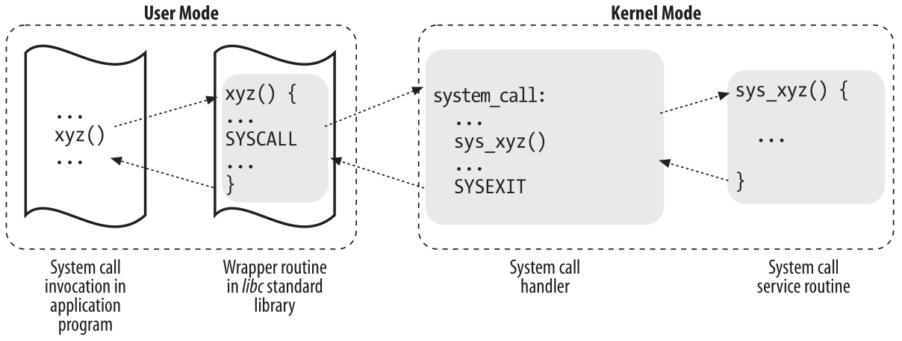

Llamadas al sistema
===================
Los sistemas operativos ofrecen a los procesos que se ejecutan en modo usuario un conjunto de interfaces para interactuar con dispositivos de hardware como la CPU, los discos y las impresoras. Poner una capa adicional entre la aplicación y el hardware tiene varias ventajas. Primero, facilita la programación al liberar a los usuarios de estudiar las características de programación de bajo nivel de los dispositivos de hardware. Segundo, aumenta en gran medida la seguridad del sistema, porque el núcleo puede verificar la precisión de la solicitud a nivel de interfaz antes de intentar satisfacerla. Por último, pero no menos importante, estas interfaces hacen que los programas sean más portátiles, porque se pueden compilar y ejecutar correctamente en cualquier núcleo que ofrezca el mismo conjunto de interfaces.

Los sistemas Unix implementan la mayoría de las interfaces entre los procesos de modo usuario y los dispositivos de hardware por medio de llamadas al sistema emitidas al núcleo. Examinaremos en detalle cómo Linux implementa las llamadas al sistema que los programas de modo usuario emiten al núcleo.

APIs POSIX y Llamadas al Sistema
--------------------------------
Comencemos enfatizando la diferencia entre una interfaz de programación de aplicaciones (API) y una llamada al sistema. La primera es una *definición de función* que especifica cómo obtener un servicio dado, mientras que la segunda es una solicitud explícita al núcleo realizada a través de una interrupción de software.

Los sistemas Unix incluyen varias bibliotecas de funciones que proporcionan APIs a los programadores. Algunas de las APIs definidas por la biblioteca estándar C *libc* se refieren a *rutinas envolventes* (rutinas cuyo único propósito es emitir una llamada al sistema). Por lo general, cada llamada al sistema tiene una rutina contenedora correspondiente, que define la API que los programas de aplicación deben emplear.

Lo contrario no es cierto, por cierto: una API no corresponde necesariamente a una llamada al sistema específica. En primer lugar, la API podría ofrecer sus servicios directamente en modo usuario. (Para algo abstracto como las funciones matemáticas, puede que no haya razón para realizar llamadas al sistema). En segundo lugar, una sola función de la API podría realizar varias llamadas al sistema. Además, varias funciones de la API podrían realizar la misma llamada al sistema, pero envolverla con funcionalidad adicional. Por ejemplo, en Linux, las API *malloc()*, *calloc()* y *free()* se implementan en la biblioteca *libc*. El código en esta biblioteca realiza un seguimiento de las solicitudes de asignación y desasignación y utiliza la llamada al sistema *brk()* para ampliar o reducir el heap de procesos.

El estándar POSIX se refiere a las API y no a las llamadas al sistema. Un sistema puede certificarse como compatible con POSIX si ofrece el conjunto adecuado de APIs a los programas de aplicación, sin importar cómo se implementen las funciones correspondientes. De hecho, varios sistemas no Unix han sido certificados como compatibles con POSIX, porque ofrecen todos los servicios tradicionales de Unix en bibliotecas de modo usuario.

Desde el punto de vista del programador, la distinción entre una API y una llamada al sistema es irrelevante: lo único que importa es el nombre de la función, los tipos de parámetros y el significado del código de retorno. Desde el punto de vista del diseñador del kernel, sin embargo, la distinción sí importa porque las llamadas al sistema pertenecen al kernel, mientras que las bibliotecas de modo usuario no.

La mayoría de las rutinas envolventes (wrapper) devuelven un valor entero, cuyo significado depende de la llamada al sistema correspondiente. Un valor de retorno de -1 usualmente indica que el kernel no pudo satisfacer la solicitud del proceso. Un fallo en el manejador de llamadas al sistema puede ser causado por parámetros no válidos, falta de recursos disponibles, problemas de hardware, etc. El código de error específico está contenido en la variable *errno*, que se define en la biblioteca *libc*.

Cada código de error se define como una constante macro, que produce un valor entero positivo correspondiente. El estándar POSIX especifica los nombres de macro de varios códigos de error. En Linux, en sistemas de 80×86, estas macros se definen en el archivo de encabezado *include/asm-i386/errno.h*. Para permitir la portabilidad de los programas C entre sistemas Unix, el archivo de encabezado *include/asm-i386/errno.h* se incluye, a su vez, en el archivo de encabezado estándar de la biblioteca C */usr/include/errno.h*. Otros sistemas tienen sus propios subdirectorios especializados de archivos de encabezado.

Manejador de llamadas al sistema y rutinas de servicio
-------------------------------------------------------
Cuando un proceso de modo usuario invoca una llamada al sistema, la CPU cambia al modo kernel e inicia la ejecución de una función del kernel. Como veremos a continuación, en la arquitectura 80×86 una llamada al sistema Linux puede invocarse de dos maneras diferentes. Sin embargo, el resultado neto de ambos métodos es un salto a una función de lenguaje ensamblador llamada *manejador de llamadas al sistema*.

Debido a que el kernel implementa muchas llamadas al sistema diferentes, el proceso de modo usuario debe pasar un parámetro llamado *número de llamada al sistema* para identificar la llamada al sistema requerida; Linux utiliza el registro *eax* para este propósito. Como veremos más adelante en "Paso de parámetros", generalmente se pasan parámetros adicionales al invocar una llamada al sistema.

Todas las llamadas al sistema devuelven un valor entero. Las convenciones para estos valores de retorno son diferentes a las de las rutinas envolventes (wrapper). En el kernel, los valores positivos o 0 denotan una terminación exitosa de la llamada al sistema, mientras que los valores negativos denotan una condición de error. En el último caso, el valor es la negación del código de error que debe devolverse al programa de aplicación en la variable *errno*. El núcleo no establece ni utiliza la variable *errno*. En su lugar, las rutinas envolventes gestionan la tarea de establecer esta variable tras el retorno de una llamada al sistema.

El manejador de llamadas al sistema, que tiene una estructura similar a la de otros manejadores de excepciones, realiza las siguientes operaciones:
 - Guarda el contenido de la mayoría de los registros en la pila del modo núcleo (esta operación es común a todas las llamadas al sistema y está codificada en lenguaje ensamblador)
 - Maneja la llamada al sistema invocando una función C correspondiente denominada *rutina de servicio de llamada al sistema*
 - Sale del manejador: los registros se cargan con los valores guardados en la pila del modo núcleo y la CPU vuelve del modo núcleo al modo usuario (esta operación es común a todas las llamadas al sistema y está codificada en lenguaje ensamblador)

El nombre de la rutina de servicio asociada a la llamada al sistema *xyz()* suele ser *sys_xyz()*; Sin embargo, existen algunas excepciones a esta regla.

La figura 1 ilustra las relaciones entre el programa de aplicación que invoca una llamada al sistema, la rutina envolvente (wrapper) correspondiente, el manejador de llamadas al sistema y la rutina de servicio de llamadas al sistema. Las flechas indican el flujo de ejecución entre las funciones. Los términos “SYSCALL” y “SYSEXIT” son marcadores de posición para las instrucciones en lenguaje ensamblador que cambian la CPU, respectivamente, del modo usuario al modo núcleo y del modo núcleo al modo usuario.

    Figura 1 - Invocando una llamada al sistema

Para asociar cada número de llamada al sistema con su rutina de servicio correspondiente, el núcleo utiliza una *tabla de despacho de llamadas al sistema*, que se almacena en la matriz *sys_call_table* y tiene entradas *NR_syscalls* (289 en el núcleo Linux 2.6.11). La entrada *n* contiene la dirección de la rutina de servicio de la llamada al sistema con el número *n*.

La macro *NR_syscalls* es simplemente un límite estático en el número máximo de llamadas al sistema implementables; no indica el número de llamadas al sistema realmente implementadas. De hecho, cada entrada de la tabla de despacho puede contener la dirección de la función *sys_ni_syscall()*, que es la rutina de servicio de las llamadas al sistema “no implementadas”; sólo devuelve el código de error -ENOSYS.

Entrada y salida de una llamada al sistema
------------------------------------------
Las aplicaciones nativas pueden invocar una llamada al sistema de dos maneras diferentes:

- Ejecutando la instrucción en lenguaje ensamblador *int $0x80*; en versiones anteriores del kernel de Linux, esta era la única manera de cambiar del modo usuario al modo kernel
- Ejecutando la instrucción en lenguaje ensamblador *sysenter*, introducida en los microprocesadores Intel Pentium II; esta instrucción ahora es compatible con el kernel de Linux 2.6

De manera similar, el kernel puede salir de una llamada al sistema (cambiando así la CPU de nuevo al modo usuario) de dos maneras:

- Ejecutando la instrucción en lenguaje ensamblador *iret*
- Ejecutando la instrucción en lenguaje ensamblador *sysexit*, que se introdujo en los microprocesadores Intel Pentium II junto con la instrucción *sysenter*

Sin embargo, admitir dos maneras diferentes de entrar al kernel no es tan sencillo como podría parecer, porque:

- El kernel debe admitir tanto bibliotecas antiguas que solo usan la instrucción *int $0x80* como bibliotecas más recientes que también usan la instrucción *sysenter*
- Una biblioteca estándar que utiliza la instrucción *sysenter* debe ser compatible con núcleos antiguos que solo admiten la instrucción *int $0x80*
- El núcleo y la biblioteca estándar deben ser compatibles tanto con procesadores antiguos que no incluyen la instrucción *sysenter* como con procesadores más recientes que sí la incluyen

A continuación veremos como se realizan llamadas al sistema con la instrucción *int $0x80*.

Emitir una llamada al sistema mediante la instrucción int $0x80
****************************************************************
La forma “tradicional” de invocar una llamada al sistema utiliza la instrucción del lenguaje ensamblador *int*, que se trató en la sección “Manejo de interrupciones y excepciones por hardware” en Interrupciones y Excepciones.

El vector 128 (en hexadecimal, *0x80*) está asociado con el punto de entrada del núcleo. La función *trap_init()*, invocada durante la inicialización del núcleo, configura la entrada de la tabla de descriptores de interrupciones correspondiente al vector 128 de la siguiente manera:

..  code-block:: c

    set_system_gate(0x80, &system_call);

La llamada carga los siguientes valores en los campos del descriptor de puerta:

*Selector de segmento*
  El selector de segmento _ _KERNEL_CS del segmento de código del núcleo
*Desplazamiento*
  El puntero al manejador de llamada al sistema *system_call()*
*Tipo*
 Establecido en 15. Indica que la excepción es un Trap y que el manejador correspondiente no deshabilita las interrupciones enmascarables
*DPL (Nivel de privilegio de descriptor)*
 Establecido en 3. Esto permite que los procesos en Modo usuario invoquen el manejador de excepciones

Por lo tanto, cuando un proceso en Modo usuario emite una instrucción *int $0x80*, la CPU cambia al Modo Kernel y comienza a ejecutar instrucciones desde la dirección *system_call*.

La función system_call()
>>>>>>>>>>>>>>>>>>>>>>>>
La función *system_call()* comienza guardando el número de llamada al sistema y todos los registros de la CPU que pueden ser utilizados por el manejador de excepciones en la pila, excepto *eflags, cs, eip, ss* y *esp*, que ya han sido guardados automáticamente por la unidad de control. La macro *SAVE_ALL*, que ya se trató en “Manejo de interrupciones de E/S”, también carga el Selector de segmento del segmento de datos del núcleo en *ds* y *es*:

..  code-block:: asm

    system_call:
        pushl %eax
        SAVE_ALL
        movl $0xffffe000, %ebx /* o 0xfffff000 para pilas de 4-KB */
        andl %esp, %ebx

La función almacena entonces la dirección de la estructura de datos *thread_info* del proceso actual en *ebx* (vea la sección “Identificación de un proceso” en Procesos). Esto se hace tomando el valor del puntero de pila del núcleo y redondeándolo a un múltiplo de 4 u 8 KB (vea la sección “Identificación de un proceso” en Procesos).

A continuación, la función *system_call()* comprueba si alguno de los indicadores TIF_SYSCALL_TRACE y TIF_SYSCALL_AUDIT incluidos en el campo *flags* de la estructura *thread_info* está establecido, es decir, si un depurador está rastreando las invocaciones de llamadas al sistema del programa ejecutado. Si este es el caso, *system_call()* invoca la función *do_syscall_trace()* dos veces: una justo antes y otra justo después de la ejecución de la rutina de servicio de llamada al sistema (como se describe más adelante). Esta función detiene *current* (proceso que se encuentra en la CPU) y, por lo tanto, permite que el proceso de depuración recopile información sobre él.

Luego, se realiza una comprobación de validez en el número de llamada al sistema pasado por el proceso del modo usuario. Si es mayor o igual que el número de entradas en la tabla de despacho de llamadas al sistema, el controlador de llamadas al sistema termina.

Si el número de llamada al sistema no es válido, la función almacena el valor -ENOSYS en la ubicación de la pila donde se ha guardado el registro *eax*, es decir, en el desplazamiento 24 desde la parte superior de la pila actual. Luego salta a *resume_userspace* (ver más abajo). De esta manera, cuando el proceso reanude su ejecución en modo usuario, encontrará un código de retorno negativo en *eax*.

Finalmente, se invoca la rutina de servicio específica asociada con el número de llamada al sistema contenido en *eax*:

..  code-block:: c

    call *sys_call_table(0, %eax, 4)

Debido a que cada entrada en la tabla de despacho tiene 4 bytes de longitud, el núcleo encuentra la dirección de la rutina de servicio que se invocará multiplicando el número de llamada al sistema por 4, sumando la dirección inicial de la tabla de despacho *sys_call_table* y extrayendo un puntero a la rutina de servicio desde esa ranura en la tabla.

Saliendo de la llamada del sistema
>>>>>>>>>>>>>>>>>>>>>>>>>>>>>>>>>>
Cuando la rutina de servicio de llamada del sistema termina, la función *system_call()* obtiene su código de retorno de *eax* y lo almacena en la ubicación de la pila donde se guarda el valor del Modo Usuario del registro *eax*:

..  code-block:: asm

    movl %eax, 24(%esp)

Por lo tanto, el proceso del Modo Usuario encontrará el código de retorno de la llamada del sistema en el registro *eax*.

Luego, la función *system_call()* deshabilita las interrupciones locales y verifica los indicadores en la estructura *thread_info* de *current*:

..  code-block:: asm

    cli
    movl 8(%ebp), %ecx
    testw $0xffff, %cx
    je restore_all

El campo *flags* está en el desplazamiento 8 en la estructura *thread_info*; la máscara 0xffff selecciona los bits correspondientes a todos los indicadores listados en la Tabla 4-15 excepto TIF_POLLING_NRFLAG. Si ninguna de estas banderas está activada, la función salta a la etiqueta *restore_all*: como se describe en la sección "Retorno tras interrupciones y excepciones" del capítulo 4, este código restaura el contenido de los registros guardados en la pila del modo kernel y ejecuta una instrucción *iret* en lenguaje ensamblador para reanudar el proceso en modo usuario.

Si alguna de las banderas está activada, hay trabajo por hacer antes de regresar al modo usuario. Si la bandera TIF_SYSCALL_TRACE está activada, la función *system_call()* invoca por segunda vez la función *do_syscall_trace()* y salta a la etiqueta *resume_userspace*. De lo contrario, si la bandera TIF_SYSCALL_TRACE no está activada, la función salta a la etiqueta *work_pending*.

Como se explica en la sección “Cómo regresar de interrupciones y excepciones” en el Capítulo 4, ese código en las etiquetas *resume_userspace* y *work_pending* verifica solicitudes de replanificación, modo virtual-8086, señales pendientes y paso a paso (debug); luego, eventualmente, se realiza un salto a la etiqueta *restore_all* para reanudar la ejecución del proceso del modo usuario.

Pase de parámetros
------------------
Al igual que las funciones ordinarias, las llamadas al sistema a menudo requieren algunos parámetros de entrada/salida, que pueden consistir en valores reales (es decir, números), direcciones de variables en el espacio de direcciones del proceso del modo usuario o incluso direcciones de estructuras de datos que incluyen punteros a funciones del modo usuario.

Debido a que las funciones *system_call()* y *sysenter_entry()* son los puntos de entrada comunes para todas las llamadas al sistema en Linux, cada una de ellas tiene al menos un parámetro: el número de llamada al sistema pasado en el registro *eax*. Por ejemplo, si un programa de aplicación invoca la rutina *fork()*, el registro *eax* se establece en 2 (es decir, *__NR_fork*) antes de ejecutar la instrucción de lenguaje ensamblador *int $0x80* o *sysenter*. Debido a que el registro es establecido por las rutinas envolventes incluidas en la biblioteca *libc*, los programadores generalmente no se preocupan por el número de llamada al sistema.

La llamada al sistema *fork()* no requiere otros parámetros. Sin embargo, muchas llamadas al sistema sí requieren parámetros adicionales, que el programa de aplicación debe pasar explícitamente. Por ejemplo, la llamada al sistema *mmap()* puede requerir hasta seis parámetros adicionales (además del número de llamada al sistema).

Los parámetros de las funciones en C ordinarias se pasan habitualmente escribiendo sus valores en la pila del programa activo (ya sea la pila del modo usuario o la pila del modo núcleo). Debido a que las llamadas al sistema son un tipo especial de función que pasa del mundo del usuario al del núcleo, no se pueden utilizar las pilas del modo usuario ni las del modo núcleo. En su lugar, los parámetros de la llamada al sistema se escriben en los registros de la CPU antes de emitir la llamada al sistema. A continuación, el núcleo copia los parámetros almacenados en los registros de la CPU en la pila del modo núcleo antes de invocar la rutina de servicio de la llamada al sistema, porque esta última es una función de C ordinaria.

¿Por qué el núcleo no copia los parámetros directamente de la pila del modo usuario a la pila del modo núcleo? En primer lugar, trabajar con dos pilas al mismo tiempo es complejo; En segundo lugar, el uso de registros hace que la estructura del manejador de llamadas del sistema sea similar a la de otros manejadores de excepciones.

Sin embargo, para pasar parámetros en registros, se deben cumplir dos condiciones:

- La longitud de cada parámetro no puede exceder la longitud de un registro (32 bits)
- El número de parámetros no debe exceder seis, además del número de llamada del sistema pasado en *eax*, porque los procesadores de 80×86 tienen un número muy limitado de registros

La primera condición siempre es verdadera porque, según el estándar POSIX, los parámetros grandes que no se pueden almacenar en un registro de 32 bits se deben pasar por referencia. Un ejemplo típico es la llamada del sistema *settimeofday()*, que debe leer una estructura de 64 bits.

Sin embargo, existen llamadas del sistema que requieren más de seis parámetros. En tales casos, se utiliza un solo registro para apuntar a un área de memoria en el espacio de direcciones del proceso que contiene los valores de los parámetros. Por supuesto, los programadores no tienen que preocuparse por esta solución alternativa. Como con cada llamada a función de C, los parámetros se guardan automáticamente en la pila cuando se invoca la rutina wrapper. Esta rutina encontrará la forma apropiada de pasar los parámetros al núcleo.

Los registros utilizados para almacenar el número de llamada del sistema y sus parámetros son, en orden creciente, *eax* (para el número de llamada del sistema), *ebx, ecx, edx, esi, edi* y *ebp*. Como se vio antes, *system_call()* y *sysenter_entry()* guardan los valores de estos registros en la pila del modo núcleo mediante la macro *SAVE_ALL*. Por lo tanto, cuando la rutina de servicio de llamada del sistema va a la pila, encuentra la dirección de retorno a *system_call()* o a *sysenter_entry()*, seguida del parámetro almacenado en *ebx* (el primer parámetro de la llamada del sistema), el parámetro almacenado en *ecx*, y así sucesivamente (consulte la sección “Guardar los registros para el manejador de interrupciones” en el Capítulo 4). Esta configuración de pila es exactamente la misma que en una llamada de función ordinaria y, por lo tanto, la rutina de servicio puede referirse fácilmente a sus parámetros usando las construcciones usuales del lenguaje C.

Veamos un ejemplo. La rutina de servicio *sys_write()*, que maneja la llamada del sistema *write()*, se declara como:

..  code-block:: c

    int sys_write (unsigned int fd, const char * buf, unsigned int count)

El compilador de C produce una función de lenguaje ensamblador que espera encontrar los parámetros *fd, buf* y *count* en la parte superior de la pila, justo debajo de la dirección de retorno, en las ubicaciones usadas para guardar el contenido de los registros *ebx, ecx* y *edx*, respectivamente.

En algunos casos, incluso si la llamada del sistema no usa ningún parámetro, la rutina de servicio correspondiente necesita conocer el contenido de los registros de la CPU justo antes de que se emitiera la llamada del sistema. Por ejemplo, la función *do_fork()* que implementa *fork()* necesita conocer el valor de los registros para duplicarlos en el campo *thread* del proceso hijo (véase la sección «El campo del subproceso» en el capítulo 3). En estos casos, un único parámetro de tipo *pt_regs* permite que la rutina de servicio acceda a los valores guardados en la pila del modo kernel mediante la macro *SAVE_ALL* (véase Sección «La función do_IRQ()» del capítulo 4:

..  code-block:: c

    int sys_fork (struct pt_regs regs)

El valor de retorno de una rutina de servicio debe escribirse en el registro *eax*. El compilador de C realiza esto automáticamente al ejecutar la instrucción return *n*;.

Verificación de los parámetros

Todos los parámetros de llamada del sistema deben comprobarse cuidadosamente antes de que el núcleo intente satisfacer una solicitud del usuario. El tipo de comprobación depende tanto de la llamada del sistema como del parámetro específico. Volvamos a la llamada del sistema *write()* presentada antes: el parámetro *fd* debe ser un descriptor de archivo que identifique un archivo específico, por lo que *sys_write()* debe comprobar si *fd* realmente es un descriptor de archivo de un archivo previamente abierto y si el proceso tiene permiso para escribir en él. Si alguna de estas condiciones no es verdadera, el manejador debe devolver un valor negativo, en este caso, el código de error -EBADF.

Sin embargo, un tipo de comprobación es común a todas las llamadas del sistema. Siempre que un parámetro especifica una dirección, el núcleo debe comprobar si está dentro del espacio de direcciones del proceso. Hay dos formas posibles de realizar esta comprobación:

- Verificar que la dirección lineal pertenece al espacio de direcciones del proceso y, de ser así, que la región de memoria que la incluye tiene los derechos de acceso adecuados
- Verificar solo que la dirección lineal sea menor que PAGE_OFFSET (es decir, que no caiga dentro del rango de direcciones de intervalo reservadas al núcleo)

Los primeros núcleos de Linux realizaban el primer tipo de comprobación. Pero consume bastante tiempo porque debe ejecutarse para cada parámetro de dirección incluido en una llamada al sistema; además, suele ser inútil porque los programas defectuosos no son muy comunes.

Por lo tanto, a partir de la versión 2.2, Linux emplea el segundo tipo de comprobación. Esto es mucho más eficiente porque no requiere ningún escaneo de los descriptores de memoria del proceso. Obviamente, esta es una comprobación muy burda: verificar que la dirección lineal sea menor que PAGE_OFFSET es una condición necesaria pero no suficiente para su validez. Pero no hay riesgo en confinar el núcleo a este tipo limitado de comprobación porque se detectarán otros errores más tarde.

Por lo tanto, el enfoque seguido es posponer la comprobación real hasta el último momento posible, es decir, hasta que la unidad de paginación traduzca la dirección lineal a una física.

Cabe preguntarse por qué se realiza esta comprobación general. Este tipo de comprobación es crucial para proteger tanto los espacios de direcciones del proceso como el del kernel de accesos ilegales. En el capítulo sobre memoria, vimos que la RAM se asigna a partir de PAGE_OFFSET. Esto significa que las rutinas del kernel pueden direccionar todas las páginas de la memoria. Por lo tanto, si no se realizara la comprobación general, un proceso en modo usuario podría pasar una dirección del espacio de direcciones del kernel como parámetro y leer o escribir en todas las páginas de la memoria sin generar una excepción de fallo de página.

