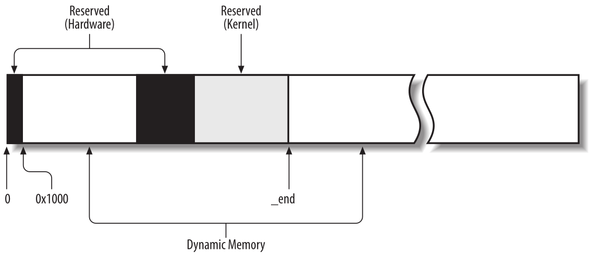

Gestion de Memoria
==================

Vimos cómo Linux aprovecha los circuitos de segmentación y paginación de 80×86 para traducir direcciones lógicas en físicas. También mencionamos que una porción de RAM está asignada permanentemente al núcleo y se usa para almacenar tanto el código del núcleo como las estructuras de datos estáticas del núcleo.

La parte restante de la RAM se llama *memoria dinámica*. Es un recurso valioso, necesario no solo para los procesos sino también para el propio núcleo. De hecho, el rendimiento de todo el sistema depende de la eficiencia con la que se gestione la memoria dinámica. Por lo tanto, todos los sistemas operativos multitarea actuales intentan optimizar el uso de la memoria dinámica, asignándola solo cuando es necesaria y liberándola lo antes posible.La figura 1 muestra esquemáticamente los marcos de página utilizados como memoria dinámica.

Ahora veremos cómo el núcleo asigna memoria dinámica para su propio uso. Las secciones «Gestión de marcos de página» y «Gestión del área de memoria» ilustran dos técnicas diferentes para gestionar áreas de memoria físicamente contiguas, mientras que la sección «Gestión del área de memoria no contigua» ilustra una tercera técnica que gestiona áreas de memoria no contiguas.

Administracion de Marcos de Páginas
-----------------------------------
Vimos en “Paginación en hardware” (en Direccionamiento de memoria) cómo el procesador Intel Pentium puede usar dos tamaños de marco de página diferentes: 4 KB y 4 MB (o 2 MB si PAE está habilitado). Linux adopta el tamaño de marco de página más pequeño de 4 KB como la unidad de asignación de memoria estándar. Esto simplifica las cosas por dos razones:

- Las excepciones de fallo de página emitidas por el circuito de paginación se interpretan fácilmente. O bien la página solicitada existe, pero el proceso no puede direccionarla, o bien la página no existe. En el segundo caso, el asignador de memoria debe encontrar un marco de página de 4 KB libre y asignarlo al proceso.
- Aunque tanto 4 KB como 4 MB son múltiplos de todos los tamaños de bloque de disco, las transferencias de datos entre la memoria principal y los discos son, en la mayoría de los casos, más eficientes cuando se usa el tamaño más pequeño.

    Figura 1 - Memoria Dinámica

Descriptores de página
**********************
El núcleo debe realizar un seguimiento del estado actual de cada marco de página. Por ejemplo, debe ser capaz de distinguir los marcos de página que se utilizan para contener páginas que pertenecen a procesos de aquellos que contienen código del núcleo o estructuras de datos del núcleo. De forma similar, debe ser capaz de determinar si un marco de página en memoria dinámica está libre. Un marco de página en memoria dinámica está libre si no contiene ningún dato útil. No está libre cuando el marco de página contiene datos de un proceso de usuario, datos de una caché de software, estructuras de datos del núcleo asignadas dinámicamente, datos en búfer de un controlador de dispositivo, código de un módulo del núcleo, etc.

La información de estado de un marco de página se mantiene en un descriptor de página de tipo *page*, cuyos campos se muestran en la siguiente tabla. Todos los descriptores de página se almacenan en el vector *mem_map*. Debido a que cada descriptor tiene 32 bytes de longitud, el espacio requerido por *mem_map* es ligeramente inferior al 1% de toda la RAM. La macro *virt_to_page(addr)* produce la dirección del descriptor de página asociado con la dirección lineal *addr*. La macro *pfn_to_page(pfn)* devuelve la dirección del descriptor de página asociado con el marco de página que tiene el número *pfn*.

+---------------------------+-------------------------------------------------------------------------------------------+
|Nombre                     |Descripción                                                                                |
+===========================+===========================================================================================+
|flags                      |Arreglo de flags. También codifica el número de zona al que pertence el marco de página    |
+---------------------------+-------------------------------------------------------------------------------------------+
|_count                     |Contador de referencia del marco de página                                                 |
+---------------------------+-------------------------------------------------------------------------------------------+
|_mapcount                  |Número de la entrada de la tabla de página que refiere al marco de página (-1 ninguno)     |
+---------------------------+-------------------------------------------------------------------------------------------+
|private                    |Disponible al componente del kernel usando la página                                       |
+---------------------------+-------------------------------------------------------------------------------------------+
|mapping                    |Usado cuando la página está en un caché de  página                                         |
+---------------------------+-------------------------------------------------------------------------------------------+
|index                      |Usado por varios componentes del kernel con distintos significado                          |
+---------------------------+-------------------------------------------------------------------------------------------+
|lru                        |Punteros a la lista de páginas doblemente enlazadas menos utilizadas recientemente         |
+---------------------------+-------------------------------------------------------------------------------------------+

No tenemos que comprender completamente la función de todos los campos en el descriptor de página en este momento. Más adelante, volveremos a los campos del descriptor de página. Además, varios campos tienen un significado diferente, según si el marco de página está libre o qué componente del núcleo está utilizando el marco de página.

Describamos con mayor detalle dos de los campos:
- *_count* Un contador de referencia de uso para la página. Si se establece en -1, el marco de página correspondiente está libre y se puede asignar a cualquier proceso o al propio núcleo. Si se establece en un valor mayor o igual que 0, el marco de página está asignado a uno o más procesos o se utiliza para almacenar algunas estructuras de datos del núcleo. La función *page_count()* devuelve el valor del campo *_count* incrementado en uno, es decir, el número de usuarios de la página.
- *flags*: Incluye hasta 32 banderas (véase la siguiente tabla) que describen el estado del marco de página. Para cada bandera *PG_xyz*, el núcleo define macros que manipulan su valor. Normalmente, la macro *PageXyz* devuelve el valor del flag, mientras que las macros *SetPageXyz* y *ClearPageXyz* activan y desactivan el bit correspondiente, respectivamente.

+-------------------------------+-------------------------------------------------------------------------------------------+
|Nombre del flag                |Significado                                                                                |
+===============================+===========================================================================================+
|PG_locked                      |La página está bloqueada, está involucrada en una operación de E/S de disco                |
+-------------------------------+-------------------------------------------------------------------------------------------+
|PG_error                       |Indica que ocurrió un error de E/S mientras se transfería la página                        |
+-------------------------------+-------------------------------------------------------------------------------------------+
|PG_referenced                  |La página ha sido accedida recientemente                                                   |
+-------------------------------+-------------------------------------------------------------------------------------------+
|PG_uptodate                    |Se activa despues de completar una operacion de lectura, a menos que haya ocurrido un error|
+-------------------------------+-------------------------------------------------------------------------------------------+
|PG_dirty                       |Indica que la página ha sido modificada                                                    |
+-------------------------------+-------------------------------------------------------------------------------------------+
|PG_lru                         |La página se encuentra en una lista de páginas activas o inactivas                         |
+-------------------------------+-------------------------------------------------------------------------------------------+
|PG_active                      |La página está en una lista de páginas activas                                             |
+-------------------------------+-------------------------------------------------------------------------------------------+
|PG_slab                        |El marco de página está incluida en un slab                                                |
+-------------------------------+-------------------------------------------------------------------------------------------+
|PG_highmem                     |La página pertenece a la zona ZONE_HIGHMEM                                                 |
+-------------------------------+-------------------------------------------------------------------------------------------+
|PG_checked                     |Usados por algunos sistemas de archivos como Ext2 y Ext3                                   |
+-------------------------------+-------------------------------------------------------------------------------------------+
|PG_arch_1                      |No usado en la arquitectura 80x86                                                          |
+-------------------------------+-------------------------------------------------------------------------------------------+
|PG_reserved                    |El marco está reservado por el kernel o no es utilizable                                   |
+-------------------------------+-------------------------------------------------------------------------------------------+
|PG_private                     |Almacena dato significativo                                                                |
+-------------------------------+-------------------------------------------------------------------------------------------+
|PG_writeback                   |La página está siendo escrita a disco                                                      |
+-------------------------------+-------------------------------------------------------------------------------------------+
|PG_nosave                      |Usado por el sistema de suspend/resume                                                     |
+-------------------------------+-------------------------------------------------------------------------------------------+
|PG_compound                    |Marco de página administrado por el mecanismo de paginación extendida                      |
+-------------------------------+-------------------------------------------------------------------------------------------+
|PG_swapcache                   |La página pertenece a un caché swap                                                        |
+-------------------------------+-------------------------------------------------------------------------------------------+
|PG_mappedtodisk                |Todo el dato en el marco de página corresponde a bloques asignados a disco                 |
+-------------------------------+-------------------------------------------------------------------------------------------+
|PG_reclaim                     |La página ha sido marcada para ser escrita a disco para reclamar memoria                   |
+-------------------------------+-------------------------------------------------------------------------------------------+
|PG_nosave_free                 |Usado por el sistema de suspend/resume                                                     |
+-------------------------------+-------------------------------------------------------------------------------------------+

Acceso a Memoria No Uniforme (NUMA)
***********************************
Estamos acostumbrados a pensar en la memoria de la computadora como un recurso homogéneo y compartido. Sin tener en cuenta el papel de las cachés de hardware, esperamos que el tiempo requerido para que una CPU acceda a una ubicación de memoria sea esencialmente el mismo, independientemente de la ubicación de la dirección física y la CPU. Desafortunadamente, esta suposición no es cierta en algunas arquitecturas. Por ejemplo, no es cierto para algunas computadoras multiprocesador Alpha o MIPS.

Linux 2.6 admite el *modelo de acceso a memoria no uniforme (NUMA)*, en el que los tiempos de acceso para diferentes ubicaciones de memoria desde una CPU dada pueden variar. La memoria física del sistema está particionada en varios *nodos*. El tiempo que necesita una CPU dada para acceder a las páginas dentro de un solo nodo es el mismo. Sin embargo, este tiempo podría no ser el mismo para dos CPU diferentes. Para cada CPU, el núcleo intenta minimizar el número de accesos a nodos costosos seleccionando cuidadosamente dónde se almacenan las estructuras de datos del núcleo a las que la CPU hace referencia con mayor frecuencia.

La memoria física dentro de cada nodo puede dividirse en varias zonas, como veremos en la siguiente sección. Cada nodo tiene un descriptor de tipo *pg_data_t*, cuyos campos se muestran en la siguiente tabla. Todos los descriptores de nodo se almacenan en una lista enlazada simple, cuyo primer elemento está indicado por la variable *pgdat_list*.

+-------------------------------+-------------------------------------------------------------------------------------------+
|Nombre                         |Descripción                                                                                |
+===============================+===========================================================================================+
|node_zones                     |Vector de descriptores de zona del nodo                                                    |
+-------------------------------+-------------------------------------------------------------------------------------------+
|node_zonelists                 |Vector de estructuras *zonelist* usado por el asignador de página                          |
+-------------------------------+-------------------------------------------------------------------------------------------+
|nr_zones                       |Número de zonas en el nodo                                                                 |
+-------------------------------+-------------------------------------------------------------------------------------------+
|node_mem_map                   |Vector de descriptores de páginas del nodo                                                 |
+-------------------------------+-------------------------------------------------------------------------------------------+
|bdata                          |Usado en la fase de inicialización del kernel                                              |
+-------------------------------+-------------------------------------------------------------------------------------------+
|node_star_pfn                  |Índice del primer marco de página del nodo                                                 |
+-------------------------------+-------------------------------------------------------------------------------------------+
|node_present_pages             |Tamaño del nodo de memoria, excluyendo huecos (en marcos de páginas)                       |
+-------------------------------+-------------------------------------------------------------------------------------------+
|node_spanned_pages             |Tamaño del nodo de memoria, incluyendo huecos (en marcos de páginas)                       |
+-------------------------------+-------------------------------------------------------------------------------------------+
|node_id                        |Identificador del nodo                                                                     |
+-------------------------------+-------------------------------------------------------------------------------------------+
|pgdat_next                     |Próximo elemento en la lista de nodos de memoria                                           |
+-------------------------------+-------------------------------------------------------------------------------------------+
|kswapd_wait                    |Cola de espera del demonio *kswapd*                                                        |
+-------------------------------+-------------------------------------------------------------------------------------------+
|kswapd                         |Puntero al descriptor de proceso del hilo del kernel *kswapd*                              |
+-------------------------------+-------------------------------------------------------------------------------------------+
|kswapd_max_order               |Tamaño logarítmico de bloques libres creados por *kswapd*                                  |
+-------------------------------+-------------------------------------------------------------------------------------------+

Como de costumbre, nos centraremos principalmente en la arquitectura 80×86. Las PC compatibles con IBM utilizan el *modelo de acceso uniforme a memoria (UMA)*, por lo que la compatibilidad con NUMA no es realmente necesaria. Sin embargo, incluso si la compatibilidad con NUMA no está compilada en el núcleo, Linux utiliza un único nodo que incluye toda la memoria física del sistema. Por lo tanto, la variable *pgdat_list* apunta a una lista que consta de un único elemento (el descriptor del nodo 0) almacenado en la variable *contig_page_data*. En la arquitectura 80×86, agrupar la memoria física en un único nodo podría parecer inútil; sin embargo, este enfoque hace que el código de gestión de memoria sea más portable, ya que el núcleo puede asumir que la memoria física está particionada en uno o más nodos en todas las arquitecturas.

Zonas de Memoria
****************
En una arquitectura informática ideal, un marco de página es una unidad de almacenamiento de memoria que puede usarse para cualquier cosa: almacenar datos del kernel y del usuario, almacenar en búfer datos de disco, etc. Todo tipo de página de datos puede almacenarse en un marco de página, sin limitaciones.

Sin embargo, las arquitecturas de computadoras reales tienen restricciones de hardware que pueden limitar la forma en que se pueden usar los marcos de página. En particular, el kernel de Linux debe lidiar con dos restricciones de hardware de la arquitectura 80×86:

- Los procesadores de acceso directo a memoria (DMA) para los antiguos buses ISA tienen una fuerte limitación: solo pueden direccionar los primeros 16 MB de RAM.
- En los ordenadores modernos de 32 bits con mucha RAM, la CPU no puede acceder directamente a toda la memoria física porque el espacio de direcciones lineal es demasiado pequeño.

Para hacer frente a estas dos limitaciones, Linux 2.6 particiona la memoria física de cada nodo de memoria en tres *zonas*. En la arquitectura UMA de 80×86 las zonas son:

ZONE_DMA
 Contiene marcos de página de memoria por debajo de 16 MB
ZONE_NORMAL
 Contiene marcos de página de memoria de 16 MB o más y por debajo de 896 MB
ZONE_HIGHMEM
 Contiene marcos de página de memoria de 896 MB o más

La zona ZONE_DMA incluye marcos de página que pueden ser utilizados por dispositivos antiguos basados ​​en ISA por medio del DMA.

Las zonas ZONE_DMA y ZONE_NORMAL incluyen los marcos de página “normales” a los que el núcleo puede acceder directamente a través del mapeo lineal en el cuarto gigabyte del espacio de direcciones lineal. Por el contrario, la zona ZONE_HIGHMEM incluye marcos de página a los que el núcleo no puede acceder directamente mediante la asignación lineal en el cuarto gigabyte de espacio de direcciones lineal (véase la sección «Asignaciones del núcleo de marcos de página de alta memoria» más adelante). La zona ZONE_HIGHMEM siempre está vacía en arquitecturas de 64 bits.

Cada zona de memoria tiene su propio descriptor de tipo *zone*. En la tabla siguiente se pueden ver los campos del descriptor.

+-------------------------------+-------------------------------------------------------------------------------------------+
|Nombre                         |Descripción                                                                                |
+===============================+===========================================================================================+
|pages_low                      |Marca de agua baja para la recuperación del marco de página                                |
+-------------------------------+-------------------------------------------------------------------------------------------+
|pages_high                     |Marca de agua alta para la recuperación del marco de página                                |
+-------------------------------+-------------------------------------------------------------------------------------------+
|lowmem_reserve                 |Especifica cuantos marcos en cada zona deben reservarse para manejo de situaciones         |
|                               |críticas de memoria baja                                                                   |
+-------------------------------+-------------------------------------------------------------------------------------------+
|pageset                        |Estructura de datos usada para implementar cachés especiales de un solo marco de página    |
+-------------------------------+-------------------------------------------------------------------------------------------+
|lock                           |Spin lock para protejer el acceso al descriptor                                            |
+-------------------------------+-------------------------------------------------------------------------------------------+
|free_area                      |Identifica los bloques de marcos de páginas libres en la zona                              |
+-------------------------------+-------------------------------------------------------------------------------------------+
|lru_lock                       |Spin lock para la lista de activos e inactivos                                             |
+-------------------------------+-------------------------------------------------------------------------------------------+
|active_list                    |Lista de páginas activas en la zona                                                        |
+-------------------------------+-------------------------------------------------------------------------------------------+
|inactive_list                  |Lista de páginas inactivas en la zona                                                      |
+-------------------------------+-------------------------------------------------------------------------------------------+
|nr_scan_active                 |Número de páginas activas a escanearse en reclamos de memoria                              |
+-------------------------------+-------------------------------------------------------------------------------------------+
|nr_scan_inactive               |Número de páginas inactivas a escanearse en reclamos de memoria                            |
+-------------------------------+-------------------------------------------------------------------------------------------+
|nr_active                      |Número de páginas en la lista activa de la zona                                            |
+-------------------------------+-------------------------------------------------------------------------------------------+
|nr_inactive                    |Número de páginas en la lista inactiva de la zona                                          |
+-------------------------------+-------------------------------------------------------------------------------------------+
|pages_scanned                  |Contador usado cuando se hace reclamo de marcos de página en la zona                       |
+-------------------------------+-------------------------------------------------------------------------------------------+
|all_unreclaimable              |Bandera establecida cuando la zona está llena de páginas no reclamables                    |
+-------------------------------+-------------------------------------------------------------------------------------------+
|temp_priority                  |Prioridad de zona temporal                                                                 |
+-------------------------------+-------------------------------------------------------------------------------------------+
|prev_priority                  |Prioridad de la zona que varía entre 12 y 0                                                |
+-------------------------------+-------------------------------------------------------------------------------------------+
|wait_table                     |Tabla hash de colas de espera de procesos esperando por una de la páginas de la zona       |
+-------------------------------+-------------------------------------------------------------------------------------------+
|wait_table_size                |Tamaño de la tabla hash de colas de espera                                                 |
+-------------------------------+-------------------------------------------------------------------------------------------+
|wait_table_bits                |Orden de potencia de 2 del tamaño de la matriz de la tabla hash de la cola de espera       |
+-------------------------------+-------------------------------------------------------------------------------------------+
|zone_pgdat                     |Nodo de memoria                                                                            |
+-------------------------------+-------------------------------------------------------------------------------------------+
|zone_mem_map                   |Puntero al primer descriptor de página de la zona                                          |
+-------------------------------+-------------------------------------------------------------------------------------------+
|zone_start_pfn                 |Índice del primer marco de página de la zona                                               |
+-------------------------------+-------------------------------------------------------------------------------------------+
|spanned_pages                  |Tamaño de total de la zona en páginas, incluyendo huecos                                   |
+-------------------------------+-------------------------------------------------------------------------------------------+
|present_pages                  |Tamaño de total de la zona en páginas, excluyendo huecos                                   |
+-------------------------------+-------------------------------------------------------------------------------------------+
|name                           |Puntero al nombre convencional de la zona. "DMA", "Normal" o "HighMem"                     |
+-------------------------------+-------------------------------------------------------------------------------------------+

Cada descriptor de página tiene enlaces al nodo de memoria y a la zona dentro del nodo que incluye el marco de página correspondiente. Para ahorrar espacio, estos enlaces no se almacenan como punteros clásicos; en su lugar, se codifican como índices almacenados en los bits altos del campo *flags*. De hecho, el número de flags que caracterizan un marco de página es limitado, por lo que siempre es posible reservar los bits más significativos del campo *flags* para codificar el nodo de memoria y el número de zona adecuados. La función *page_zone()* recibe como parámetro la dirección de un descriptor de página; lee los bits más significativos del campo *flags* en el descriptor de página, luego determina la dirección del descriptor de zona correspondiente buscando en el vector *zone_table*. Este vector se inicializa durante el arranque con las direcciones de todos los descriptores de zona de todos los nodos de memoria.

Cuando el núcleo invoca una función de asignación de memoria, debe especificar las zonas que contienen los marcos de página solicitados. El núcleo generalmente especifica qué zonas está dispuesto a usar. Por ejemplo, si un marco de página debe asignarse directamente en el cuarto gigabyte de direcciones lineales, pero no se utilizará para transferencias ISA DMA, el núcleo solicita un marco de página en ZONE_NORMAL o en ZONE_DMA. Por supuesto, el marco de página solo debe obtenerse de ZONE_DMA si ZONE_NORMAL no tiene marcos de página libres. Para especificar las zonas preferidas en una solicitud de asignación de memoria, el núcleo utiliza la estructura de datos *zonelist*, que es una matriz de punteros de descriptor de zona.

Pool de Marcos de Páginas Reservadas
************************************
Las solicitudes de asignación de memoria se pueden satisfacer de dos maneras diferentes. Si hay suficiente memoria libre disponible, la solicitud se puede satisfacer de inmediato. De lo contrario, debe recuperarse memoria y la ruta de control del núcleo que realizó la solicitud se bloquea hasta que se libere memoria adicional.

Sin embargo, algunas rutas de control del núcleo no se pueden bloquear mientras se solicita memoria; esto sucede, por ejemplo, al gestionar una interrupción o al ejecutar código dentro de una región crítica. En estos casos, una ruta de control del núcleo debe emitir *solicitudes de asignación de memoria atómica*. Una solicitud atómica nunca se bloquea: si no hay suficientes páginas libres, la asignación simplemente falla.

Aunque no hay forma de garantizar que una *solicitud de asignación de memoria atómica* nunca falle, el núcleo se esfuerza por minimizar la probabilidad de este desafortunado evento. Para ello, el núcleo reserva un conjunto de marcos de página para solicitudes de asignación de memoria atómica que se utilizarán solo en condiciones de poca memoria.

La cantidad de memoria reservada (en kilobytes) se almacena en la variable *min_free_kbytes*. Su valor inicial se establece durante la inicialización del núcleo y depende de la cantidad de memoria física asignada directamente al cuarto gigabyte de direcciones lineales del núcleo; es decir, depende del número de marcos de página incluidos en las zonas de memoria ZONE_DMA y ZONE_NORMAL.

Sin embargo, inicialmente, *min_free_kbytes* no puede ser inferior a 128 ni superior a 65536.

Las zonas de memoria ZONE_DMA y ZONE_NORMAL contribuyen a la memoria reservada con un número de marcos de página proporcional a sus tamaños relativos. Por ejemplo, si la zona ZONE_NORMAL es ocho veces mayor que ZONE_DMA, siete octavos de los marcos de página se tomarán de ZONE_NORMAL y un octavo de ZONE_DMA.

El campo *pages_min* del descriptor de zona almacena el número de marcos de página reservados dentro de la zona.

Asignador de Marcos de Página en Zona
-------------------------------------
El subsistema del núcleo que maneja las solicitudes de asignación de memoria para grupos de marcos de página contiguos se llama *asignador de marcos de página por zonas*. Sus componentes principales se muestran en la figura 2.

El componente llamado "asignador de zonas" recibe las solicitudes de asignación y desasignación de memoria dinámica. En el caso de las solicitudes de asignación, el componente busca una zona de memoria que incluya un grupo de marcos de página contiguos que puedan satisfacer la solicitud. Dentro de cada zona, los marcos de página son manejados por un componente llamado "sistema de amigos" ("El algoritmo del sistema de amigos"). Para obtener un mejor rendimiento del sistema, se mantiene una pequeña cantidad de marcos de página en caché para satisfacer rápidamente las solicitudes de asignación de marcos de página individuales.

    Figura 2 - Componentes del asignador de marcos de página en zonas

Mapeos del kernel de Marcos de Página de Memoria Alta
-----------------------------------------------------
La dirección lineal que corresponde al final de la memoria física mapeada directamente, y por lo tanto al comienzo de la memoria alta, se almacena en la variable *high_memory*, que está establecida en 896 MB. Los marcos de página por encima del límite de 896 MB generalmente no se asignan en el cuarto gigabyte de los espacios de direcciones lineales del núcleo, por lo que el núcleo no puede acceder directamente a ellos. Esto implica que cada función del asignador de páginas que devuelve la dirección lineal del marco de página asignado no funciona para marcos de página de *memoria alta*, es decir, para marcos de página en la zona de memoria ZONE_HIGHMEM.

Por ejemplo, supongamos que el núcleo invocó *__get_free_pages(GFP_HIGHMEM,0)* para asignar un marco de página en memoria alta. Si el asignador asignó un marco de página en memoria alta, *__get_free_pages()* no puede devolver su dirección lineal porque no existe; por lo tanto, la función devuelve NULL. A su vez, el núcleo no puede usar el marco de página; peor aún, el marco de página no se puede liberar porque el núcleo ha perdido la pista de él.

Este problema no existe en plataformas de hardware de 64 bits, porque el espacio de direcciones lineales disponible es mucho mayor que la cantidad de RAM que se puede instalar; en resumen, la zona ZONE_HIGHMEM de estas arquitecturas siempre está vacía. Sin embargo, en plataformas de 32 bits como la arquitectura 80×86, los diseñadores de Linux tuvieron que encontrar alguna forma de permitir que el núcleo explotara toda la RAM disponible, hasta los 64 GB admitidos por PAE. El enfoque adoptado es el siguiente:

- La asignación de marcos de página de memoria alta se realiza solo a través de la función *alloc_pages()* y su acceso directo *alloc_page()*. Estas funciones no devuelven la dirección lineal del primer marco de página asignado, porque si el marco de página pertenece a la memoria alta, dicha dirección lineal simplemente no existe. En su lugar, las funciones devuelven la dirección lineal del descriptor de página del primer marco de página asignado. Estas direcciones lineales siempre existen, porque todos los descriptores de página se asignan en memoria baja una vez y para siempre durante la inicialización del núcleo.
- El núcleo no puede acceder a los marcos de página en memoria alta que no tienen una dirección lineal. Por lo tanto, parte de los últimos 128 MB del espacio de direcciones lineales del núcleo se dedica a mapear marcos de página de memoria alta. Por supuesto, este tipo de mapeo es temporal, de lo contrario solo 128 MB de memoria alta serían accesibles. En cambio, al reciclar direcciones lineales se puede acceder a toda la memoria alta, aunque en diferentes momentos.

El núcleo utiliza tres mecanismos diferentes para mapear marcos de página en memoria alta; se llaman *mapeo de núcleo permanente*, *mapeo de núcleo temporal* y *asignación de memoria no contigua*. En esta sección, cubriremos las dos primeras técnicas; la tercera se trata en la sección "Administración del área de memoria no contigua" más adelante.

Establecer un mapeo de núcleo permanente puede bloquear el proceso actual; esto sucede cuando no existen entradas libres en la tabla de páginas que se puedan usar como "ventanas" en los marcos de página en memoria alta. Por lo tanto, no se puede establecer un mapeo de kernel permanente en manejadores de interrupciones y funciones diferibles. Por el contrario, establecer un mapeo de kernel temporal nunca requiere bloquear el proceso actual; su inconveniente, sin embargo, es que se pueden establecer muy pocos mapeos de kernel temporales al mismo tiempo.

Una ruta de control de kernel que usa un mapeo de kernel temporal debe asegurar que ninguna otra ruta de control de kernel esté usando el mismo mapeo. Esto implica que la ruta de control de kernel nunca puede bloquearse, de lo contrario otra ruta de control de kernel podría usar la misma ventana para mapear alguna otra página de memoria alta. Por supuesto, ninguna de estas técnicas permite direccionar toda la RAM simultáneamente. Después de todo, quedan menos de 128 MB de espacio de direcciones lineales para mapear la memoria alta, mientras que PAE admite sistemas que tienen hasta 64 GB de RAM.

Mapeo del kernel permanente
***************************
Los mapeos de kernel permanentes permiten al kernel establecer mapeos de larga duración de marcos de página en memoria alta en el espacio de direcciones del kernel. Usan una Tabla de Páginas dedicada en las tablas de páginas maestras del kernel. La variable *pkmap_page_table* almacena la dirección de esta Tabla de Páginas, mientras que la macro LAST_PKMAP produce el número de entradas. Como es usual, la Tabla de Páginas incluye 512 o 1,024 entradas, dependiendo de si PAE está habilitado o deshabilitado; por lo tanto, el kernel puede acceder como máximo a 2 o 4 MB de memoria alta a la vez. La Tabla de Páginas mapea las direcciones lineales comenzando desde PKMAP_BASE. La matriz *pkmap_count* incluye contadores LAST_PKMAP, uno para cada entrada de la Tabla de Páginas *pkmap_page_table*. Distinguimos tres casos:

*El contador es 0*
 La entrada correspondiente de la Tabla de Páginas no mapea ningún marco de página de alta memoria y es utilizable
*El contador es 1*
 La entrada correspondiente de la tabla de páginas no asigna ningún marco de página de memoria alta, pero no se puede usar porque la entrada TLB correspondiente no se ha vaciado desde su último uso
*El contador es n (mayor que 1)*
 La entrada correspondiente de la tabla de páginas asigna un marco de página de memoria alta, que es utilizado por exactamente n −1 componentes del núcleo.

Para realizar un seguimiento de la asociación entre los marcos de página de memoria alta y las direcciones lineales inducidas por las asignaciones permanentes del núcleo, el núcleo utiliza la tabla hash page_address_htable. Esta tabla contiene una estructura de datos page_address_map para cada marco de página en memoria alta que esté asignado actualmente. A su vez, esta estructura de datos contiene un puntero al descriptor de página y la dirección lineal asignada al marco de página.

Mapeo del kernel temporal
*************************
Las asignaciones de kernel temporales son más sencillas de implementar que las asignaciones de kernel permanentes; además, se pueden usar dentro de manejadores de interrupciones y funciones diferibles, porque solicitar una asignación de kernel temporal nunca bloquea el proceso actual.

Cada marco de página en memoria alta se puede asignar a través de una *ventana* en el espacio de direcciones del kernel, es decir, una entrada de la tabla de páginas que se reserva para este propósito. El número de ventanas reservadas para asignaciones de kernel temporales es bastante pequeño.

Cada CPU tiene su propio conjunto de 13 ventanas, representadas por la estructura de datos *enum km_type*. Cada símbolo definido en esta estructura de datos, como KM_BOUNCE_READ, KM_USER0 o KM_PTE0, identifica la dirección lineal de una ventana.

El kernel debe garantizar que la misma ventana nunca sea utilizada por dos rutas de control del kernel al mismo tiempo. Por lo tanto, cada símbolo en la estructura km_type está dedicado a un componente del kernel y se nombra como el componente. El último símbolo, KM_TYPE_NR, no representa una dirección lineal por sí mismo, sino que proporciona el número de ventanas diferentes que puede utilizar cada CPU.

Algoritmo del Sistema de Amigos (Buddy)
***************************************
El núcleo debe establecer una estrategia robusta y eficiente para asignar grupos de marcos de página contiguos. Al hacerlo, debe lidiar con un conocido problema de administración de memoria llamado *fragmentación externa*: las frecuentes solicitudes y liberaciones de grupos de marcos de página contiguos de diferentes tamaños pueden llevar a una situación en la que varios bloques pequeños de marcos de página libres se "dispersan" dentro de bloques de marcos de página asignados. Como resultado, puede resultar imposible asignar un bloque grande de marcos de página contiguos, incluso si hay suficientes páginas libres para satisfacer la solicitud.

Esencialmente, hay dos formas de evitar la fragmentación externa:

- Usar el circuito de paginación para mapear grupos de marcos de página libres no contiguos en intervalos de direcciones lineales contiguas.
- Desarrollar una técnica adecuada para realizar un seguimiento de los bloques existentes de marcos de página contiguos libres, evitando tanto como sea posible la necesidad de dividir un bloque libre grande para satisfacer una solicitud de uno más pequeño.

El kernel prefiere el segundo enfoque por tres buenas razones:

- En algunos casos, los marcos de página contiguos son realmente necesarios, porque las direcciones lineales contiguas no son suficientes para satisfacer la solicitud. Un ejemplo típico es una solicitud de memoria para que se asignen búferes a un procesador DMA. Debido a que la mayoría de los DMA ignoran los circuitos de paginación y acceden directamente al bus de direcciones mientras transfieren varios sectores de disco en una sola operación de E/S, los búferes solicitados deben ubicarse en marcos de página contiguos.
- Incluso si la asignación de marcos de página contiguos no es estrictamente necesaria, ofrece la gran ventaja de dejar las tablas de paginación del kernel sin cambios. ¿Qué hay de malo en modificar las tablas de páginas? Como sabemos (en Direccionamiento de Memoria), las modificaciones frecuentes de las tablas de páginas conducen a tiempos de acceso a memoria promedio más altos, porque hacen que la CPU vacíe el contenido de los búferes de búsqueda de traducción (TLB).
- El kernel puede acceder a grandes porciones de memoria física contigua a través de páginas de 4 MB. Esto reduce los fallos de los buffers lookaside de traducción (TLB), acelerando así significativamente el tiempo medio de acceso a memoria (véase la sección “Buffers Lookaside de Traducción (TLB)” en Direccionamiento de Memoria).

La técnica adoptada por Linux para resolver el problema de la fragmentación externa se basa en el conocido algoritmo del *sistema buddy*. Todos los marcos de página libres se agrupan en 11 listas de bloques que contienen grupos de 1, 2, 4, 8, 16, 32, 64, 128, 256, 512 y 1024 marcos de página contiguos, respectivamente. La solicitud más grande de 1024 marcos de página corresponde a un trozo de 4 MB de RAM contigua. La dirección física del primer marco de página de un bloque es un múltiplo del tamaño del grupo; por ejemplo, la dirección inicial de un bloque de 16 marcos de página es un múltiplo de 16 × 2\ :sup:`12` (2\ :sup:`12` = 4096, que es el tamaño de página normal).

Mostraremos cómo funciona el algoritmo mediante un ejemplo sencillo:

Supongamos que se solicita un grupo de 256 marcos de página contiguos (es decir, un megabyte). El algoritmo comprueba primero si existe un bloque libre en la lista de 256 marcos de página. Si no existe, busca el siguiente bloque más grande: un bloque libre en la lista de 512 marcos de página. Si existe, el núcleo asigna 256 de los 512 marcos de página para satisfacer la solicitud e inserta los 256 marcos de página restantes en la lista de bloques libres de 256 marcos de página. Si no hay ningún bloque libre de 512 páginas, busca el siguiente bloque más grande (es decir, un bloque libre de 1024 marcos de página). Si existe un bloque de este tipo, asigna 256 de los 1024 marcos de página para satisfacer la solicitud, inserta los primeros 512 de los 768 marcos de página restantes en la lista de bloques de 512 marcos de página libres e inserta los últimos 256 marcos de página en la lista de bloques de 256 marcos de página libres. Si la lista de bloques de 1024 marcos de página está vacía, el algoritmo se da por vencido y señala una condición de error. La operación inversa, liberar bloques de marcos de página, da lugar al nombre de este algoritmo. El núcleo intenta fusionar pares de bloques amigos libres de tamaño *b* en un solo bloque de tamaño *2b*. Dos bloques se consideran amigos si:

- Ambos bloques tienen el mismo tamaño, digamos *b*
- Están ubicados en direcciones físicas contiguas
- La dirección física del primer marco de página del primer bloque es un múltiplo de 2 × *b* × 2\ :sup:`12`

El algoritmo es iterativo; Si logra fusionar los bloques liberados, duplica *b* y vuelve a intentarlo para crear bloques aún más grandes.

Caché de Marcos de Página Por CPU
*********************************
El núcleo a menudo solicita y libera marcos de página individuales. Para mejorar el rendimiento del sistema, cada zona de memoria define una *caché de marcos de página por CPU*. Cada caché por CPU incluye algunos marcos de página preasignados que se utilizarán para solicitudes de memoria individuales emitidas por la CPU local.

En realidad, hay dos cachés para cada zona de memoria y para cada CPU: una *caché caliente*, que almacena marcos de página cuyo contenido es probable que se incluya en la caché de hardware de la CPU, y una *caché fría*.

Tomar un marco de página de la *caché caliente* es beneficioso para el rendimiento del sistema si el núcleo o un proceso de usuario escribirá en el marco de página justo después de la asignación. De hecho, cada acceso a una celda de memoria del marco de página resultará en que se "robe" una línea de la caché de hardware de otro marco de página, a menos que, por supuesto, la caché de hardware ya incluya una línea que asigne la celda del marco de página "caliente" al que se acaba de acceder.

Por el contrario, extraer un marco de página de la caché fría resulta conveniente si este se va a llenar con una operación de DMA. En este caso, la CPU no interviene y no se modifica ninguna línea de la caché de hardware. Extraer el marco de página de la caché fría preserva la reserva de marcos de página calientes para otros tipos de solicitudes de asignación de memoria.

Administración de Area de Memoria
---------------------------------
Ahora trataremos sobre *áreas de memoria*, es decir, secuencias de celdas de memoria que tienen direcciones físicas contiguas y una longitud arbitraria.

El algoritmo del sistema buddy adopta el marco de página como el área de memoria básica. Esto está bien para tratar con solicitudes de memoria relativamente grandes, pero ¿cómo vamos a tratar con solicitudes de áreas de memoria pequeñas, digamos unas pocas decenas o cientos de bytes?

Claramente, sería bastante derrochador asignar un marco de página completo para almacenar unos pocos bytes. Un mejor enfoque consiste en introducir nuevas estructuras de datos que describan cómo se asignan áreas de memoria pequeñas dentro del mismo marco de página. Al hacerlo, introducimos un nuevo problema llamado *fragmentación interna*. Es causada por una discrepancia entre el tamaño de la solicitud de memoria y el tamaño del área de memoria asignada para satisfacer la solicitud.

Una solución clásica (adoptada por las primeras versiones de Linux) consiste en proporcionar áreas de memoria cuyos tamaños están distribuidos geométricamente; en otras palabras, el tamaño depende de una potencia de 2 en lugar del tamaño de los datos que se van a almacenar. De esta manera, independientemente del tamaño de la solicitud de memoria, podemos garantizar que la fragmentación interna sea siempre inferior al 50%. Siguiendo este enfoque, el núcleo crea 13 listas distribuidas geométricamente de áreas de memoria libres, cuyos tamaños oscilan entre 32 y 131072 bytes. El sistema buddy se invoca tanto para obtener marcos de página adicionales necesarios para almacenar nuevas áreas de memoria como, a la inversa, para liberar marcos de página que ya no contienen áreas de memoria. Se utiliza una lista dinámica para realizar un seguimiento de las áreas de memoria libres contenidas en cada marco de página.

El asignador de slabs
*********************

Ejecutar un algoritmo de asignación de área de memoria sobre el algoritmo buddy no es particularmente eficiente. Un mejor algoritmo se deriva del esquema del *asignador de slabs (losas)* que se adoptó por primera vez en el sistema operativo Sun Microsystems Solaris 2.4. Se basa en las siguientes premisas:

- El tipo de datos que se van a almacenar puede afectar la forma en que se asignan las áreas de memoria; por ejemplo, al asignar un marco de página a un proceso de usuario, el núcleo invoca la función *get_zeroed_page()*, que llena la página con ceros. El concepto de un asignador de slabs amplía esta idea y considera las áreas de memoria como objetos que constan de un conjunto de estructuras de datos y un par de funciones o métodos llamados *constructor* y *destructor*. El primero inicializa el área de memoria mientras que el segundo la desinicializa. Para evitar inicializar objetos repetidamente, el asignador de slabs no descarta los objetos que se han asignado y luego liberado, sino que los guarda en la memoria. Cuando se solicita un nuevo objeto, se puede tomar de la memoria sin tener que reinicializarlo.
- Las funciones del núcleo tienden a solicitar áreas de memoria del mismo tipo repetidamente. Por ejemplo, siempre que el núcleo crea un nuevo proceso, asigna áreas de memoria para algunas tablas de tamaño fijo, como el descriptor de proceso, el objeto de archivo abierto, etc. Cuando un proceso termina, las áreas de memoria utilizadas para contener estas tablas se pueden reutilizar. Debido a que los procesos se crean y destruyen con bastante frecuencia, sin el asignador de slabs, el núcleo pierde tiempo asignando y desasignando los marcos de página que contienen las mismas áreas de memoria repetidamente; el asignador de slabs permite guardarlos en una caché y reutilizarlos rápidamente.
- Las solicitudes de áreas de memoria se pueden clasificar según su frecuencia. Las solicitudes de un tamaño particular que se espera que ocurran con frecuencia se pueden manejar de manera más eficiente creando un conjunto de objetos de propósito especial que tengan el tamaño adecuado, evitando así la fragmentación interna. Mientras tanto, los tamaños que rara vez se encuentran pueden gestionarse mediante un esquema de asignación basado en objetos con tamaños distribuidos geométricamente (como los tamaños de potencia de 2 utilizados en las primeras versiones de Linux), incluso si este enfoque provoca fragmentación interna.
- Existe otra ventaja sutil al introducir objetos con tamaños no distribuidos geométricamente: las direcciones iniciales de las estructuras de datos son menos propensas a concentrarse en direcciones físicas con valores de potencia de 2. Esto, a su vez, mejora el rendimiento de la caché de hardware del procesador.
- El rendimiento de la caché de hardware crea una razón adicional para limitar al máximo las llamadas al asignador de sistema buddy. Cada llamada a una función de sistema buddy "ensucia" la caché de hardware, lo que aumenta el tiempo medio de acceso a la memoria. El impacto de una función del núcleo en la caché de hardware se denomina *huella* de la función; se define como el porcentaje de caché sobrescrito por la función al finalizar. Claramente, las huellas grandes ralentizan la ejecución del código ejecutado justo después de la función del núcleo, ya que la caché de hardware ya está llena de información inútil.

El asignador de slabs agrupa los objetos en *cachés*. Cada caché es un almacén de objetos del mismo tipo. Por ejemplo, al abrir un archivo, el área de memoria necesaria para almacenar el objeto correspondiente se toma de una caché de asignación de bloques llamada *filp* (puntero de archivo). El área de la memoria principal que contiene una caché se divide en bloques; cada bloque consta de uno o más marcos de página contiguos que contienen objetos asignados y libres (véase la figura 8).

    Figura 3 - Componentes del asignador de slabs

Descriptor de cache
*******************
Cada caché está descripto mediante una estructura de tipo *kmem_cache_t* (equivalente al tipo *struct kmem_cache_s*), cuyos campos se listan (parcialmente) en la siguiente tabla. Esta estructura representa un descriptor de caché.

+---------------------------+-------------------------------------------------------------------------------+
|Nombre                     |Descripción                                                                    |
+===========================+===============================================================================+
|array                      |Vector de punteros por CPU a cachés locales de objetos libres                  |
+---------------------------+-------------------------------------------------------------------------------+
|batchcount                 |Número de objetos a ser transferidos a granel hacia o desde cachés locales     |
+---------------------------+-------------------------------------------------------------------------------+
|limit                      |Máximo número de objetos libres en el caché local. Configurable.               |
+---------------------------+-------------------------------------------------------------------------------+
|lists                      |Ver siguiente tabla                                                            |
+---------------------------+-------------------------------------------------------------------------------+
|otros campos...            |                                                                               |
+---------------------------+-------------------------------------------------------------------------------+

El campo de *lists* del descriptor de caché *kmem_cache_t*, a su vez, es una estructura del tipo *struct kmem_list3* cuyos campos se enumeran en la siguiente tabla.

+---------------------------+-------------------------------------------------------------------------------+
|Nombre                     |Descripción                                                                    |
+===========================+===============================================================================+
|slabs_partial              |Lista circular doblemente enlazada de descriptores de slabs con objetos libres |
|                           |y objetos no libres                                                            |
+---------------------------+-------------------------------------------------------------------------------+
|slabs_full                 |Lista circular doblemente enlazada de descriptores de slabs con objetos no     |
|                           |libres                                                                         |
+---------------------------+-------------------------------------------------------------------------------+
|slabs_free                 |Lista circular doblemente enlazada de descriptores con objetos libres solamente|
+---------------------------+-------------------------------------------------------------------------------+
|free_objects               |Número de objetos libres en el caché                                           |
+---------------------------+-------------------------------------------------------------------------------+
|free_touched               |Usado por el algoritmo de reclamo de páginas                                   |
+---------------------------+-------------------------------------------------------------------------------+
|otros campos...            |                                                                               |
+---------------------------+-------------------------------------------------------------------------------+

Descriptor de Slabs
*******************
Cada slab de un caché tiene su propio descriptor de tipo *slab* ilustrado en la siguiente tabla.

+---------------------------+-------------------------------------------------------------------------------+
|Nombre                     |Descripción                                                                    |
+===========================+===============================================================================+
|list                       |Punteros para una de tres listas doblemente enlazadas de descriptores de slabs |
|                           |(listas *slabs_full*, *slabs_partial* o *slabs_free* en la estructura          |
|                           |*kmem_list3* de descritor de caché                                             |
+---------------------------+-------------------------------------------------------------------------------+
|colouroff                  |Desplazamiento del primer objeto en el slab                                    |
+---------------------------+-------------------------------------------------------------------------------+
|s_mem                      |Dirección del primero objeto en el slab                                        |
+---------------------------+-------------------------------------------------------------------------------+
|inuse                      |Número de objetos en el slab que estan en uso (no libres)                      |
+---------------------------+-------------------------------------------------------------------------------+
|otros campos...            |                                                                               |
+---------------------------+-------------------------------------------------------------------------------+

La figura 4 ilustra las principales relaciones entre los descriptores de caché y de slabs. Los slabs completos, parcialmente completos y libres están enlazadas en diferentes listas.

    Figura 4 - Relacion entre descriptores de cache y descriptores de slabs

Descriptor de Objetos
*********************
Cada objeto tiene un descriptor corto de tipo *kmem_bufctl_t*. Los descriptores de objeto se almacenan en una matriz ubicada justo después del descriptor de *slab* correspondiente. Por lo tanto, al igual que los descriptores de slab, los descriptores de objeto de un slab pueden almacenarse de dos maneras posibles, que se ilustran en la figura 5.

    Figura 5 - Relacion entre descriptores de slabs y descriptores de objetos

Administración de Area de Memoria No Contigua
---------------------------------------------
Ya sabemos que es preferible mapear áreas de memoria en conjuntos de marcos de página contiguos, haciendo así un mejor uso de la caché y logrando tiempos de acceso a memoria promedio más bajos. Sin embargo, si las solicitudes de áreas de memoria son poco frecuentes, tiene sentido considerar un esquema de asignación basado en marcos de página no contiguos a los que se accede a través de direcciones lineales contiguas. La principal ventaja de este esquema es evitar la fragmentación externa, mientras que la desventaja es que es necesario manipular las tablas de páginas del núcleo. Claramente, el tamaño de un área de memoria no contigua debe ser un múltiplo de 4096. Linux usa áreas de memoria no contiguas de varias maneras; por ejemplo, para asignar estructuras de datos para áreas de intercambio activas, para asignar espacio para un módulo o para asignar búferes a algunos controladores de E/S. Además, las áreas de memoria no contiguas proporcionan otra forma de utilizar marcos de página de memoria alta.

Direcciones lineales de áreas de memoria no contiguas
*****************************************************
Para encontrar un rango libre de direcciones lineales, podemos buscar en el área que comienza en PAGE_OFFSET (normalmente 0xc0000000, el comienzo del cuarto gigabyte). La figura 6 muestra cómo se utilizan las direcciones lineales de cuarto gigabyte:

- El comienzo del área incluye las direcciones lineales que asignan los primeros 896 MB de RAM; la dirección lineal que corresponde al final de la memoria física asignada directamente se almacena en la variable *high_memory*.
- El final del área contiene las direcciones lineales de asignación fija
- A partir de PKMAP_BASE encontramos las direcciones lineales utilizadas para el mapeo persistente del kernel de marcos de página de alta memoria
- Las direcciones lineales restantes pueden utilizarse para áreas de memoria no contiguas. Se inserta un intervalo de seguridad de 8 MB (macro VMALLOC_OFFSET) entre el final del mapeo de memoria física y la primera área de memoria; su propósito es “capturar” accesos a memoria fuera de límites. Por la misma razón, se insertan intervalos de seguridad adicionales de 4 KB para separar áreas de memoria no contiguas. La macro VMALLOC_START define la dirección inicial del espacio lineal reservado para áreas de memoria no contiguas, mientras que VMALLOC_END define su dirección final.

    Figura 6 - Intervalo de dirección lineal iniciando desde PAGE_OFFSET

Descriptor de areas de memoria no contiguos
*******************************************

1