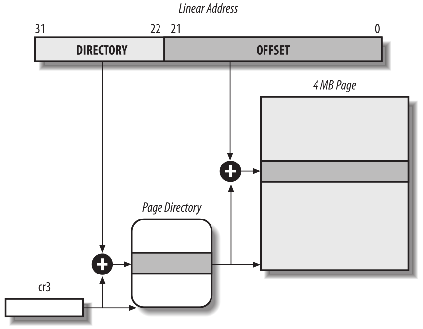
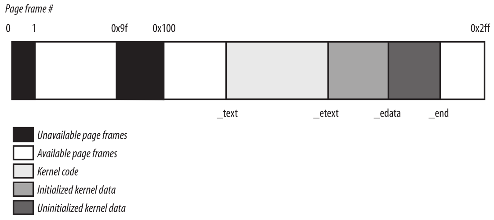

Memoria
=======
Trataremos las técnicas de direccionamiento. Afortunadamente, un sistema operativo no está obligado a realizar un seguimiento de la memoria física por sí mismo; Los microprocesadores actuales incluyen varios circuitos de hardware para hacer que la gestión de la memoria sea más eficiente y robusta, de modo que los errores de programación no puedan causar accesos indebidos a la memoria fuera del programa.

Veremos los detalles sobre cómo los microprocesadores 80x86 direccionan memoria y cómo Linux usa los circuitos de direccionamiento disponibles.

Direcciones de memoria
----------------------
Los programadores casualmente se refieren a una *dirección de memoria* como la forma de acceder al contenido de una celda de memoria. Pero cuando se trata de microprocesadores 80x86, tenemos que distinguir tres tipos de direcciones:

*Dirección lógica*
    Incluida en las instrucciones del lenguaje máquina para especificar la dirección de un operando o de una instrucción. Este tipo de dirección incorpora la conocida arquitectura segmentada del 80x86 que obliga a los programadores de Windows a dividir sus programas en segmentos. Cada dirección lógica consta de un *segmento* y un *desplazamiento* que indica la distancia desde el inicio del segmento hasta la dirección real.

*Dirección lineal (también conocida como dirección virtual)*
    Un único entero sin signo de 32 bits que se puede utilizar para direccionar hasta 4 GB, es decir, hasta 4.294.967.296 celdas de memoria. Las direcciones lineales generalmente se representan en notación hexadecimal; sus valores van desde 0x00000000 a 0xffffffff.

*Dirección física*
    Se utiliza para direccionar celdas de memoria en chips de memoria. Corresponden a las señales eléctricas enviadas a través de los pines de dirección del microprocesador al bus de memoria. Las direcciones físicas se representan como enteros sin signo de 32 o 36 bits.

La Unidad de Gestión de Memoria (MMU) transforma una dirección lógica en una dirección lineal por medio de un circuito de hardware denominado *unidad de segmentación*; posteriormente, un segundo circuito de hardware llamado *unidad de paginación* transforma la dirección lineal en una dirección física.

    Traducción de dirección lógica

En los sistemas multiprocesador, todas las CPU suelen compartir la misma memoria; esto significa que las CPU independientes pueden acceder simultáneamente a los chips de RAM. Debido a que las operaciones de lectura o escritura en un chip de RAM deben realizarse en serie, se inserta un circuito de hardware llamado *árbitro de memoria* entre el bus y cada chip de RAM. Su función es otorgar acceso a una CPU si el chip está libre y aplazarlo si el chip está ocupado atendiendo una solicitud de otro procesador. Incluso los sistemas de un solo procesador usan árbitros de memoria, porque incluyen procesadores especializados llamados *controladores DMA* que operan simultáneamente con la CPU.

Segmentación en hardware
------------------------
A partir del modelo 80286, los microprocesadores Intel realizan la traducción de direcciones de dos maneras diferentes, llamadas *modo real* y *modo protegido*. En las siguientes secciones nos centraremos en la traducción de direcciones cuando el modo protegido está habilitado. El modo real existe principalmente para mantener la compatibilidad del procesador con modelos más antiguos y para permitir que el sistema operativo se inicie.

Selectores de segmento y registros de segmentación
**************************************************
Una dirección lógica consta de dos partes: un identificador de segmento y un desplazamiento que especifica la dirección relativa dentro del segmento. El identificador de segmento es un campo de 16 bits denominado *Selector de Segmento*, mientras que el desplazamiento es un campo de 32 bits. Describiremos los campos de los selectores de segmento en la sección “Acceso rápido a los descriptores de segmento” más adelante.

    Formato del selector de segmento

Para facilitar la recuperación rápida de selectores de segmento, el procesador proporciona *registros de segmentación* cuyo único propósito es contener selectores de segmento; estos registros se denominan cs, ss, ds, es, fs y gs. Aunque solo hay seis de ellos, un programa puede reutilizar el mismo registro de segmentación para diferentes propósitos guardando su contenido en la memoria y luego restaurándolo más tarde.

Tres de los seis registros de segmentación tienen propósitos específicos:

- *cs* El registro de segmento de código, que apunta a un segmento que contiene instrucciones de programa
- *ss* El registro de segmento de pila, que apunta a un segmento que contiene la pila de programa actual
- *ds* El registro de segmento de datos, que apunta a un segmento que contiene datos globales y estáticos

Los tres registros de segmentación restantes son de propósito general y pueden referirse a segmentos de datos arbitrarios.

El registro cs tiene otra función importante: incluye un campo de 2 bits que especifica el nivel de privilegio actual (CPL) de la CPU. El valor 0 denota el nivel de privilegio más alto, mientras que el valor 3 denota el más bajo. Linux usa solo los niveles 0 y 3, que se denominan respectivamente Modo Kernel y Modo Usuario.

Descriptores de segmento
************************
Cada segmento está representado por un *descriptor de segmento* de 8 bytes que describe las características del segmento. Los descriptores de segmento se almacenan en la *tabla de descriptores globales* (GDT) o en la *tabla de descriptores locales* (LDT).

Por lo general, solo se define una GDT, mientras que a cada proceso se le permite tener su propia LDT si necesita crear segmentos adicionales además de los almacenados en la GDT. La dirección y el tamaño de la GDT en la memoria principal están contenidos en el registro de control *gdtr*, mientras que la dirección y el tamaño de la LDT utilizada actualmente están contenidos en el registro de control *ldtr*.

La figura 2-3 ilustra el formato de un descriptor de segmento; el significado de los diversos campos se explica en la tabla que sigue:

+----------+-----------------------------------+
| Campo    | Descripción                       |
+==========+===================================+
| Base     | Contiene la dirección lineal del  |
|          | primer byte del segmento.         |
+----------+-----------------------------------+
| G        | Bandera de granularidad: si se    |
|          | borra (igual a 0), el tamaño del  |
|          | segmento se expresa en bytes; de  |
|          | lo contrario, se expresa en       |
|          | múltiplos de 4096 bytes.          |
+----------+-----------------------------------+
| Limit    | Mantiene el desplazamiento de la  |
|          | última celda de memoria en el     |
|          | segmento, vinculando así la       |
|          | longitud del segmento. Cuando G   |
|          | se establece en 0, el tamaño de   |
|          | un segmento puede variar entre 1  |
|          | byte y 1 MB; de lo contrario,     |
|          | puede variar entre 4 KB y 4 GB.   |
+----------+-----------------------------------+
| S        | Indicador del sistema: si se      |
|          | borra, el segmento es un segmento |
|          | del sistema que almacena          |
|          | estructuras de datos críticas,    |
|          | como la tabla de descriptores     |
|          | locales; de lo contrario, es un   |
|          | código normal o un segmento de    |
|          | datos.                            |
+----------+-----------------------------------+
| Type     | Caracteriza el tipo de segmento y |
|          | sus derechos de acceso (ver el    |
|          | texto que sigue a esta tabla).    |
+----------+-----------------------------------+
| DPL      | Descriptor Nivel de Privilegio:   |
|          | utilizado para restringir los     |
|          | accesos al segmento. Representa   |
|          | el nivel mínimo de privilegio de  |
|          | CPU solicitado para acceder al    |
|          | segmento. Por lo tanto, solo se   |
|          | puede acceder a un segmento con   |
|          | su DPL establecido en 0 cuando el |
|          | CPL es 0, es decir, en modo       |
|          | Kernel, mientras que se puede     |
|          | acceder a un segmento con su DPL  |
|          | establecido en 3 con cada valor   |
|          | de CPL.                           |
+----------+-----------------------------------+
| P        | Indicador de segmento presente:   |
|          | es igual a 0 si el segmento no    |
|          | está almacenado actualmente en la |
|          | memoria principal. Linux siempre  |
|          | establece este indicador (bit 47) |
|          | en 1, porque nunca intercambia    |
|          | segmentos completos en el disco.  |
+----------+-----------------------------------+
| D o B    | Llamado D o B dependiendo de si   |
|          | el segmento contiene código o     |
|          | datos. Su significado es          |
|          | ligeramente diferente en los dos  |
|          | casos, pero básicamente se        |
|          | establece (igual a 1) si las      |
|          | direcciones utilizadas como       |
|          | desplazamientos de segmento       |
|          | tienen una longitud de 32 bits, y |
|          | se borra si tienen una longitud   |
|          | de 16 bits (consulte el manual de |
|          | Intel para obtener más detalles). |
+----------+-----------------------------------+
| AVL      | Puede ser utilizado por el        |
|          | sistema operativo, pero Linux lo  |
|          | ignora.                           |
+----------+-----------------------------------+

Hay varios tipos de segmentos y, por lo tanto, varios tipos de descriptores de segmento. La siguiente lista muestra los tipos que se usan ampliamente en Linux.

*Descriptor de segmento de código*
    Indica que el Descriptor de segmento hace referencia a un segmento de código; puede estar incluido en la GDT o en la LDT. El descriptor tiene el indicador S establecido (segmento que no es del sistema).
*Descriptor de segmento de datos*
    Indica que el Descriptor de segmento hace referencia a un segmento de datos; puede estar incluido en la GDT o en la LDT. El descriptor tiene el indicador S establecido. Los segmentos de pila se implementan mediante segmentos de datos genéricos.
*Descriptor de segmento de estado de tarea (TSSD)*
    Indica que el descriptor de segmento hace referencia a un segmento de estado de tarea (TSS), es decir, un segmento utilizado para guardar el contenido de los registros del procesador (consulte “Segmento de estado de tarea”); solo puede aparecer en la GDT. El campo Tipo correspondiente tiene el valor 11 o 9, dependiendo de si el proceso correspondiente se está ejecutando actualmente en una CPU. La bandera S de dichos descriptores se establece en 0.

..  figure:: ../images/memoria-figura-3-formato-descriptor-de-segmento.png
    :align: center
    :alt: Figura 3 - Formato del descriptor de segmento

    Figura 3 - Formato del descriptor de segmento

*Descriptor de tabla de descriptor local (LDTD)*
    Indica que el Descriptor de segmento hace referencia a un segmento que contiene una LDT; solo puede aparecer en la GDT. El campo Tipo correspondiente tiene el valor 2. El indicador S de dichos descriptores se establece en 0. La siguiente sección muestra cómo los procesadores 80x86 pueden decidir si un descriptor de segmento se almacena en la GDT o en la LDT del proceso.

Acceso Rápido a los Descriptores de Segmento
~~~~~~~~~~~~~~~~~~~~~~~~~~~~~~~~~~~~~~~~~~~~
Recordemos que las direcciones lógicas constan de un selector de segmento de 16 bits y un desplazamiento (offset) de 32 bits, y que los registros de segmentación almacenan únicamente el selector de segmento.

Para acelerar la traducción de direcciones lógicas en direcciones lineales, el procesador 80x86 proporciona un registro no programable adicional, es decir, un registro que no puede configurar un programador, por cada uno de los seis registros de segmentación programables. Cada registro no programable contiene el descriptor de segmento de 8 bytes (descrito anteriormente) especificado por el selector de segmento contenido en el registro de segmentación correspondiente. Cada vez que se carga un selector de segmento en un registro de segmentación, el descriptor de segmento correspondiente se carga desde la memoria en el registro no programable correspondiente de la CPU. A partir de ese momento, las traducciones de direcciones lógicas referidas a ese segmento se pueden realizar sin acceder a la GDT o LDT almacenada en la memoria principal; el procesador sólo puede referirse directamente al registro de la CPU que contiene el descriptor de segmento. Los accesos a GDT o LDT son necesarios solo cuando cambia el contenido de los registros de segmentación.

    Figura 4 - Selector y descriptor de segmento

Cualquier selector de segmento incluye tres campos que se describen en
la siguiente tabla.

+---------+-----------------------------------+
| Campo   | Descripción                       |
+=========+===================================+
| index   | Identifica la entrada del         |
|         | descriptor de segmento contenida  |
|         | en la GDT o en la LDT (descrita   |
|         | más adelante en el texto que      |
|         | sigue a esta tabla).              |
+---------+-----------------------------------+
| TI      | Indicador de Tabla: especifica si |
|         | el Descriptor de Segmento está    |
|         | incluido en la GDT (TI = 0) o en  |
|         | la LDT (TI = 1).                  |
+---------+-----------------------------------+
| RPL     | Nivel de privilegio del           |
|         | solicitante: especifica el nivel  |
|         | de privilegio actual de la CPU    |
|         | cuando el selector de segmento    |
|         | correspondiente se carga en el    |
|         | registro cs; también se puede     |
|         | usar para debilitar               |
|         | selectivamente el nivel de        |
|         | privilegio del procesador al      |
|         | acceder a segmentos de datos      |
|         | (consulte la documentación de     |
|         | Intel para obtener más detalles). |
+---------+-----------------------------------+

Dado que un descriptor de segmento tiene 8 bytes, su dirección relativa dentro de la GDT o la LDT se obtiene multiplicando el campo de índice de 13 bits del selector de segmento por 8. Por ejemplo, si la GDT está en 0x00020000 (el valor almacenado en la registro gdtr) y el índice especificado por el selector de segmento es 2, la dirección del descriptor de segmento correspondiente es 0x00020000 + (2 × 8), o 0x00020010.

La primera entrada de la GDT siempre se establece en 0. Esto garantiza que las direcciones lógicas con un selector de segmento nulo se considerarán no válidas, lo que provocará una excepción del procesador. El número máximo de descriptores de segmento que se pueden almacenar en la GDT es 8191 (es decir, 2\ :sup:`13`–1).

Unidad de segmentación
**********************
La figura 5 muestra en detalle cómo se traduce una dirección lógica en una dirección lineal correspondiente. La *unidad de segmentación* realiza las siguientes operaciones:

- Examina el campo TI del selector de segmento para determinar que tabla de descriptores almacena el descriptor de segmento. Este campo indica que el descriptor está en la GDT (en cuyo caso la unidad de    segmentación obtiene la dirección lineal base de la GDT del registro *gdtr*) o en la LDT activa (en cuyo caso la unidad de segmentación obtiene la dirección lineal base de esa LDT del registro *ldtr*).
- Calcula la dirección del descriptor de segmento a partir del campo *index* del selector de segmento. El campo de index se multiplica por 8 (el tamaño de un descriptor de segmento) y el resultado se suma al contenido del registro gdtr o ldtr.
- Agrega el desplazamiento de la dirección lógica al campo *Base* del descriptor de segmento, obteniendo así la dirección lineal.

..  figure:: ../images/memoria-figura-5-tracduccion-direccion-logica.png
    :align: center
    :alt: Figura 5 - Traduciendo una dirección lógica

    Figura 5 - Traduciendo una dirección lógica

Observe que, gracias a los registros no programables asociados con los registros de segmentación, las dos primeras operaciones deben realizarse solo cuando se ha cambiado un registro de segmentación.

Segmentación en Linux
---------------------
La segmentación se ha incluido en los microprocesadores de 80x86 para permitir a los programadores dividir sus aplicaciones en entidades relacionadas lógicamente, como subrutinas o áreas de datos globales y locales. Sin embargo, Linux utiliza la segmentación de forma muy limitada. De hecho, la segmentación y la paginación son un tanto redundantes, porque ambas se pueden usar para separar los espacios de direcciones físicas de los procesos: la segmentación puede asignar un espacio de direcciones lineal diferente a cada proceso, mientras que la paginación puede asignar el mismo espacio de direcciones lineales a diferentes espacios de direcciones físicas. Linux prefiere la paginación a la segmentación por las siguientes razones:

- La administración de la memoria es más simple cuando todos los procesos usan los mismos valores de registro de segmento, es decir, cuando comparten el mismo conjunto de direcciones lineales.
- Uno de los objetivos de diseño de Linux es la portabilidad a una amplia gama de arquitecturas; las arquitecturas RISC en particular tienen un soporte limitado para la segmentación.

La versión 2.6 de Linux usa la segmentación solo cuando lo requiere la arquitectura 80x86.
Todos los procesos de Linux que se ejecutan en modo de usuario utilizan el mismo par de segmentos para direccionar instrucciones y datos. Estos segmentos se denominan *segmento de código de usuario* y *segmento de datos de usuario*, respectivamente. De manera similar, todos los procesos de Linux que se ejecutan en Modo Kernel usan el mismo par de segmentos para direccionar instrucciones y datos: se denominan *segmento de código del kernel* y *segmento de datos del kernel*, respectivamente. La siguiente tabla muestra los valores de los campos del descriptor de segmento para estos cuatro segmentos cruciales.

=========== ========== = ======= = ==== === === =
Segment     Base       G Limit   S Type DPL D/B P
=========== ========== = ======= = ==== === === =
user code   0x00000000 1 0xfffff 1 10   3   1   1
user data   0x00000000 1 0xfffff 1 2    3   1   1
kernel code 0x00000000 1 0xfffff 1 10   0   1   1
kernel data 0x00000000 1 0xfffff 1 2    0   1   1
=========== ========== = ======= = ==== === === =

Los selectores de segmento correspondientes están definidos por las macros \__USER_CS, \__USER_DS, \__KERNEL_CS y \__KERNEL_DS, respectivamente. Para abordar el segmento de código del núcleo, por ejemplo, el núcleo simplemente carga el valor generado por la macro \__KERNEL_CS en el registro de segmentación cs.

Tenga en cuenta que todas las direcciones lineales asociadas con dichos segmentos comienzan en 0 y alcanzan el límite de direccionamiento de 2\ :sup:`32` - 1. Esto significa que todos los procesos, ya sea en Modo Usuario o en Modo Kernel, pueden usar las mismas direcciones lógicas.

Otra consecuencia importante de que todos los segmentos comiencen en 0x00000000 es que, en Linux, las direcciones lógicas coinciden con las direcciones lineales; es decir, el valor del campo *offset* de una dirección lógica siempre coincide con el valor de la dirección lineal correspondiente.

Como se indicó anteriormente, el nivel de privilegio actual de la CPU indica si el procesador está en modo de usuario o de kernel y se especifica mediante el campo RPL del selector de segmento almacenado en el registro cs. Cada vez que se cambia el CPL (nivel de privilegio actual), algunos registros de segmentación deben actualizarse correspondientemente. Por ejemplo, cuando el CPL es igual a 3 (Modo de usuario), el registro ds debe contener el Selector de segmento del segmento de datos del usuario, pero cuando el CPL es igual a 0, el registro ds debe contener el Selector de segmento del segmento de datos del kernel.

Una situación similar ocurre para el registro ss. Debe hacer referencia a una pila de modo usuario dentro del segmento de datos de usuario cuando la CPL es 3, y debe hacer referencia a una pila de modo kernel dentro del segmento de datos de kernel cuando la CPL es 0. Al cambiar de modo usuario a modo kernel, Linux siempre se asegura de que el registro ss contenga el Selector de segmento del segmento de datos del kernel.

Al guardar un puntero a una instrucción o a una estructura de datos, el núcleo no necesita almacenar el componente Selector de segmento de la dirección lógica, porque el registro ss contiene el selector de segmento actual. Como ejemplo, cuando el kernel invoca una función, ejecuta una instrucción call en lenguaje ensamblador que especifica solo el componente offset de su dirección lógica; el selector de segmento se selecciona implícitamente como aquel al que hace referencia el registro cs. Debido a que solo hay un segmento de tipo “ejecutable en modo kernel”, es decir, el segmento de código identificado por la macro \__KERNEL_CS, es suficiente cargar \__KERNEL_CS en cs cada vez que la CPU cambia al modo kernel. El mismo argumento se aplica a los punteros a estructuras de datos del kernel (usando implícitamente el registro ds), así como a los punteros a estructuras de datos del usuario (el kernel usa explícitamente el registro es).

Además de los cuatro segmentos que acabamos de describir, Linux hace uso de algunos otros segmentos especializados. Los presentaremos en la siguiente sección mientras describimos Linux GDT.

La GDT de Linux
***************
En los sistemas monoprocesador solo hay una GDT, mientras que en los sistemas multiprocesador hay una GDT para cada CPU del sistema. Todos los GDT se almacenan en el arreglo *cpu_gdt_table*, mientras que las direcciones y tamaños de los GDT (utilizados al inicializar los registros *gdtr*) se almacenan en el arreglo *cpu_gdt_descr*.

El diseño de los GDT se muestra esquemáticamente en la figura 6. Cada GDT incluye 18 descriptores de segmento y 14 entradas nulas, no utilizadas o reservadas. Las entradas no utilizadas se insertan a propósito para que los descriptores de segmento a los que normalmente se accede juntos se mantengan en la misma línea de 32 bytes del caché de hardware.

Los 18 descriptores de segmento incluidos en cada GDT apuntan a los siguientes segmentos:

- Cuatro segmentos de datos y código de usuario y kernel.
- Un Segmento de Estado de Tarea (TSS), diferente para cada procesador en el sistema. El espacio de direcciones lineales correspondiente a un TSS es un pequeño subconjunto del espacio de direcciones lineales correspondiente al segmento de datos del kernel. Los segmentos de estado de tareas se almacenan secuencialmente en el arreglo init_tss; en particular, el campo Base del 

    ..  figure:: ../images/memoria-figura-6-tabla-descriptor-global.png
        :align: center
        :alt: Figura 6 - Tabla de Descriptor Global

        Figura 6 - Tabla de Descriptor Global

  descriptor TSS para la n-ésima CPU apunta al n-ésimo componente de la matriz init_tss. El indicador G (granularidad) se borra, mientras que el campo Limit se establece en 0xeb, porque el segmento TSS tiene una longitud de 236 bytes. El campo Type se establece en 9 u 11 (si el proceso está ejecutando en la CPU o no) y el DPL se establece en 0, porque los procesos en modo de usuario no pueden acceder a los segmentos TSS.
- Un segmento que incluye la Tabla de descriptores locales (LDT) predeterminada, generalmente compartida por todos los procesos.
- Tres segmentos de Thread-Local Storage (TLS): este es un mecanismo que permite que las aplicaciones multiproceso hagan uso de hasta tres segmentos que contienen datos locales para cada hilo. Las llamadas al sistema set_thread_area() y get_thread_area(), respectivamente, crean y liberan un segmento TLS para el proceso de ejecución.
- Tres segmentos relacionados con la administración avanzada de energía (APM): el código del BIOS utiliza segmentos, por lo que cuando el controlador APM de Linux invoca las funciones del BIOS para obtener o establecer el estado de los dispositivos APM, puede usar códigos personalizados y segmentos de datos.
- Cinco segmentos relacionados con los servicios BIOS Plug and Play (PnP). Como en el caso anterior, el código del BIOS utiliza segmentos, por lo que cuando el controlador PnP de Linux invoca las funciones del BIOS para detectar los recursos utilizados por los dispositivos PnP, puede utilizar segmentos de datos y códigos personalizados.
- Un segmento TSS especial utilizado por el kernel para manejar las excepciones de “Doble falla”.

Como se indicó anteriormente, existe una copia de la GDT para cada procesador del sistema. Todas las copias de la GDT almacenan entradas idénticas, excepto en unos pocos casos. Primero, cada procesador tiene su propio segmento TSS, por lo que las entradas de GDT correspondientes difieren. Además, algunas entradas en la GDT pueden depender del proceso que está ejecutando la CPU (descriptores de segmento LDT y TLS). Finalmente, en algunos casos, un procesador puede modificar temporalmente una entrada en su copia de la GDT; esto sucede, por ejemplo, al invocar un procedimiento BIOS de APM.

Las LDT de Linux
****************
La mayoría de las aplicaciones del modo de usuario de Linux no utilizan una tabla de descriptores locales, por lo que el núcleo define una LDT predeterminada para que la compartan la mayoría de los procesos. La tabla de descriptores locales predeterminada se almacena en el arreglo *default_ldt*. Incluye cinco entradas, pero el núcleo solo utiliza dos de ellas.

En algunos casos, sin embargo, los procesos pueden requerir configurar su propia LDT. Esto resulta útil para las aplicaciones (como Wine) que ejecutan aplicaciones de Microsoft Windows orientadas a segmentos. La llamada al sistema *modify_ldt()* permite que un proceso haga esto.

Paginación en hardware
----------------------
La unidad de paginación traduce direcciones lineales en direcciones físicas. Una tarea clave en la unidad es comparar el tipo de acceso solicitado con los derechos de acceso de la dirección lineal. Si el acceso a la memoria no es válido, genera una excepción de falla de página.

En aras de la eficiencia, las direcciones lineales se agrupan en intervalos de longitud fija llamados *páginas*; las direcciones lineales contiguas dentro de una página se asignan a direcciones físicas contiguas. De esta forma, el kernel puede especificar la dirección física y los derechos de acceso por página en lugar de hacerlo por direcciones lineales incluidas en ella. Siguiendo la convención habitual, utilizaremos el término "página" para referirnos tanto a un conjunto de direcciones lineales como a los datos contenidos en este grupo de direcciones.

La unidad de paginación considera que toda la RAM está dividida en *marcos de página* de longitud fija (a veces denominados *páginas físicas* o *frames*). Cada marco de página contiene una página, es decir, la longitud de un marco de página coincide con la de una página. Un marco de página es un componente de la memoria principal y, por lo tanto, es un área de almacenamiento. Es importante distinguir una página de un marco de página; el primero es solo un bloque de datos, que puede almacenarse en cualquier marco de página o en disco.

Las estructuras de datos que asignan direcciones lineales a físicas se denominan *tablas de páginas*; se almacenan en la memoria principal y el kernel debe inicializarlos correctamente antes de habilitar la unidad de paginación.  A partir del 80386, todos los procesadores de 80x86 admiten paginación; se habilita configurando la bandera PG de un registro de control llamado cr0. Cuando PG = 0, las direcciones lineales se interpretan como direcciones físicas.

Paginación Regular
******************

A partir del 80386, la unidad de paginación de los procesadores Intel maneja páginas de 4 KB.

Los 32 bits de una dirección lineal se dividen en tres campos:

*Directorio*
    Los 10 bits más significativos

*Tabla*
    Los 10 bits intermedios

*Desplazamiento*
    Los 12 bits menos significativos

La traducción de direcciones lineales se realiza en dos pasos, cada uno basado en un tipo de tabla de traducción. La primera tabla de traducción se llama *Directorio de Páginas* y la segunda se llama *Tabla de Páginas*.

El objetivo de este esquema de dos niveles es reducir la cantidad de RAM requerida para las tablas de páginas por proceso. Si se usara una tabla de páginas simple de un nivel, se requerirían hasta 2\ :sup:`20` entradas (es decir, a 4 bytes por entrada, 4 MB de RAM) para representar la tabla de páginas para cada proceso (si el proceso usa un espacio de 4 GB de direcciones lineales), aunque un proceso no utiliza todas las direcciones en ese rango. El esquema de dos niveles reduce la memoria al requerir tablas de página solo para aquellas regiones de memoria virtual que un proceso realmente usa.

Cada proceso activo debe tener asignado un directorio de páginas. Sin embargo, no es necesario asignar RAM para todas las tablas de página de un proceso a la vez; es más eficiente asignar RAM para una tabla de páginas solo cuando el proceso realmente lo necesita.

La dirección física del directorio de páginas en uso se almacena en un registro de control llamado *cr3*. El campo *Directorio* dentro de la dirección lineal determina la entrada en el Directorio de Páginas que apunta a la Tabla de Páginas adecuada. El campo *Tabla* de la dirección, a su vez, determina la entrada en la Tabla de Páginas que contiene la dirección física del marco de página que contiene la página. El campo *Desplazamiento* determina la posición relativa dentro del marco de página (Figura 7). Debido a que tiene una longitud de 12 bits, cada página consta de 4096 bytes de datos. 

..  figure:: ../images/memoria-figura-7-paginacion-procesadores-80x86.png
    :align: center
    :alt: Figura 7 - Paginación en procesadores 80x86

    Figura 7 - Paginación en procesadores 80x86

Los campos *Directorio* y *Tabla* tienen una longitud de 10 bits, por lo que los directorios de páginas y las tablas de páginas pueden incluir hasta 1024 entradas. De ello se deduce que un directorio de páginas puede direccionar hasta 1024 × 1024 × 4096 = 2\ :sup:`32` celdas de memoria, como cabría esperar en direcciones de 32 bits.

Las entradas de Directorios de páginas y Tablas de páginas tienen la misma estructura. Cada entrada incluye los siguientes campos:

*Flag Presente*
    Si está seteado, la página a la que se hace referencia (o tabla de páginas) está en la memoria principal; si el indicador es 0, la página no está en la memoria principal y el sistema operativo puede utilizar los bits de entrada restantes para sus propios fines. Si la entrada de una tabla de páginas o un directorio de páginas necesario para realizar una traducción de direcciones tiene el indicador Presente en cero, la unidad de paginación almacena la dirección lineal en un registro de control llamado cr2 y genera la excepción 14 de falla de página.

*Campo con los 20 bits más significativos de una dirección física de marco de página*
    Debido a que cada marco de página tiene una capacidad de 4 KB, su dirección física debe ser un múltiplo de 4096, por lo que los 12 bits menos significativos de la dirección física son siempre iguales a 0. Si el campo se refiere a un directorio de páginas, el marco de la página físico contiene una tabla de páginas; si se refiere a una tabla de páginas, el marco de página físico contiene una página de datos.

*Flag Accedido*
    Seteado cada vez que la unidad de paginación direcciona al marco de página correspondiente. El sistema operativo puede utilizar este indicador al seleccionar las páginas que se van a intercambiar. La unidad de paginación nunca restablece esta bandera; esto debe hacerlo el sistema operativo.

*Flag Sucio*
    Se aplica solo a las entradas de la tabla de páginas. Se establece cada vez que se realiza una operación de escritura en el marco de la página. Al igual que con el indicador Accedido, el sistema operativo puede usar Sucio al seleccionar las páginas que se intercambiarán. La unidad de paginación nunca restablece esta bandera; esto debe hacerlo el sistema operativo.

*Flag de lectura/escritura*
    Contiene el derecho de acceso (lectura/escritura o lectura) de la página o de la tabla de páginas (consulte la sección “Esquema de protección de hardware” más adelante).

*Indicador de usuario/supervisor*
    Contiene el nivel de privilegio necesario para acceder a la página o tabla de páginas (consulte la sección posterior “Esquema de protección de hardware”).

*Indicadores PCD y PWT*
    Controlan la forma en que la caché de hardware maneja la página o la tabla de páginas (consulte la sección “Caché de hardware” más adelante).

*Indicador de tamaño de página*
    Se aplica solo a las entradas del directorio de páginas. Si está configurado, la entrada se refiere a un marco de página de 2 MB o 4 MB (consulte las siguientes secciones).

*Indicador Global*
    Se aplica solo a las entradas de la tabla de páginas. Este indicador se introdujo en el Pentium Pro para evitar que las páginas de uso frecuente se eliminen de la memoria caché TLB (consulte la sección “Búferes de búsqueda de traducción (TLB)” más adelante). Funciona solo si se establece el indicador de Habilitación global de página (PGE) del registro cr4.

Paginación extendida
********************
Comenzando con el modelo Pentium, los microprocesadores 80x86 introducen la *paginación extendida*, que permite que los marcos de página tengan un tamaño de 4 MB en lugar de 4 KB (Figura 8). La paginación extendida se utiliza para traducir grandes rangos de direcciones lineales contiguas en los correspondientes físicos; en estos casos, el núcleo puede prescindir de las tablas de páginas intermedias y, por lo tanto, ahorrar memoria y preservar las entradas de TLB.

    Figura 8 - Paginación extendida

Como se mencionó en la sección anterior, la paginación extendida se habilita configurando el indicador Tamaño de página de una entrada del Directorio de páginas. En este caso, la unidad de paginación divide los 32 bits de una dirección lineal en dos campos:

*Directorio*
    Los 10 bits más significativos

*Desplazamiento*
    Los 22 bits restantes

Las entradas del Pirectorio de Páginas para la paginación extendida son las mismas que para la paginación normal, excepto que:

-  El indicador de *Tamaño de Página* debe estar seteado.
-  Sólo los 10 bits más significativos del campo de dirección física de 20 bits son significativos. Esto se debe a que cada dirección física está alineada en un límite de 4 MB, por lo que los 22 bits menos significativos de la dirección son 0.

La paginación extendida coexiste con la paginación normal; se habilita configurando el indicador PSE del registro del procesador *cr4*.

Esquema de protección de hardware
*********************************
La unidad de paginación utiliza un esquema de protección diferente al de la unidad de segmentación. Si bien los procesadores de 80x86 permiten cuatro posibles niveles de privilegios para un segmento, solo dos niveles de privilegios están asociados con paginaciones y tablas de paginación, porque los privilegios están controlados por el indicador de usuario/supervisor mencionado anteriormente en “Paginación Regular”. Cuando este indicador es 0, la página se puede direccionar solo cuando el CPL es inferior a 3 (esto significa, para Linux, cuando el procesador está en Modo Kernel). Cuando la bandera es 1, la página siempre puede ser direccionada.

Además, en lugar de los tres tipos de derechos de acceso (Lectura, Escritura y Ejecución) asociados con los segmentos, solo dos tipos de derechos de acceso (Lectura y Escritura) están asociados con las páginas. Si el indicador de lectura/escritura de una entrada del Directorio de páginas o de la Tabla de páginas es igual a 0, la Tabla de páginas o la página correspondiente solo se puede leer; de lo contrario, se puede leer y escribir.

Un ejemplo de paginación regular
********************************

Un ejemplo simple ayudará a aclarar cómo funciona la paginación regular. Supongamos que el kernel asigna el espacio de direcciones lineales entre 0x20000000 y 0x2003ffff a un proceso en ejecución. Este espacio consta de exactamente 64 páginas. No nos importan las direcciones físicas de los marcos de página que contienen las páginas; de hecho, es posible que algunos de ellos ni siquiera estén en la memoria principal. Solo nos interesan los campos restantes de las entradas de la tabla de páginas.

Comencemos con los 10 bits más significativos de las direcciones lineales asignadas al proceso, que la unidad de paginación interpreta como el campo *Directorio*. Las direcciones comienzan con un 2 seguido de ceros, por lo que los 10 bits tienen todos el mismo valor, es decir, 0x080 o 128 decimal. Por lo tanto, el campo *Directorio* en todas las direcciones se refiere a la entrada 129 del *Directorio de páginas* del proceso. La entrada correspondiente debe contener la dirección física de la *Tabla de Páginas* asignada al proceso (Figura 9). Si no se asignan otras direcciones lineales al proceso, las 1023 entradas restantes del directorio de páginas se rellenan con ceros.

    Figura 9 - Ejemplo de paginación

Los valores que asumen los 10 bits intermedios (es decir, los valores del campo Tabla) oscilan entre 0 y 0x03f, o entre 0 y 63 decimales. Por lo tanto, solo las primeras 64 entradas de la tabla de páginas son válidas. Las 960 entradas restantes se rellenan con ceros.

Suponga que el proceso necesita leer el byte en la dirección lineal 0x20021406. Esta dirección es manejada por la unidad de paginación de la siguiente manera:

1. El campo *Directorio* 0x80 (0010000000 binario) se usa para seleccionar la entrada 0x80 del *Directorio de Páginas*, que apunta a la *Tabla de Páginas* asociada con las páginas del proceso.
2. El campo *Tabla* 0x21 se utiliza para seleccionar la entrada 0x21 de la *Tabla de Páginas*, que apunta al marco de página que contiene la página deseada.
3. Finalmente, el campo *offset* 0x406 se usa para seleccionar el byte en el desplazamiento 0x406 en el marco de página deseado.

Si el indicador *Presente* de la entrada 0x21 de la *Tabla de Páginas* está seteado en 0, la página no está presente en la memoria principal; en este caso, la unidad de paginación emite una excepción de *fallo de página* mientras traduce la dirección lineal. La misma excepción se emite cada vez que el proceso intenta acceder a direcciones lineales fuera del intervalo delimitado por 0x20000000 y 0x2003ffff, porque las entradas de la *Tabla de Páginas* no asignadas al proceso se rellenan con ceros; en particular, se borran todos sus indicadores *Presente*.

El mecanismo de paginación de extensión de dirección física (PAE)
*****************************************************************
La cantidad de RAM admitida por un procesador está limitada por la cantidad de pines de dirección conectados al bus de direcciones. Los procesadores Intel más antiguos, desde el 80386 hasta el Pentium, usaban direcciones físicas de 32 bits. En teoría, se podrían instalar hasta 4 GB de RAM en tales sistemas; en la práctica, debido a los requisitos de espacio de direcciones lineales de los procesos de usuario, el kernel no puede abordar directamente más de 1 GB de RAM.

Sin embargo, los servidores grandes que necesitan ejecutar cientos o miles de procesos al mismo tiempo requieren más de 4 GB de RAM, y en los últimos años esto creó una presión sobre Intel para expandir la cantidad de RAM admitida en la arquitectura 80x86 de 32 bits. Intel ha satisfecho estas solicitudes aumentando el número de pines de dirección en sus procesadores de 32 a 36.

Comenzando con el Pentium Pro, todos los procesadores Intel ahora pueden direccionar hasta 2\ :sup:`36` = 64 GB de RAM. Sin embargo, el mayor rango de direcciones físicas solo se puede aprovechar introduciendo un nuevo mecanismo de paginación que traduce las direcciones lineales de 32 bits en direcciones físicas de 36 bits. Con el procesador Pentium Pro, Intel introdujo un mecanismo llamado Extensión de Dirección Física (PAE). Otro mecanismo, Page Size Extension (PSE-36), se introdujo en el procesador Pentium III, pero Linux no lo usa y no lo discutiremos.

PAE se activa configurando el indicador de Extensión de Dirección Física (PAE) en el registro de control *cr4*. El indicador Tamaño de página (PS) en la entrada del directorio de páginas permite tamaños de página grandes (2 MB cuando PAE está habilitado).

Intel ha cambiado el mecanismo de paginación para admitir PAE.

- Los 64 GB de RAM se dividen en 2\ :sup:`24` marcos de página distintos y el campo de dirección física de las entradas de la *Tabla de Páginas* se ha ampliado de 20 a 24 bits. Debido a que una entrada de la *Tabla de Páginas* PAE debe incluir los 12 bits de flags y los 24 bits de dirección física, para un total general de 36, el tamaño de entrada de la *Tabla de Páginas* se ha duplicado de 32 a 64 bits. Como resultado, una *Tabla de Páginas* PAE de 4 KB incluye 512 entradas en lugar de 1024 debido a que el tamaño de cada tabla no cambia (no olvidemos que la dirección lineal sigue siendo de 32 bits).
- Se ha introducido un nuevo nivel de *Tabla de Páginas* denominado *Tabla de Puntero de Directorio de Página* (PDPT) que consta de cuatro entradas de 64 bits.
- El registro de control *cr3* contiene un campo de dirección base de *Tabla de Puntero de Directorio de Páginas* (PDPT) de 27 bits. Debido a que los PDPT se almacenan en los primeros 4 GB de RAM y se alinean con un múltiplo de 32 bytes (25), 27 bits son suficientes para representar la dirección base de dichas tablas.
- Cuando se asignan direcciones lineales a páginas de 4 KB (indicador PS en 0 en la entrada del *Directorio de Páginas*), los 32 bits de una dirección lineal se interpretan de la siguiente manera:

 *cr3*
  Apunta a un PDPT
 *bits 31–30*
  Apunta a 1 de 4 entradas posibles en PDPT
 *bits 29–21*
  Apunta a 1 de 512 entradas posibles en Page Directory
 *bits 20–12*
  Apuntan a 1 de 512 entradas posibles en Page Table
 *bits 11–0*
  Desplazamiento de página de 4 KB

- Al mapear direcciones lineales a páginas de 2 MB, (PS en 1 en la entrada del *Directorio de Páginas*) los 32 bits de una dirección lineal se interpretan de la siguiente manera:

 *cr3*
  Apunta a un PDPT
 *bits* 31–30
  Apunta a 1 de 4 entradas posibles en PDPT
 *bits* 29–21
  Apunta a 1 de 512 posibles entradas en Page Directory
 *bits* 20–0
  Desplazamiento de página de 2 MB

Para resumir, una vez que se configura *cr3*, es posible direccionar hasta 4 GB de RAM. Si queremos abordar más RAM, tendremos que poner un nuevo valor en *cr3* o cambiar el contenido del PDPT. Sin embargo, el principal problema con PAE es que las direcciones lineales todavía tienen una longitud de 32 bits. Esto obliga a los programadores del kernel a reutilizar las mismas direcciones lineales para mapear diferentes áreas de RAM. Claramente, PAE no amplía el espacio de direcciones lineales de un proceso, porque solo trata con direcciones físicas. Además, solo el kernel puede modificar las tablas de páginas de los procesos, por lo que un proceso que se ejecuta en modo de usuario no puede utilizar un espacio de direcciones físicas superior a 4 GB. Por otro lado, PAE permite que el kernel explote hasta 64 GB de RAM y, por lo tanto, aumente significativamente la cantidad de procesos en el sistema.

Paginación para arquitecturas de 64 bits
****************************************
Como hemos visto en las secciones anteriores, los microprocesadores de 32 bits suelen utilizar la paginación de dos niveles. Sin embargo, la paginación de dos niveles no es adecuada para computadoras que adoptan una arquitectura de 64 bits. Usemos un experimento para explicar por qué:

Comience suponiendo un tamaño de página estándar de 4 KB. Dado que 1 KB cubre un rango de 2\ :sup:`10` direcciones, 4 KB cubre 2\ :sup:`12` direcciones, por lo que el campo *Desplazamiento* tiene 12 bits. Esto deja hasta 52 bits de la dirección lineal para ser distribuidos entre los campos de tabla y directorio. Si ahora decidimos usar solo 48 de los 64 bits para el direccionamiento (¡esta restricción nos deja con un cómodo espacio de direcciones de 256 TB!), los 48-12 = 36 bits restantes deberán dividirse entre los campos *Tabla* y *Directorio*. Si ahora decidimos reservar 18 bits para cada uno de estos dos campos, tanto el directorio de páginas como las *Tablas de Páginas* de cada proceso deberían incluir 2\ :sup:`18` entradas, es decir, más de 256000 entradas.  Por esa razón, todos los sistemas de paginación de hardware para procesadores de 64 bits utilizan niveles de paginación adicionales. El número de niveles utilizados depende del tipo de procesador. La siguiente tabla resume las principales características de los sistemas de paginación de hardware utilizados por algunas plataformas de 64 bits compatibles con Linux.

+-------------+-------------+-------------+-------------+-------------+
| Plataforma  | Tamaño      | Bits        | Número      | Dirección   |
|             | Página      | direcciones | niveles     | lineal      |
+=============+=============+=============+=============+=============+
| alpha       | 8 KB a      | 43          | 3           | 10 + 10 +10 |
|             |             |             |             | + 13        |
+-------------+-------------+-------------+-------------+-------------+
| ia64        | 4 KB a      | 39          | 3           | 9 + 9 + 9 + |
|             |             |             |             | 12          |
+-------------+-------------+-------------+-------------+-------------+
| ppc64       | 4 KB        | 41          | 3           | 10 + 10 + 9 |
|             |             |             |             | + 12        |
+-------------+-------------+-------------+-------------+-------------+
| sh64        | 4 KB        | 41          | 3           | 10 + 10 + 9 |
|             |             |             |             | + 12        |
+-------------+-------------+-------------+-------------+-------------+
| x86_64      | 4 KB        | 48          | 4           | 9 + 9 + 9 + |
|             |             |             |             | 9 + 12      |
+-------------+-------------+-------------+-------------+-------------+

Como veremos en la sección “Paginación en Linux” más adelante, Linux logra proporcionar un modelo de paginación común que se adapta a la mayoría de los sistemas de paginación de hardware admitidos.

Caché de hardware
*****************
Los microprocesadores de hoy en día tienen velocidades de reloj de varios gigahercios, mientras que los chips de RAM dinámica (DRAM) tienen tiempos de acceso en el rango de cientos de ciclos de reloj. Esto significa que la CPU puede retrasarse considerablemente mientras ejecuta instrucciones que requieren obtener operandos de la RAM y/o almacenar resultados en la RAM.

Las memorias caché de hardware se introdujeron para reducir la diferencia de velocidad entre la CPU y la RAM. Se basan en el conocido *principio de localidad*, que se aplica tanto a los programas como a las estructuras de datos. Esto establece que, debido a la estructura cíclica de los programas y al empaquetamiento de los datos relacionados en arreglos lineales, las direcciones cercanas a las utilizadas más recientemente tienen una alta probabilidad de ser utilizadas en un futuro cercano. Por lo tanto, tiene sentido introducir una memoria más pequeña y rápida que contenga el código y los datos utilizados más recientemente. Para ello se introdujo en la arquitectura 80x86 una nueva unidad denominada *línea*. Consiste en unas pocas docenas de bytes contiguos que se transfieren en ráfagas entre la DRAM lenta y la RAM estática rápida (SRAM) que se utiliza para implementar caché.

El caché se subdivide en subconjuntos de líneas. En un extremo, la memoria caché se puede *mapear directamente*, en cuyo caso una línea en la memoria principal siempre se almacena exactamente en la misma ubicación en la memoria caché. En el otro extremo, la memoria caché es *totalmente asociativa*, lo que significa que cualquier línea de la memoria se puede almacenar en cualquier ubicación de la memoria caché. Pero la mayoría de los cachés son hasta cierto punto *asociativos de conjuntos de N vías*, donde cualquier línea de la memoria principal se puede almacenar en cualquiera de las N líneas del caché. Por ejemplo, una línea de memoria se puede almacenar en dos líneas diferentes de una memoria caché asociativa de conjunto bidireccional.

Como se muestra en la figura 10, la unidad de caché se inserta entre la unidad de paginación y la memoria principal. Incluye una memoria *caché de hardware* y un *controlador de caché*. La memoria caché almacena las líneas reales de memoria. El controlador de caché almacena una matriz de entradas, una entrada para cada línea de la memoria caché. Cada entrada incluye una etiqueta y algunas banderas que describen el estado de la línea de caché. La etiqueta consta de algunos bits que permiten que el controlador de caché reconozca la ubicación de memoria asignada actualmente por la línea. Los bits de la dirección física de la memoria generalmente se dividen en tres grupos: los más significativos corresponden a la etiqueta, los del medio al índice del subconjunto del controlador de caché y los menos significativos al desplazamiento dentro de la línea.

    Figura 10 - Caché de hardware del procesador

Al acceder a una celda de memoria RAM, la CPU extrae el índice del subconjunto de la dirección física y compara las etiquetas de todas las líneas del subconjunto con los bits de orden superior de la dirección física. Si se encuentra una línea con la misma etiqueta que los bits de orden superior de la dirección, la CPU tiene un *acierto de caché (cache hit)*; de lo contrario, tiene un *fallo de caché (cache miss)*.

Cuando se produce un acierto de caché, el controlador de caché se comporta de manera diferente, según el tipo de acceso. Para una operación de lectura, el controlador selecciona los datos de la línea de caché y los transfiere a un registro de la CPU; no se accede a la RAM y la CPU ahorra tiempo, por eso se inventó el sistema de caché. Para una operación de escritura, el controlador puede implementar una de dos estrategias básicas llamadas *escritura simultánea (write-through)* y *escritura diferida (write-back)*. En una escritura simultánea, el controlador siempre escribe tanto en la RAM como en la línea de caché, apagando efectivamente la memoria caché para las operaciones de escritura. En una escritura diferida, que ofrece una eficiencia más inmediata, solo se actualiza la línea de caché y el contenido de la RAM permanece sin cambios. Después de una escritura diferida, por supuesto, la RAM debe actualizarse eventualmente. El controlador de caché vuelve a escribir la línea de caché en la RAM solo cuando la CPU ejecuta una instrucción que requiere vaciar las entradas de caché o cuando se produce una señal de hardware FLUSH (generalmente después de un fallo de caché).

Cuando ocurre un fallo de caché, la línea de caché se escribe en la memoria, si es necesario, y la línea correcta se obtiene de la RAM en la entrada de caché. Los sistemas multiprocesador tienen una memoria caché de hardware separada para cada procesador y, por lo tanto, necesitan circuitos de hardware adicionales para sincronizar el contenido de la memoria caché. Como se muestra en la figura 11, cada CPU tiene su propio caché de hardware local. Pero ahora la actualización requiere más tiempo: cada vez que una CPU modifica su caché de hardware, debe verificar si los mismos datos están contenidos en el otro caché de hardware; si es así, debe notificar a la otra CPU para actualizarlo con el valor adecuado. Esta actividad a menudo se denomina *espionaje de caché (cache snooping)*. Afortunadamente, todo esto se hace a nivel de hardware y no involucra al kernel.

    Figura 11 - Caché en procesadores duales

La tecnología de caché está evolucionando rápidamente. Por ejemplo, los primeros modelos de Pentium incluían un solo caché en chip llamado *caché L1*. Los modelos más recientes también incluyen otros cachés en chip más grandes y lentos llamados *caché L2*, *caché L3*, etc. La coherencia entre los niveles de caché se implementa a nivel de hardware. Linux ignora estos detalles de hardware y asume que hay un solo caché.

La bandera CD del registro del procesador *cr0* se usa para habilitar o deshabilitar el circuito de caché. El indicador NW, en el mismo registro, especifica si se utiliza la estrategia de escritura simultánea o de escritura diferida para las cachés.

Otra característica interesante del caché de Pentium es que permite que un sistema operativo asocie una política de administración de caché diferente con cada marco de página. Para este propósito, cada Directorio de Páginas y cada entrada de la Tabla de Páginas incluye dos indicadores: PCD (Deshabilitar Caché de Página - Page Cache Disable), que especifica si el caché debe estar habilitado o deshabilitado al acceder a los datos incluidos en el marco de la página; y PWT (Escritura Simultánea de Página - Page Write-Through), que especifica si se debe aplicar la estrategia de escritura diferida o simultánea mientras se escriben datos en el marco de la página. Linux borra los indicadores PCD y PWT de todas las entradas del directorio de páginas y de la tabla de páginas; como resultado, el almacenamiento en caché está habilitado para todos los marcos de página y siempre se adopta la estrategia de escritura diferida para la escritura.

Búfer de Traducción Anticipada (TLB)
************************************
Además de las memorias caché de hardware de uso general, los procesadores 80x86 incluyen otra memoria caché denominada *Translation Lookaside Buffers (TLB)* para acelerar la traducción lineal de direcciones. Cuando se usa una dirección lineal por primera vez, la dirección física correspondiente se calcula a través de accesos lentos a las tablas de páginas en la RAM. Luego, la dirección física se almacena en una entrada TLB para que se puedan traducir rápidamente en sucesivas referencias a la misma dirección lineal.

En un sistema multiprocesador, cada CPU tiene su propia TLB, denominada *TLB local* de la CPU. A diferencia de la caché de hardware, no es necesario sincronizar las entradas correspondientes de la TLB, porque los procesos que se ejecutan en las CPUs existentes pueden asociar la misma dirección lineal con direcciones físicas diferentes.

Cuando se modifica el registro de control *cr3* de una CPU, el hardware invalida automáticamente todas las entradas de la TLB local, porque se está utilizando un nuevo conjunto de tablas de páginas y las TLB apuntan a datos antiguos.

Paginación en Linux
-------------------
Linux adopta un modelo de paginación común que se adapta a las arquitecturas de 32 y 64 bits. Como se explicó en la sección anterior “Paginación para arquitecturas de 64 bits”, dos niveles de paginación son suficientes para arquitecturas de 32 bits, mientras que las arquitecturas de 64 bits requieren una mayor cantidad de niveles de paginación. Hasta la versión 2.6.10, el modelo de paginación de Linux constaba de tres niveles de paginación. A partir de la versión 2.6.11, se ha adoptado un modelo de paginación de cuatro niveles. Los cuatro tipos de tablas de página que se ilustran en la figura 13 se denominan:

- Directorio Global de Página
- Directorio Superior de Página
- Directorio Intermedio de Página
- Tabla de Página

El Directorio Global incluye las direcciones de varios Directorios Superiores de Página, que a su vez incluyen las direcciones de varios Directorios Intermedios de Página, que a su vez incluyen las direcciones de varias Tablas de Página. Cada entrada de la Tabla de Páginas apunta a un marco de página. Por lo tanto, la dirección lineal se puede dividir en hasta cinco partes. La figura 12 no muestra los números de bits, porque el tamaño de cada parte depende de la arquitectura de la computadora.

Para arquitecturas de 32 bits sin Extensión de Dirección Física, dos niveles de paginación son suficientes. Linux esencialmente elimina los campos Directorio Superior de Página y Directorio Intermedio de Página diciendo que contienen ceros. Sin embargo, las posiciones del Directorio Superior de Página y el Directorio Intermedio de Página en la secuencia de punteros se mantienen para que el mismo código pueda funcionar en arquitecturas de 32 y 64 bits. El núcleo mantiene una posición para el Directorio Superior de Página y el Directorio Intermedio de Página estableciendo el número de entradas en ellos en 1 y mapeando estas dos entradas en la entrada adecuada del Directorio Global de Página.

    Figura 12 - Modelo de paginación de Linux

Para arquitecturas de 32 bits con la Extensión de Dirección Física habilitada, se utilizan tres niveles de paginación. El Directorio Global de Páginas de Linux corresponde a la tabla de punteros del Directorio de Páginas de 80x86, el Directorio Superior de Páginas se elimina, el Directorio Medio de Páginas corresponde al Directorio de Páginas de 80x86 y la Tabla de Páginas de Linux corresponde a la Tabla de Páginas de 80x86.

Finalmente, para arquitecturas de 64 bits, se utilizan tres o cuatro niveles de paginación según la división de bits de dirección lineal realizada por el hardware.

El manejo de procesos de Linux depende en gran medida de la paginación. De hecho, la traducción automática de direcciones lineales a físicas hace factibles los siguientes objetivos de diseño:

- Asignar un espacio de direcciones físicas diferente a cada proceso, asegurando una protección eficiente contra errores de direccionamiento.
- Distinguir páginas (grupos de datos) de marcos de página (direcciones físicas en la memoria principal). Esto permite que la misma página se almacene en un marco de página, luego se guarde en el disco y luego se vuelva a cargar en un marco de página diferente. Este es el ingrediente básico del mecanismo de la memoria virtual.

Como veremos más adelante, cada proceso tiene su propio Directorio Global de Páginas y su propio conjunto de Tablas de Páginas. Cuando ocurre un cambio de proceso, Linux guarda el registro de control *cr3* en el descriptor del proceso previamente en ejecución y luego carga *cr3* con el valor almacenado en el descriptor del próximo proceso a ejecutar. Por lo tanto, cuando el nuevo proceso reanuda su ejecución en la CPU, la unidad de paginación hace referencia al conjunto correcto de tablas de páginas.  El mapeo de direcciones lineales a físicas ahora se convierte en una tarea mecánica, aunque todavía algo compleja.

Distribución de memoria física
******************************

Durante la fase de inicialización, el kernel debe crear un mapa de direcciones físicas que especifique qué rangos de direcciones físicas son utilizables por él mismo y cuáles no están disponibles (ya sea porque asignan la memoria compartida de E/S de los dispositivos de hardware o porque los marcos de página correspondientes contienen datos del BIOS).

El kernel considera reservados los siguientes marcos de página:

- Aquellos que se encuentran en los rangos de direcciones físicas no disponibles
- Aquellos que contienen el código del kernel y estructuras de datos inicializadas.

Una página contenida en un marco de página reservado nunca puede asignarse ni intercambiarse dinámicamente al disco.

Por regla general, el kernel de Linux se instala en la RAM a partir de la dirección física 0x00100000, es decir, a partir del segundo megabyte. El número total de marcos de página necesarios depende de cómo esté configurado el kernel. Una configuración típica produce un kernel que se puede cargar en menos de 3 MB de RAM.

¿Por qué no se carga el kernel comenzando con el primer megabyte de RAM disponible? Bueno, la arquitectura de la PC tiene varias peculiaridades que hay que tener en cuenta. Por ejemplo:

- El BIOS utiliza el marco de página 0 para almacenar la configuración de hardware del sistema detectada durante la autoprueba de encendido (POST); Además, la BIOS de muchos portátiles escribe datos en este marco de página incluso después de inicializar el sistema.
- Las direcciones físicas que van desde 0x000a0000 a 0x000fffff generalmente se reservan para rutinas de BIOS y para asignar la memoria interna de las tarjetas gráficas ISA. Esta zona es el conocido hueco de 640 KB a 1 MB en todos los PC compatibles con IBM: las direcciones físicas existen pero están reservadas y el sistema operativo no puede utilizar los marcos de página correspondientes.
- Modelos de computadora específicos pueden reservar marcos de página adicionales dentro del primer megabyte. Por ejemplo, IBM ThinkPad asigna el marco de página 0xa0 al 0x9f.

En la primera etapa de la secuencia de arranque, el kernel consulta el BIOS para conocer el tamaño de la memoria física. En las computadoras más recientes, el kernel también invoca un procedimiento de BIOS para crear una lista de rangos de direcciones físicas y sus correspondientes tipos de memoria.

Luego el kernel ejecuta la función *machine_specific_memory_setup()*, que construye el mapa de direcciones físicas (ver tabla). Por supuesto, el kernel crea esta tabla basándose en la lista del BIOS, si está disponible; de lo contrario, el kernel crea la tabla siguiendo la configuración conservadora predeterminada: todos los marcos de página con números desde 0x9f (LOWMEMSIZE()) hasta 0x100 (HIGH_MEMORY) se marcan como reservados.

+-----------+-----------+-----------+
|Inicia     |Finaliza   |Tipo       |
+===========+===========+===========+
|0x00000000 |0x0009ffff |Utilizable |
+-----------+-----------+-----------+
|0x000f0000 |0x000fffff |Reservado  |
+-----------+-----------+-----------+
|0x00100000 |0x07feffff |Utilizable |
+-----------+-----------+-----------+
|0x07ff0000 |0x07ff2fff |ACPI Data  |
+-----------+-----------+-----------+
|0x07ff3000 |0x07ffffff |ACPI NVS   |
+-----------+-----------+-----------+
|0xffff0000 |0xffffffff |Reservado  |
+-----------+-----------+-----------+

En la tabla anterior se muestra una configuración típica para una computadora con 128 MB de RAM. El rango de direcciones físicas de 0x07ff0000 a 0x07ff2fff almacena información sobre los dispositivos de hardware del sistema escrita por el BIOS en la fase POST; durante la fase de inicialización, el kernel copia dicha información en una estructura de datos adecuada del kernel y luego considera utilizables estos marcos de página. Por el contrario, el rango de direcciones físicas de 0x07ff3000 a 0x07ffffff se asigna a los chips ROM de los dispositivos de hardware. El rango de direcciones físicas que comienza en 0xffff0000 está marcado como reservado, porque el hardware lo asigna al chip ROM del BIOS. Tenga en cuenta que es posible que el BIOS no proporcione información para algunos rangos de direcciones físicas (en la tabla, el rango es 0x000a0000 a 0x000effff). Para estar seguro, Linux supone que dichos rangos no son utilizables.

Para evitar cargar el kernel en grupos de marcos de páginas no contiguos, Linux prefiere omitir el primer megabyte de RAM. Claramente, Linux utilizará los marcos de página no reservados por la arquitectura de la PC para almacenar páginas asignadas dinámicamente.  La figura 13 muestra cómo Linux llena los primeros 3 MB de RAM. Hemos asumido que el kernel requiere menos de 3 MB de RAM.

El símbolo *\_text*, que corresponde a la dirección física 0x00100000, indica la dirección del primer byte del código del kernel. El final del código del kernel se identifica de manera similar con el símbolo *\_etext*. Los datos del kernel se dividen en dos grupos: *inicializados* y *no inicializados*. Los datos inicializados comienzan justo después de *\_etext* y terminan en *\_edata*. Los datos no inicializados siguen y terminan en *\_end*.  Los símbolos que aparecen en la figura no están definidos en el código fuente de Linux; se producen mientras se compila el kernel.

    Figura 13 - Los primeros 768 marcos de página en Linux 2.6
