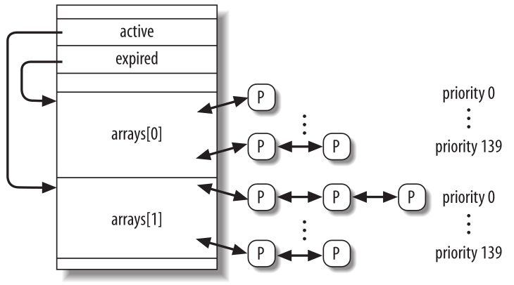
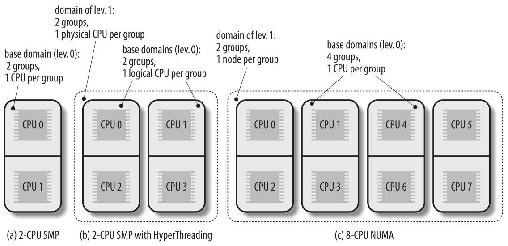

Planificación de Procesos
=========================
Como cualquier sistema de tiempo compartido, Linux logra el efecto mágico de una aparente ejecución simultánea de múltiples procesos al cambiar de un proceso a otro en un lapso de tiempo muy corto. El cambio de procesos en sí se trató en Procesos; ahora se trata de la planificación, que se ocupa de cuándo cambiar y qué proceso elegir. En “Política de planificación” presenta las elecciones que hace Linux en para planificar procesos. “El algoritmo de planificación” analiza las estructuras de datos utilizadas para implementar la planificación y el algoritmo correspondiente. Finalmente, en “Llamadas del sistema relacionadas con la planificación” describe las llamadas del sistema que afectan a la planificación de procesos. Para simplificar la descripción, nos referimos como siempre a la arquitectura 80×86; en particular, suponemos que el sistema utiliza el Modelo de Acceso Uniforme a Memoria (UMA) y que el tic del sistema está establecido en 1 ms.

Política de planificación
-------------------------
El algoritmo de planificación de los sistemas operativos Unix tradicionales debe cumplir varios objetivos contrapuestos: tiempo de respuesta rápido de los procesos, buen rendimiento para trabajos en segundo plano, evitar la inanición de los procesos, conciliar las necesidades de los procesos de alta y baja prioridad, etc. El conjunto de reglas que se utilizan para determinar cuándo y cómo seleccionar un nuevo proceso para ejecutar se denomina *política de planificación*.

La planificación de Linux se basa en la técnica de *tiempo compartido*: varios procesos se ejecutan en “multiplexación de tiempo” porque el tiempo de la CPU se divide en porciones, una para cada proceso ejecutable. Por supuesto, un solo procesador puede ejecutar solo un proceso en un instante dado. Si un proceso que se está ejecutando actualmente no finaliza cuando su porción de tiempo o *quantum* expira, puede tener lugar un cambio de proceso. El tiempo compartido se basa en interrupciones del temporizador y, por lo tanto, es transparente para los procesos. No es necesario insertar código adicional en los programas para garantizar el tiempo compartido de la CPU.

La política de planificación también se basa en la clasificación de los procesos según su prioridad. A veces se utilizan algoritmos complicados para derivar la prioridad actual de un proceso, pero el resultado final es el mismo: cada proceso está asociado con un valor que le dice al planificador cuán apropiado es permitir que el proceso se ejecute en una CPU.

En Linux, la prioridad del proceso es dinámica. El planificador lleva un registro de lo que están haciendo los procesos y ajusta sus prioridades periódicamente; de ​​esta manera, los procesos a los que se les ha negado el uso de una CPU durante un largo intervalo de tiempo son impulsados al aumentar dinámicamente su prioridad. En consecuencia, los procesos que se ejecutan durante mucho tiempo se penalizan al disminuir su prioridad.

Cuando se habla de planificación, los procesos se clasifican tradicionalmente como *limitados por E/S* o *limitados por CPU*. Los primeros hacen un uso intensivo de los dispositivos de E/S y pasan mucho tiempo esperando que se completen las operaciones de E/S; los últimos llevan a cabo aplicaciones de procesamiento numérico que requieren mucho tiempo de CPU.

Una clasificación alternativa distingue tres clases de procesos:

*Procesos interactivos*
 Estos interactúan constantemente con sus usuarios y, por lo tanto, pasan mucho tiempo esperando pulsaciones de teclas y operaciones del mouse. Cuando se recibe una entrada, el proceso debe ser despertado rápidamente, o el usuario encontrará que el sistema no responde. Normalmente, el retraso promedio debe estar entre 50 y 150 milisegundos. La varianza de dicho retraso también debe estar limitada, o el usuario encontrará que el sistema es errático. Los programas interactivos típicos son los shells de comandos, los editores de texto y las aplicaciones gráficas.

*Procesos por lotes*
    Estos no necesitan la interacción del usuario y, por lo tanto, a menudo se ejecutan en segundo plano. Debido a que estos procesos no necesitan ser muy sensibles (que responden rápidamente), a menudo son penalizados por el planificador. Los programas por lotes típicos son los compiladores de lenguajes de programación, los motores de búsqueda de bases de datos y los cálculos científicos.

*Procesos en tiempo real*
 Estos tienen requisitos de planificación muy estrictos. Estos procesos nunca deben ser bloqueados por procesos de menor prioridad y deben tener un tiempo de respuesta corto garantizado con una varianza mínima. Los programas en tiempo real típicos son las aplicaciones de video y sonido, los controladores de robots y los programas que recopilan datos de sensores físicos.

Las dos clasificaciones que acabamos de ofrecer son algo independientes. Por ejemplo, un proceso por lotes puede estar limitado por E/S (por ejemplo, un servidor de base de datos) o limitado por CPU (por ejemplo, un programa de renderizado de imágenes). Si bien los programas en tiempo real son reconocidos explícitamente como tales por el algoritmo de planificación en Linux, no hay una manera fácil de distinguir entre programas interactivos y por lotes. El planificador de Linux 2.6 implementa un sofisticado algoritmo heurístico basado en el comportamiento pasado de los procesos para decidir si un proceso determinado debe considerarse interactivo o por lotes. Por supuesto, el planificador tiende a favorecer los procesos interactivos sobre los procesos por lotes.

Preempcion de procesos
**********************
Como se mencionó al inicio, los procesos de Linux son *preemptables* (apropiables). Cuando un proceso entra en el estado TASK_RUNNING, el núcleo verifica si su prioridad dinámica es mayor que la prioridad del proceso que se está ejecutando actualmente. Si es así, se interrumpe la ejecución del proceso actual y se invoca al planificador para seleccionar otro proceso para ejecutar (generalmente el proceso que acaba de volverse ejecutable). Por supuesto, un proceso también puede ser preemptable cuando su quantum de tiempo expira. Cuando esto ocurre, se establece el indicador TIF_NEED_RESCHED en la estructura *thread_info* del proceso actual, por lo que se invoca al planificador cuando finaliza el controlador de interrupción del temporizador.

Por ejemplo, consideremos un escenario en el que solo se están ejecutando dos programas: un editor de texto y un compilador. El editor de texto es un programa interactivo, por lo que tiene una prioridad dinámica más alta que el compilador. Sin embargo, a menudo se suspende, porque el usuario alterna entre pausas para pensar y para ingresar datos; además, el retraso promedio entre dos pulsaciones de teclas es relativamente alto. Sin embargo, tan pronto como el usuario presiona una tecla, se produce una interrupción y el núcleo despierta el proceso del editor de texto. El núcleo también determina que la prioridad dinámica del editor es mayor que la prioridad del proceso actual, el proceso que se está ejecutando (el compilador), por lo que establece el indicador TIF_NEED_RESCHED de este proceso, lo que obliga a que el planificador se active cuando el núcleo termina de manejar la interrupción. El planificador selecciona el editor y realiza un cambio de proceso; como resultado, la ejecución del editor se reanuda muy rápidamente y el carácter escrito por el usuario se muestra en la pantalla. Cuando el carácter ha sido procesado, el proceso del editor de texto se suspende a sí mismo esperando otra pulsación de tecla y el proceso del compilador puede reanudar su ejecución.

Tenga en cuenta que un proceso interrumpido no se suspende, porque permanece en el estado TASK_RUNNING; simplemente ya no utiliza la CPU. Además, recuerde que el núcleo Linux 2.6 es preemptivo, lo que significa que un proceso puede ser interrumpido ya sea cuando se ejecuta en modo núcleo o en modo usuario; Discutimos esta característica en profundidad en la sección “Apropiatividad del núcleo” en Sincronización.

Cuánto debe durar un quantum
****************************
La duración del quantum es crítica para el rendimiento del sistema: no debe ser ni demasiado larga ni demasiado corta.

Si la duración promedio del quantum es demasiado corta, la sobrecarga del sistema causada por los cambios de proceso se vuelve excesivamente alta. Por ejemplo, supongamos que un cambio de proceso requiere 5 milisegundos; si la duración del quantum también se establece en 5 milisegundos, entonces al menos el 50 por ciento de los ciclos de CPU se dedicarán al cambio de proceso.

Si la duración promedio del quantum es demasiado larga, los procesos ya no parecerán ejecutarse simultáneamente. Por ejemplo, supongamos que la duración del quantum se establece en cinco segundos; cada proceso ejecutable avanza durante unos cinco segundos, pero luego se detiene durante un tiempo muy largo (normalmente, cinco segundos multiplicado por el número de procesos ejecutables).

A menudo se cree que una duración larga del quantum degrada el tiempo de respuesta de las aplicaciones interactivas. Esto suele ser falso. Como se describió en la sección "Preempcion de procesos”, los procesos interactivos tienen una prioridad relativamente alta, por lo que rápidamente se anticipan a los procesos por lotes, sin importar cuán larga sea la duración del quantum.

En algunos casos, sin embargo, una duración muy larga del quantum degrada la capacidad de respuesta del sistema. Por ejemplo, supongamos que dos usuarios ingresan simultáneamente dos comandos en sus respectivos shells; un comando inicia un proceso limitado por la CPU, mientras que el otro lanza una aplicación interactiva. Ambos shells bifurcan a un nuevo proceso y le delegan la ejecución del comando del usuario; además, supongamos que esos nuevos procesos tienen la misma prioridad inicial (Linux no sabe de antemano si un programa que se ejecutará es por lotes o interactivo). Ahora bien, si el planificador selecciona el proceso limitado por la CPU para que se ejecute primero, el otro proceso podría esperar un quantum de tiempo completo antes de comenzar su ejecución. Por lo tanto, si la duración del quantum es larga, el sistema podría parecer que no responde al usuario que lanzó la aplicación interactiva.

La elección de la duración promedio del quantum es siempre un compromiso. La regla de oro adoptada por Linux es elegir una duración lo más larga posible, manteniendo un buen tiempo de respuesta del sistema.

El algoritmo de planificación
-----------------------------
El algoritmo de planificación utilizado en versiones anteriores de Linux era bastante simple y directo: en cada cambio de proceso, el núcleo escaneaba la lista de procesos ejecutables, calculaba sus prioridades y seleccionaba el “mejor” proceso para ejecutar. El principal inconveniente de ese algoritmo es que el tiempo empleado en elegir el mejor proceso depende del número de procesos ejecutables; por lo tanto, el algoritmo es demasiado costoso (es decir, consume demasiado tiempo) en sistemas high-end que ejecutan miles de procesos.

El algoritmo de planificación de Linux 2.6 es mucho más sofisticado. Por diseño, escala bien con el número de procesos ejecutables, porque selecciona el proceso que se ejecutará en tiempo constante, independientemente del número de procesos ejecutables. También escala bien con el número de procesadores porque cada CPU tiene su propia cola de procesos ejecutables. Además, el nuevo algoritmo hace un mejor trabajo al distinguir los procesos interactivos de los procesos por lotes. Como consecuencia, los usuarios de sistemas muy cargados sienten que las aplicaciones interactivas responden mucho mejor en Linux 2.6 que en versiones anteriores.

El planificador siempre logra encontrar un proceso para ser ejecutado; de hecho, siempre hay al menos un proceso ejecutable: el proceso *swapper*, que tiene PID 0 y se ejecuta solo cuando la CPU no puede ejecutar otros procesos. Como se mencionó en Procesos, cada CPU de un sistema multiprocesador tiene su propio proceso *swapper* con PID igual a 0.

Cada proceso Linux siempre se planifica de acuerdo con una de las siguientes clases de planificación:

SCHED_FIFO
 Un proceso de tiempo real de primero entra, primero sale (First-In First-Out). Cuando el planificador asigna la CPU al proceso, deja el descriptor del proceso en su posición actual en la lista de cola de ejecución (runqueue). Si no se puede ejecutar ningún otro proceso en tiempo real de mayor prioridad, el proceso continúa usando la CPU mientras lo desee, incluso si se pueden ejecutar otros procesos en tiempo real que tienen la misma prioridad.
SCHED_RR
 Un proceso de tiempo real Round Robin. Cuando el planificador asigna la CPU al proceso, coloca el descriptor del proceso al final de la lista de cola de ejecución (runqueue). Esta política garantiza una asignación justa de tiempo de CPU a todos los procesos de tiempo real SCHED_RR que tienen la misma prioridad.
SCHED_NORMAL
 Un proceso convencional de tiempo compartido.

El algoritmo de planificación se comporta de manera bastante diferente según si el proceso es convencional o de tiempo real.

Planificación de procesos convencionales
****************************************
Cada proceso convencional tiene su propia *prioridad estática*, que es un valor utilizado por el planificador para calificar el proceso con respecto a los demás procesos convencionales del sistema. El núcleo representa la prioridad estática de un proceso convencional con un número que va desde 100 (prioridad más alta) hasta 139 (prioridad más baja); observe que la prioridad estática disminuye a medida que aumentan los valores.

Un proceso nuevo siempre hereda la prioridad estática de su padre. Sin embargo, un usuario puede cambiar la prioridad estática de los procesos que posee al pasar algunos “valores nice” a las llamadas del sistema nice() y setpriority().

Quantum de tiempo base
>>>>>>>>>>>>>>>>>>>>>>
La prioridad estática determina esencialmente el *quantum de tiempo base* de un proceso, es decir, la duración del quantum de tiempo asignado al proceso cuando ha agotado su quantum de tiempo anterior. La prioridad estática y el quantum de tiempo base están relacionados por la siguiente fórmula:

 *quantum de tiempo base* (en milisegundos) =
  * {(140 - prioridad estatica) x 20 si la prioridad estatica < 120
  * {(140 - prioridad estatica) x 5 si la prioridad estatica ≥ 120

Como puede ver, cuanto mayor sea la prioridad estática (es decir, cuanto menor sea su valor numérico), mayor será el quantum de tiempo base. En consecuencia, los procesos de mayor prioridad suelen obtener porciones más largas de tiempo de CPU con respecto a los procesos de menor prioridad. La siguiente tabla muestra la prioridad estática, los valores del quantum de tiempo base y los valores nice correspondientes para un proceso convencional que tiene la prioridad estática más alta, la prioridad estática predeterminada y la prioridad estática más baja. (La tabla también enumera los valores del delta interactivo y del umbral de tiempo de suspensión, que se explican más adelante).

+---------------------------+------------------+----------+----------------------+-----------------+-------------------------+
|Descripción                |Prioridad Estática|Valor Nice|Quantum de tiempo base|Delta Interactivo|Umbral de tiempo de sueño|
+===========================+==================+==========+======================+=================+=========================+
|Máxima prioridad estática  |100               |-20       |800 ms                |-3               |299 ms                   |
+---------------------------+------------------+----------+----------------------+-----------------+-------------------------+
|Alta prioridad estática    |110               |-10       |600 ms                |-1               |499 ms                   |
+---------------------------+------------------+----------+----------------------+-----------------+-------------------------+
|Default prioridad estática |120               |0         |100 ms                |+2               |799 ms                   |
+---------------------------+------------------+----------+----------------------+-----------------+-------------------------+
|Baja prioridad estática    |130               |+10       |50 ms                 |+4               |999 ms                   |
+---------------------------+------------------+----------+----------------------+-----------------+-------------------------+
|Mínima prioridad estática  |139               |+19       |5 ms                  |+6               |1199 ms                  |
+---------------------------+------------------+----------+----------------------+-----------------+-------------------------+

Prioridad dinámica y tiempo de suspensión promedio
>>>>>>>>>>>>>>>>>>>>>>>>>>>>>>>>>>>>>>>>>>>>>>>>>>
Además de una prioridad estática, un proceso convencional también tiene una *prioridad dinámica*, que es un valor que va desde 100 (prioridad más alta) a 139 (prioridad más baja). La prioridad dinámica es el número que realmente busca el planificador al seleccionar el nuevo proceso para ejecutar. Está relacionada con la prioridad estática por la siguiente fórmula empírica:

  *prioridad dinamica* = max ( 100, min ( *prioridad estática* - *bonus* + 5, 139 ))

El *bonus* (bono) es un valor que va de 0 a 10; un valor menor que 5 representa una penalización que reduce la prioridad dinámica, mientras que un valor mayor que 5 es un premio que aumenta la prioridad dinámica. El valor del bonus, a su vez, depende del historial pasado del proceso; más precisamente, está relacionado con el *tiempo de suspensión promedio* del proceso.

Aproximadamente, el tiempo de suspensión promedio es el número promedio de nanosegundos que transcurrieron mientras que el proceso dormía. Sin embargo, tenga en cuenta que esta no es una operación promedio en el tiempo transcurrido. Por ejemplo, dormir en el estado TASK_INTERRUPTIBLE contribuye al tiempo de suspensión promedio de una manera diferente a dormir en el estado TASK_UNINTERRUPTIBLE. Además, el tiempo de suspensión promedio disminuye mientras un proceso está en ejecución. Finalmente, el tiempo de suspensión promedio nunca puede ser mayor que 1 segundo.

La correspondencia entre los tiempos de suspensión promedio y los valores de bonus se muestra en la siguiente tabla. (La tabla también enumera la granularidad correspondiente de la porción de tiempo, que se discutirá más adelante).

+------------------------------------------------------+-------------+-------------+
|Tiempo promedio de sueño                              |Bonus        |Granularidad |
+======================================================+=============+=============+
|Mayor o igual que 0 pero menor que 100 ms             |0            |5120         |
+------------------------------------------------------+-------------+-------------+
|Mayor o igual que 100 pero menor que 200 ms           |1            |2560         |
+------------------------------------------------------+-------------+-------------+
|Mayor o igual que 200 pero menor que 300 ms           |2            |1280         |
+------------------------------------------------------+-------------+-------------+
|Mayor o igual que 200 pero menor que 400 ms           |3            |640          |
+------------------------------------------------------+-------------+-------------+
|Mayor o igual que 200 pero menor que 500 ms           |4            |320          |
+------------------------------------------------------+-------------+-------------+
|Mayor o igual que 200 pero menor que 600 ms           |5            |160          |
+------------------------------------------------------+-------------+-------------+
|Mayor o igual que 200 pero menor que 700 ms           |6            |80           |
+------------------------------------------------------+-------------+-------------+
|Mayor o igual que 200 pero menor que 800 ms           |7            |40           |
+------------------------------------------------------+-------------+-------------+
|Mayor o igual que 200 pero menor que 900 ms           |8            |20           |
+------------------------------------------------------+-------------+-------------+
|Mayor o igual que 200 pero menor que 1000 ms          |9            |10           |
+------------------------------------------------------+-------------+-------------+
|1 segundo                                             |10           |10           |
+------------------------------------------------------+-------------+-------------+

El planificador también utiliza el tiempo de suspensión promedio para determinar si un proceso dado debe considerarse interactivo o por lotes. Más precisamente, un proceso se considera "interactivo" si satisface la siguiente fórmula:

 *prioridad dinámica* ≤ 3 × *prioridad estática* / 4 + 28

que es equivalente a lo siguiente:

 *bonus* - 5 ≥ *prioridad estática* / 4 − 28

La expresión *prioridad estática* / 4 − 28 se denomina *delta interactivo*; algunos valores típicos de este término se enumeran en la tabla anterior. Debe apreciarse que es mucho más fácil que los procesos de alta prioridad se vuelvan interactivos que los de baja prioridad. Por ejemplo, un proceso que tiene la prioridad estática más alta (100) se considera interactivo cuando su valor de bonus excede 2, es decir, cuando su tiempo de suspensión promedio excede 200 ms. Por el contrario, un proceso que tiene la prioridad estática más baja (139) nunca se considera interactivo, porque el valor de bonus siempre es menor que el valor 11 requerido para alcanzar un delta interactivo igual a 6. Un proceso que tiene la prioridad estática predeterminada (120) se vuelve interactivo tan pronto como su tiempo de suspensión promedio excede los 700 ms.

Procesos activos y expirados
>>>>>>>>>>>>>>>>>>>>>>>>>>>>
Incluso si los procesos convencionales que tienen prioridades estáticas más altas obtienen porciones más grandes del tiempo de CPU, no deberían bloquear completamente a los procesos que tienen una prioridad estática más baja. Para evitar la inanición del proceso, cuando un proceso termina su quantum de tiempo, puede ser reemplazado por un proceso de menor prioridad cuyo quantum de tiempo aún no se haya agotado. Para implementar este mecanismo, el planificador mantiene dos conjuntos disjuntos de procesos ejecutables:

*Procesos activos*
 Estos procesos ejecutables aún no han agotado su quantum de tiempo y, por lo tanto, se les permite ejecutarse.
*Procesos expirados*
 Estos procesos ejecutables han agotado su quantum de tiempo y, por lo tanto, se les prohíbe ejecutarse hasta que todos los procesos activos expiren.

Sin embargo, el esquema general es ligeramente más complicado que esto, porque el planificador intenta aumentar el rendimiento de los procesos interactivos. Un proceso por lotes activo que termina su quantum de tiempo siempre expira. Un proceso interactivo activo que termina su quantum de tiempo generalmente permanece activo: el planificador rellena su quantum de tiempo y lo deja en el conjunto de procesos activos. Sin embargo, el planificador mueve un proceso interactivo que finalizó su quantum de tiempo al conjunto de procesos expirados si el proceso expirado más antiguo ya ha esperado durante mucho tiempo, o si un proceso expirado tiene una prioridad estática más alta (valor más bajo) que el proceso interactivo. Como consecuencia, el conjunto de procesos activos eventualmente quedará vacío y los procesos expirados tendrán la oportunidad de ejecutarse.

Planficación de procesos de tiempo real
***************************************
Cada proceso en tiempo real está asociado con una *prioridad en tiempo real*, que es un valor que va desde 1 (prioridad más alta) hasta 99 (prioridad más baja). El planificador siempre favorece un proceso ejecutable de mayor prioridad sobre uno de menor prioridad; en otras palabras, un proceso en tiempo real inhibe la ejecución de todo proceso de menor prioridad mientras permanezca ejecutable. A diferencia de los procesos convencionales, los procesos en tiempo real siempre se consideran activos (consulte la sección anterior). El usuario puede cambiar la prioridad en tiempo real de un proceso mediante las llamadas al sistema *sched_setparam()* y *sched_setscheduler()*.

Si varios procesos ejecutables de tiempo real tienen la misma prioridad más alta, el planificador elige el proceso que ocurre primero en la lista correspondiente de la cola de ejecución de la CPU local.

Un proceso en tiempo real es reemplazado por otro proceso solamente cuando ocurre uno de los siguientes eventos:

- El proceso es reemplazado por otro proceso que tiene una prioridad de tiempo real más alta.
- El proceso realiza una operación bloqueante y se pone a dormir (en estado TASK_INTERRUPTIBLE o TASK_UNINTERRUPTIBLE).
- El proceso se detiene (en estado TASK_STOPPED o TASK_TRACED), o se elimina (en estado EXIT_ZOMBIE o EXIT_DEAD).
- El proceso renuncia voluntariamente a la CPU invocando la llamada del sistema *sched_yield()*.
- El proceso es de tiempo real Round Robin (SCHED_RR), y ha agotado su quantum de tiempo.

Las llamadas del sistema *nice()* y *setpriority()*, cuando se aplican a un proceso de tiempo real Round Robin, no cambian la prioridad de tiempo real sino la duración del quantum de tiempo base. De hecho, la duración del quantum de tiempo base de los procesos Round Robin en tiempo real no depende de la prioridad en tiempo real, sino de la prioridad estática del proceso, de acuerdo con la fórmula de la sección anterior “Planificación de procesos convencionales”.

Estructuras de datos usadas por el planificador
-----------------------------------------------
Recuerde de la sección “Identificación de un proceso” en el capítulo de Procesos que la lista de procesos vincula *todos* los descriptores de procesos, mientras que las listas de runqueues vinculan los descriptores de procesos de todos los procesos *ejecutables* (es decir, aquellos en un estado TASK_RUNNING), excepto el proceso *swapper* (proceso inactivo).

La estructura de datos *runqueue*
*********************************
La estructura de datos *runqueue* es la estructura de datos más importante del planificador de Linux 2.6. Cada CPU del sistema tiene su propia *runqueue*; todas las estructuras de *runqueue* se almacenan en la variable por CPU *runqueue*. La macro *this_rq()* proporciona la dirección de la *runqueue* de la CPU local, mientras que la macro *cpu_rq(n)* proporciona la dirección de la *runqueue* de la CPU que tiene el índice *n*.

La siguiente tabla enumera los campos incluidos en la estructura de datos *runqueue*; analizaremos la mayoría de ellos en las siguientes secciones.

+---------------+-------------------+----------------------------------------------------------------------------+
|Tipo           |Nombre             |Descripción                                                                 |
+===============+===================+============================================================================+
|spinlock_t     |lock               |Spin lock para protección de las listas de procesos                         |
+---------------+-------------------+----------------------------------------------------------------------------+
|unsigned long  |nr_running         |Número de procesos ejecutables en runqueues                                 |
+---------------+-------------------+----------------------------------------------------------------------------+
|unsigned long  |cpu_load           |Factor de carga de la CPU basado en el número promedio de procesos          |
|               |                   |en la runqueue                                                              |
+---------------+-------------------+----------------------------------------------------------------------------+
|unsigned long  |nr_switches        |Número de cambios de procesos realizados por la CPU                         |
+---------------+-------------------+----------------------------------------------------------------------------+
|unsigned long  |nr_uninterrumpible |Número de procesos que estuvieron previamente en las listas runqueue y      |
|               |                   |están ahora inactivos en estado TASK_UNINTRERRUMPIBLE (solo la suma de      |
|               |                   |estos campos en todas las colas es significativa                            |
+---------------+-------------------+----------------------------------------------------------------------------+
|unsigned long  |expired_timestamp  |Tiempo de inserción del proceso más antiguo en las listas expiradas         |
+---------------+-------------------+----------------------------------------------------------------------------+
|unsigned long  |timestamp_last_tick|Timestamp de la última interrupción del timer                               |
|long           |                   |                                                                            |
+---------------+-------------------+----------------------------------------------------------------------------+
|task_t*        |curr               |Puntero al descriptor de procesos que está ejecutando actualmente (el mismo |
|               |                   |de *current* para la CPU local                                              |
+---------------+-------------------+----------------------------------------------------------------------------+
|task_t*        |idle               |Puntero al descriptor de proceso al proceso *swapper* para ésta CPU         |
+---------------+-------------------+----------------------------------------------------------------------------+
|struct         |prev_mm            |Utilizado durante un cambio de proceso para almacenar la dirección de       |
|mm_struct*     |                   |memoria del descriptor de proceso que está siendo reemplazado               |
+---------------+-------------------+----------------------------------------------------------------------------+
|prio_array_t*  |active             |Puntero a la lista de procesos activos                                      |
+---------------+-------------------+----------------------------------------------------------------------------+
|prio_array_t*  |expired            |Puntero a la lista de procesos expirados                                    |
+---------------+-------------------+----------------------------------------------------------------------------+
|prio_array_t[2]|arrays             |Los dos conjuntos de procesos activos y expirados                           |
+---------------+-------------------+----------------------------------------------------------------------------+
|int            |best_expired_prio  |Mejor prioridad estática (valor mas bajo) entre procesos expirados          |
+---------------+-------------------+----------------------------------------------------------------------------+
|atomic_t       |nr_iowait          |Número de procesos que anteriormente estaban en las listas runqueues y      |
|               |                   |ahora están esperando que se complete una operación de E/S de disco         |
+---------------+-------------------+----------------------------------------------------------------------------+
|struct         |sd                 |Apunta al dominio de planificación base de ésta CPU                         |
|sched_domain*  |                   |                                                                            |
+---------------+-------------------+----------------------------------------------------------------------------+
|int            |active_balance     |Flag establecido si algún proceso se debe migrar de ésta cola a otra        |
|               |                   |(balanceo de runqueues)                                                     |
+---------------+-------------------+----------------------------------------------------------------------------+
|int            |push_cpu           |No utilizado                                                                |
+---------------+-------------------+----------------------------------------------------------------------------+
|tast_t*        |migration_thread   |Puntero al descriptor de proceso del hilo del kernel de migración           |
+---------------+-------------------+----------------------------------------------------------------------------+
|struct         |migration_queue    |Lista de procesos a ser removidos de la runqueue                            |
|list_head      |                   |                                                                            |
+---------------+-------------------+----------------------------------------------------------------------------+

Los campos más importantes de la estructura de datos de la cola de ejecución son los relacionados con las listas de procesos ejecutables. Cada proceso ejecutable del sistema pertenece a una, y sólo una, runqueue. Mientras un proceso ejecutable permanezca en la misma runqueue, sólo podrá ser ejecutado por la CPU que posee esa runqueue. Sin embargo, como veremos más adelante, los procesos ejecutables pueden migrar de una runqueue a otra.

El campo *arrays* de la runqueue es un vector que consta de dos estructuras *prio_array_t*. Cada estructura de datos representa un conjunto de procesos ejecutables e incluye 140 encabezados de lista doblemente enlazados (una lista para cada prioridad de proceso posible), un mapa de bits de prioridad y un contador de los procesos incluidos en el conjunto.

    Figura 1 - Estructura runqueue y los conjuntos de procesos ejecutables

Como se muestra en la figura 1, el campo *active* de la estructura de la runqueue apunta a una de las dos estructuras de datos *prio_array_t* en vectores: el conjunto correspondiente de procesos ejecutables incluye los procesos activos. Por el contrario, el campo *expired* apunta a la otra estructura de datos *prio_array_t* en vectores: el conjunto correspondiente de procesos ejecutables incluye los procesos expirados.

Periódicamente, el papel de las dos estructuras de datos en los vectores cambia: los procesos activos se convierten repentinamente en procesos expirados, y los procesos expirados se convierten en los procesos activos. Para lograr este cambio, el planificador simplemente intercambia los contenidos de los campos activo y expirado de la cola de ejecución.

El descriptor de proceso
************************
Cada descriptor de proceso incluye varios campos relacionados con la planificación; se enumeran en la siguiente tabla.

+---------------+-------------------+-------------------------------------------------------------------------------+
|Tipo           |Nombre             |Descripción                                                                    |
+===============+===================+===============================================================================+
|unsigned long  |thread_info->flags |Almacena el flag TIFF_NEED_RESCHED que indica si el planificador debe ser      |
|               |                   |invocado                                                                       |
+---------------+-------------------+-------------------------------------------------------------------------------+
|unsigned int   |thread_info->cpu   |Número lógico de la CPU propietaria de la runqueue a la que pertence           |
|               |                   |el proceso ejecutable                                                          |
+---------------+-------------------+-------------------------------------------------------------------------------+
|unsigned long  |state              |Estado actual del proceso                                                      |
+---------------+-------------------+-------------------------------------------------------------------------------+
|int            |prio               |Prioridad dinámica del proceso                                                 |
+---------------+-------------------+-------------------------------------------------------------------------------+
|int            |static_prio        |Prioridad estática del proceso                                                 |
+---------------+-------------------+-------------------------------------------------------------------------------+
|struct         |run_list           |Punteros al siguiente y anterior elemento en la lista de runqueues             |
|list_head      |                   |al cual pertenece el proceso                                                   |
+---------------+-------------------+-------------------------------------------------------------------------------+
|prio_array_t*  |array              |Puntero al conjunto prio_array_t de la runqueue que incluye el proceso         |
+---------------+-------------------+-------------------------------------------------------------------------------+
|unsigned long  |sleep_avg          |Tiempo promedio de suspensión del proceso                                      |
+---------------+-------------------+-------------------------------------------------------------------------------+
|unsigned long  |timestamp          |Tiempo de la última inserción del proceso en la runqueue, o tiempo del último  |
|long           |                   |cambio de proceso que involucra al proceso                                     |
+---------------+-------------------+-------------------------------------------------------------------------------+
|unsigned long  |last_ran           |Tiempo del último cambio de proceso que reemplazó el proceso                   |
|long           |                   |                                                                               |
+---------------+-------------------+-------------------------------------------------------------------------------+
|int            |activated          |Código de condición usado cuando se activa el proceso                          |
+---------------+-------------------+-------------------------------------------------------------------------------+
|unsigned long  |policy             |Clase de planificación del proceso (SCHED_NORMAL, SCHED_RR, SCHED_FIFO)        |
+---------------+-------------------+-------------------------------------------------------------------------------+
|cpumask_t      |cpus_allowed       |Máscara de bits indicando las CPUs que pueden ejecutar el proceso              |
+---------------+-------------------+-------------------------------------------------------------------------------+
|unsigned int   |time_slice         |Ticks restantes en el quantum de tiempo del proceso                            |
+---------------+-------------------+-------------------------------------------------------------------------------+
|unsigned int   |first_time_slice   |Flag establecido en 1 si el proceso nunca agotó su quantum                     |
+---------------+-------------------+-------------------------------------------------------------------------------+
|unsigned long  |rt_priority        |Prioridad de tiempo real del proceso                                           |
+---------------+-------------------+-------------------------------------------------------------------------------+

Cuando se crea un nuevo proceso, *sched_fork()*, invocado por *copy_process()*, establece el campo *time_slice* de los procesos actuales (el padre) y p (el hijo) de la siguiente manera:

..  code-block:: c

    p->time_slice = (current->time_slice + 1) >> 1;
    current->time_slice >>= 1;

En otras palabras, el número de ticks que le quedan al padre se divide en dos mitades: una para el padre y otra para el hijo. Esto se hace para evitar que los usuarios obtengan una cantidad ilimitada de tiempo de CPU mediante el siguiente método: el proceso padre crea un proceso hijo que ejecuta el mismo código y luego se mata a sí mismo; al ajustar adecuadamente la tasa de creación, el proceso hijo siempre obtendría un quantum nuevo antes de que expire el quantum de su padre. Este truco de programación no funciona porque el núcleo no recompensa los forks. De manera similar, un usuario no puede acaparar una parte injusta del procesador iniciando varios procesos en segundo plano en un shell o abriendo muchas ventanas en un escritorio gráfico. En términos más generales, un proceso no puede acaparar recursos (a menos que tenga privilegios para darse una política de tiempo real) al bifurcar múltiples descendientes.

Si al padre solo le quedaba un tick en su porción de tiempo, la operación de división fuerza a *current->time_slice* a 0, agotando así el quantum del padre. En este caso, *copy_process()* establece *current->time_slice* nuevamente a 1, luego invoca *scheduler_tick()* para disminuir el campo (consulte la siguiente sección).

La función *copy_process()* también inicializa algunos otros campos del descriptor de proceso del hijo relacionados con la planificación:

..  code-block:: c

    p->first_time_slice = 1;
    p->timestamp = sched_clock();

el indicador *first_time_slice* se establece en 1, porque el hijo nunca ha agotado su quantum de tiempo (si un proceso termina o ejecuta un nuevo programa durante su primera porción de tiempo, el proceso padre es recompensado con la porción de tiempo restante del hijo). El campo *timestamp* se inicializa con un valor de marca de tiempo producido por *sched_clock()*: esencialmente, esta función devuelve el contenido del registro TSC de 64 bits convertido a nanosegundos.

Funciones usadas por el planificador
------------------------------------
El planificador depende de varias funciones para realizar su trabajo; las más importantes son:

*scheduler_tick()*
 Mantiene actualizado el contador *time_slice* de *current*
*try_to_wake_up()*
 Despierta un proceso inactivo
*recalc_task_prio()*
 Actualiza la prioridad dinámica de un proceso
*schedule()*
 Selecciona un nuevo proceso para ejecutar
*load_balance()*
 Mantiene equilibradas las colas de ejecución de un sistema multiprocesador

Balanceo de runqueues en sistemas multiprocesador
-------------------------------------------------
Hemos visto anteriormente que Linux se apega al modelo de Multiprocesamiento Simétrico (SMP); esto significa, esencialmente, que el núcleo no debería tener ningún sesgo hacia una CPU con respecto a las otras. Sin embargo, las máquinas multiprocesador vienen en muchos sabores diferentes, y el planificador se comporta de manera diferente dependiendo de las características del hardware. En particular, consideraremos los siguientes tres tipos de máquinas multiprocesador:

*Arquitectura multiprocesador clásica*
 Hasta hace poco, esta era la arquitectura más común para las máquinas multiprocesador. Estas máquinas tienen un conjunto común de chips de RAM compartidos por todas las CPU.
*Hyper-threading*
 Un chip con hyper-threading es un microprocesador que ejecuta varios hilos de ejecución a la vez; incluye varias copias de los registros internos y cambia rápidamente entre ellos. Esta tecnología, que fue inventada por Intel, permite al procesador explotar los ciclos de la máquina para ejecutar otro hilo mientras el hilo actual está detenido para un acceso a la memoria. Una CPU física con hyper-threading es vista por Linux como varias CPU lógicas diferentes.
*NUMA*
 Las CPU NUMA y los chips de RAM se agrupan en “nodos” locales (normalmente un nodo incluye una CPU y unos pocos chips de RAM). El árbitro de memoria (un circuito especial que serializa los accesos a la RAM realizados por las CPU en el sistema) es un cuello de botella para el rendimiento de los sistemas multiprocesador clásicos. En una arquitectura NUMA, cuando una CPU accede a un chip de RAM “local” dentro de su propio nodo, hay poca o ninguna contención, por lo que el acceso suele ser rápido; por otro lado, acceder a un chip de RAM “remoto” fuera de su nodo es mucho más lento. Mencionaremos en la sección “Acceso a memoria no uniforme (NUMA)” en "Administración de Memoria" cómo el asignador de memoria del núcleo Linux admite arquitecturas NUMA.

Estos tipos básicos de sistemas multiprocesador a menudo se combinan. Por ejemplo, una placa base que incluye dos CPU diferentes con hyper-threading es vista por el núcleo como cuatro CPU lógicas.

Como hemos visto antes, la función *schedule()* selecciona el nuevo proceso a ejecutar de la runqueue de la CPU local. Por lo tanto, una CPU dada puede ejecutar solo los procesos ejecutables que están contenidos en la runqueue correspondiente. Por otro lado, un proceso ejecutable siempre se almacena exactamente en una runqueue: nunca un mismo proceso ejecutable aparece en dos o más runqueue. Por lo tanto, hasta que un proceso permanezca ejecutable, normalmente está vinculado a una CPU.

Esta opción de diseño suele ser beneficiosa para el rendimiento del sistema, porque es probable que la caché de hardware de cada CPU se llene con datos que pertenecen a los procesos ejecutables en la cola de ejecución. Sin embargo, en algunos casos, vincular un proceso ejecutable a una CPU dada puede inducir una grave penalización del rendimiento. Por ejemplo, considere una gran cantidad de procesos por lotes que hacen un uso intensivo de la CPU: si la mayoría de ellos terminan en la misma cola de ejecución, una CPU en el sistema se sobrecargará, mientras que las otras estarán casi inactivas. Por lo tanto, el núcleo comprueba periódicamente si las cargas de trabajo de las runqueues (colas de ejecución) están equilibradas y, si es necesario, mueve algún proceso de una runqueues a otra. Sin embargo, para obtener el mejor rendimiento de un sistema multiprocesador, el algoritmo de equilibrio de carga debe tener en cuenta la topología de las CPU del sistema. A partir de la versión 2.6.7 del núcleo, Linux cuenta con un sofisticado algoritmo de equilibrio de colas de ejecución basado en la noción de "dominios de programación". Gracias a los dominios de programación, el algoritmo se puede ajustar fácilmente para todo tipo de arquitecturas multiprocesador existentes e incluso para arquitecturas recientes como las basadas en microprocesadores "multinúcleo".

Dominios de planificación
*************************
En esencia, un *dominio de planificación* es un conjunto de CPUs cuyas cargas de trabajo deben mantenerse equilibradas por el núcleo. En términos generales, los dominios de planificación están organizados jerárquicamente: el dominio de planificación superior, que generalmente abarca todas las CPUs del sistema, incluye dominios de planificación secundarios, cada uno de los cuales incluye un subconjunto de las CPUs. Gracias a la jerarquía de los dominios de planificación, el equilibrio de la carga de trabajo se puede realizar de una manera bastante eficiente.

Cada dominio de planificación se divide, a su vez, en uno o más grupos, cada uno de los cuales representa un subconjunto de las CPUs del dominio de planificación. El equilibrio de la carga de trabajo siempre se realiza entre grupos de un dominio de planificación. En otras palabras, un proceso se mueve de una CPU a otra solo si la carga de trabajo total de algún grupo en algún dominio de planificación es significativamente menor que la carga de trabajo de otro grupo en el mismo dominio de planificación.

La figura 2 ilustra tres ejemplos de jerarquías de dominios de planificación, correspondientes a las tres arquitecturas principales de máquinas multiprocesador.

    Figura 2 - Tres ejemplos de jerarquías de dominios de planificación

La figura 2 (a) representa una jerarquía compuesta por un solo dominio de planificación para una arquitectura multiprocesador clásica de 2 CPUs. El dominio de planificación incluye solo dos grupos, cada uno de los cuales incluye una CPU.

La figura 2 (b) representa una jerarquía de dos niveles para un equipo multiprocesador de 2 CPUs con tecnología hyper-threading. El dominio de planificación de nivel superior abarca las cuatro CPUs lógicas del sistema y está compuesto por dos grupos. Cada grupo del dominio de nivel superior corresponde a un dominio de planificación secundario y abarca una CPU física. Los dominios de planificación de nivel inferior (también denominados dominios de planificación base) incluyen dos grupos, uno para cada CPU lógica.

Finalmente, la figura 2 (c) representa una jerarquía de dos niveles para una arquitectura NUMA de 8 CPUs con dos nodos y cuatro CPUs por nodo. El dominio de nivel superior está organizado en dos grupos, cada uno de los cuales corresponde a un nodo diferente. Cada dominio de planificación base abarca las CPUs dentro de un solo nodo y tiene cuatro grupos, cada uno de los cuales abarca una sola CPU.

Cada dominio de planificación está representado por un descriptor *sched_domain*, mientras que cada grupo dentro de un dominio de planificación está representado por un descriptor *sched_group*. Cada descriptor *sched_domain* incluye un campo *groups*, que apunta al primer elemento en una lista de descriptores de grupo. Además, el campo *parent* de la estructura *sched_domain* apunta al descriptor del dominio de planificación padre, si lo hay.

Los descriptores *sched_domain* de todas las CPUs físicas en el sistema se almacenan en la variable por CPU *phys_domains*. Si el núcleo no admite la tecnología de hyper-threading, estos dominios se encuentran en el nivel inferior de la jerarquía de dominios y los campos *sd* de los descriptores de la runqueue apuntan a ellos; es decir, son los dominios de planificación base. Por el contrario, si el núcleo admite la tecnología de hyper-threading, los dominios de planificación de nivel inferior se almacenan en la variable por CPU *cpu_domains*.

Balanceo de carga
*****************

