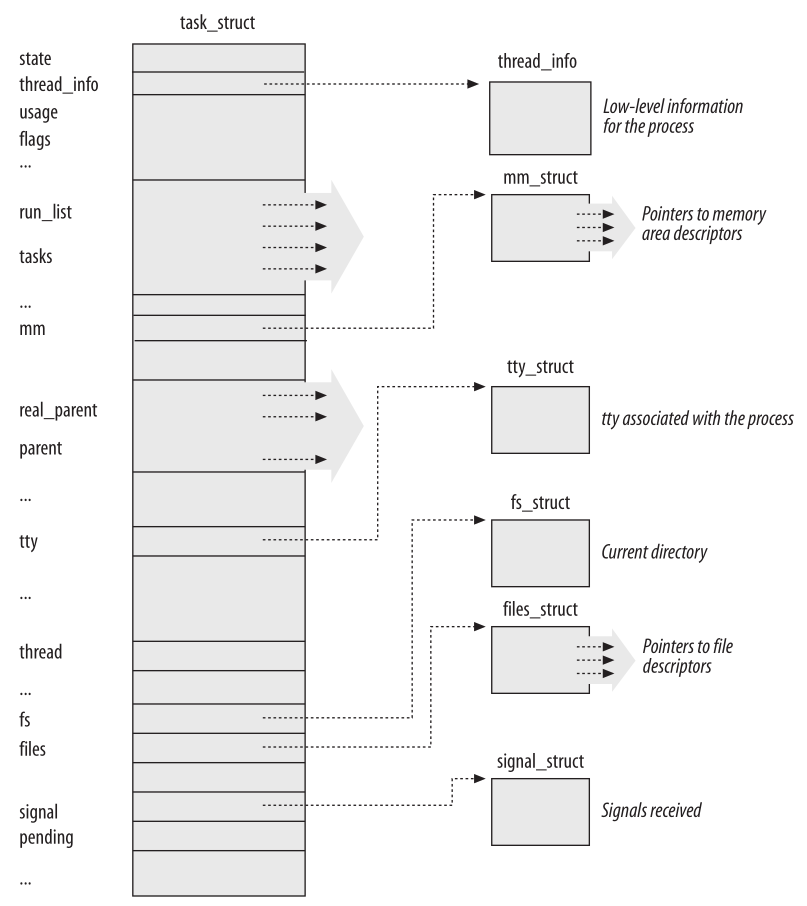
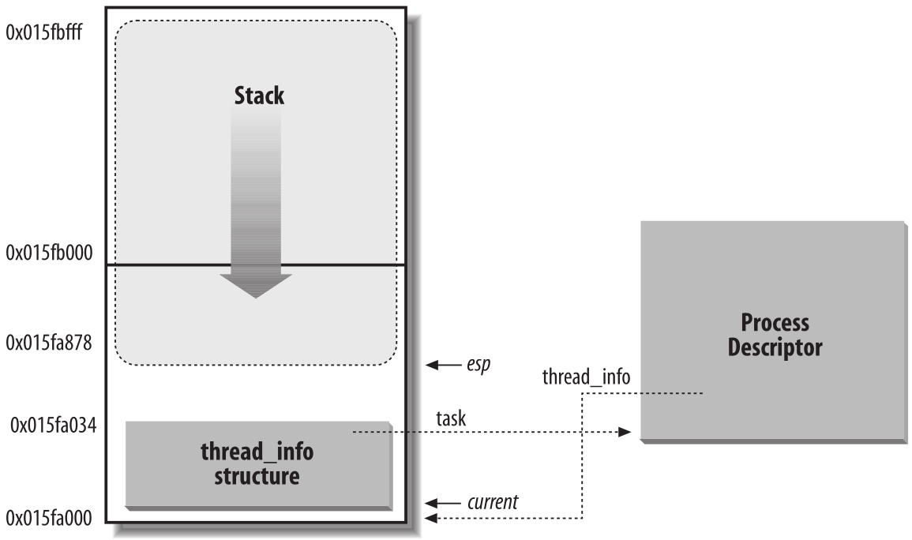
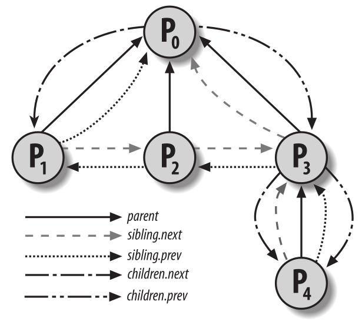

Procesos
========
El concepto de proceso es fundamental para cualquier sistema operativo multiprogramado. Un proceso se define generalmente como una instancia de un programa en ejecución; por lo tanto, si 16 usuarios están ejecutando el editor nano a la vez, hay 16 procesos separados (aunque pueden compartir el mismo código ejecutable). Los procesos a menudo se denominan tareas o hilos en el código fuente de Linux.

Analizamos las propiedades estáticas de los procesos y luego describimos cómo el núcleo realiza el cambio de procesos. También describimos cómo se pueden crear y destruir los procesos. Veremos cómo Linux admite aplicaciones multiproceso; como mencionamos anteriormente, se basa en los llamados procesos livianos (LWP - Light Weight Process).

Procesos, procesos livianos e hilos
-----------------------------------

El término “proceso” se utiliza a menudo con varios significados diferentes. Nosotros nos ceñimos a la definición habitual de los libros de texto sobre sistemas operativos: un *proceso* es una instancia de un programa en ejecución. Se puede pensar en él como la colección de estructuras de datos que describe completamente hasta qué punto ha progresado la ejecución del programa.

Los procesos son como los seres humanos: se crean, tienen una vida más o menos significativa, generan opcionalmente uno o más procesos hijos y, finalmente, mueren.

Desde el punto de vista del núcleo, el propósito de un proceso es actuar como una entidad a la que se asignan recursos del sistema (tiempo de CPU, memoria, etc.).

Cuando se crea un proceso, es casi idéntico a su padre. Recibe una copia (lógica) del espacio de direcciones del padre y ejecuta el mismo código que el padre, comenzando en la siguiente instrucción después de la llamada al sistema de creación del proceso. Aunque el padre y el hijo pueden compartir las páginas que contienen el código del programa (texto), tienen copias separadas de los datos (pila y heap), de modo que los cambios del hijo a una ubicación de memoria son invisibles para el padre (y viceversa).

Mientras que los núcleos Unix anteriores empleaban este modelo simple, los sistemas Unix modernos no lo hacen. Admiten *aplicaciones multiproceso*: programas de usuario que tienen muchos flujos de ejecución relativamente independientes que comparten una gran parte de las estructuras de datos de la aplicación. En tales sistemas, un proceso se compone de varios *hilos de usuario* (o simplemente *hilos*), cada uno de los cuales representa un flujo de ejecución del proceso. Hoy en día, la mayoría de las aplicaciones multiproceso se escriben utilizando conjuntos estándar de funciones de biblioteca llamadas bibliotecas pthread (hilos POSIX).

Las versiones anteriores del núcleo Linux no ofrecían soporte para aplicaciones multiproceso. Desde el punto de vista del núcleo, una aplicación multiproceso era simplemente un proceso normal. Los múltiples flujos de ejecución de una aplicación multiproceso se creaban, manejaban y planificaban completamente en modo usuario, generalmente por medio de una biblioteca *pthread* compatible con POSIX.

Sin embargo, esta implementación de aplicaciones multiprocesos no es muy satisfactoria. Por ejemplo, supongamos que un programa de ajedrez utiliza dos hilos: uno de ellos controla el tablero gráfico, esperando los movimientos del jugador humano y mostrando los movimientos de la computadora, mientras que el otro hilo analiza el siguiente movimiento de la partida. Mientras el primer hilo espera el movimiento humano, el segundo hilo debe ejecutarse continuamente, aprovechando así el tiempo  que el jugador humano usa para pensar su próxima jugada. Sin embargo, si el programa de ajedrez está pensado con un solo flujo de ejecución (un solo proceso), el primer hilo no puede simplemente esperar una acción del usuario (haciendo una llamada al sistema para esperar); de ser así, el segundo hilo también se bloquea. En cambio, el primer hilo debe emplear técnicas sofisticadas no bloqueantes para garantizar que el proceso siga siendo ejecutable.

Linux utiliza *procesos livianos* para ofrecer un mejor soporte para aplicaciones multiproceso. Básicamente, dos procesos livianos pueden compartir algunos recursos, como el espacio de direcciones, los archivos abiertos, etc. Siempre que uno de ellos modifica un recurso compartido, el otro ve inmediatamente el cambio. Por supuesto, los dos procesos deben sincronizarse al acceder al recurso compartido.

Una forma sencilla de implementar aplicaciones multiproceso es asociar un proceso liviano a cada hilo. De esta forma, los hilos pueden acceder al mismo conjunto de estructuras de datos de la aplicación simplemente compartiendo el mismo espacio de direcciones de memoria, el mismo conjunto de archivos abiertos, etc.; al mismo tiempo, el núcleo puede programar cada hilo de forma independiente para que uno pueda permanecer inactivo mientras el otro permanece en ejecución.

Descriptor de proceso
---------------------

Para gestionar procesos, el núcleo debe tener una idea clara de lo que hace cada proceso. Debe saber, por ejemplo, la prioridad del proceso, si se está ejecutando en una CPU o está bloqueado por un evento, qué espacio de direcciones se le ha asignado, qué archivos se le permite direccionar, etc. Ésta es la función del *descriptor de proceso*, una estructura de tipo *task_struct* cuyos campos contienen toda la información relacionada con un único proceso. Como repositorio de tanta información, el descriptor de proceso es bastante complejo. Además de una gran cantidad de campos que contienen atributos de proceso, el descriptor de proceso contiene varios punteros a otras estructuras de datos que, a su vez, contienen punteros a otras estructuras. La siguiente figura describe esquemáticamente el descriptor de proceso de Linux.

    Descriptor de procesos de Linux

Estados de un proceso
*********************

Como su nombre lo indica, el campo *state* del descriptor de proceso describe lo que está sucediendo actualmente con el proceso. Consiste en un vector de indicadores, cada uno de los cuales describe un posible estado del proceso. En la versión actual de Linux, estos estados son mutuamente excluyentes y, por lo tanto, siempre se establece exactamente un indicador de estado; los indicadores restantes se borran. Los siguientes son los posibles estados del proceso:

TASK_RUNNING
    El proceso se está ejecutando en una CPU o esperando a ser ejecutado.

TASK_INTERRUPTIBLE
    El proceso está suspendido (durmiendo) hasta que alguna condición se vuelva verdadera. Generar una interrupción de hardware, liberar un recurso del sistema que el proceso está esperando o entregar una señal son ejemplos de condiciones que podrían despertar el proceso (poner su estado nuevamente en TASK_RUNNING).

TASK_UNINTERRUPTIBLE
    Como TASK_INTERRUPTIBLE, excepto que entregar una señal al proceso dormido deja su estado sin cambios. Este estado de proceso rara vez se usa. Sin embargo, es valioso bajo ciertas condiciones específicas en las que un proceso debe esperar hasta que ocurra un evento dado sin ser interrumpido. Por ejemplo, este estado se puede utilizar cuando un proceso abre un archivo de dispositivo y el controlador del dispositivo correspondiente comienza a buscar un dispositivo de hardware correspondiente. El controlador de dispositivo no debe interrumpirse hasta que se complete el sondeo, o el dispositivo de hardware podría quedar en un estado impredecible.

TASK_STOPPED
    La ejecución del proceso se ha detenido; el proceso entra en este estado después de recibir una señal SIGSTOP, SIGTSTP, SIGTTIN o SIGTTOU.

TASK_TRACED
    La ejecución del proceso ha sido detenida por un depurador. Cuando un proceso está siendo monitoreado por otro (como cuando un depurador ejecuta una llamada al sistema ptrace() para monitorear un programa de prueba), cada señal puede poner el proceso en el estado TASK_TRACED.

Se pueden almacenar dos estados adicionales del proceso tanto en el campo de estado como en el campo *exit_state* del descriptor de proceso; como sugiere el nombre del campo, un proceso alcanza uno de estos dos estados solo cuando finaliza su ejecución:

EXIT_ZOMBIE
    La ejecución del proceso finaliza, pero el proceso padre aún no ha emitido una llamada al sistema wait4() o waitpid() para devolver información sobre el proceso muerto. Antes de que se emita la llamada similar a wait(), el núcleo no puede descartar los datos contenidos en el descriptor del proceso muerto porque el padre podría necesitarlos.

EXIT_DEAD
    El estado final: el proceso está siendo eliminado por el sistema porque el proceso padre acaba de emitir una llamada al sistema wait4() o waitpid() para él. Cambiar su estado de EXIT_ZOMBIE a EXIT_DEAD evita condiciones de carrera debido a otros hilos de ejecución que ejecutan llamadas similares a wait() en el mismo proceso.

El valor del campo de estado generalmente se establece con una asignación simple. Por ejemplo:

    p->state = TASK_RUNNING;

Identificando un proceso
************************

Como regla general, cada contexto de ejecución que se puede planificar de forma independiente debe tener su propio descriptor de proceso; por lo tanto, incluso los procesos livianos, que comparten una gran parte de sus estructuras de datos del núcleo, tienen sus propias estructuras task_struct.

La estricta correspondencia uno a uno entre el proceso y el descriptor de proceso hace que la dirección de 32 bits de la estructura task_struct sea un medio útil para que el núcleo identifique los procesos. Estas direcciones se conocen como *punteros de descriptor de proceso*. La mayoría de las referencias a procesos que hace el núcleo se realizan a través de punteros de descriptor de proceso.

Por otro lado, los sistemas operativos tipo Unix permiten a los usuarios identificar los procesos por medio de un número llamado *identificador de proceso* (o *PID*), que se almacena en el campo *pid* del descriptor de proceso. Los PID se numeran secuencialmente: el PID de un proceso recién creado es normalmente el PID del proceso creado anteriormente incrementado en uno. Por supuesto, existe un límite superior en los valores de PID; cuando el núcleo alcanza dicho límite, debe comenzar a reciclar los PID inferiores, que no se utilizan (procesos que ya no existen y a los cuales se les asignó esos PIDs). Por defecto, el número máximo de PID es 32.767 (PID_MAX_DEFAULT - 1); el administrador del sistema puede reducir este límite escribiendo un valor menor en el archivo /proc/sys/kernel/pid_max.

Al reciclar números de PID, el núcleo debe administrar un mapa de bits *pidmap_array* que indique cuáles son los PID actualmente asignados y cuáles están libres. Debido a que un marco de página contiene 32.768 bits, en arquitecturas de 32 bits el mapa de bits pidmap_array se almacena en una sola página. Sin embargo, en arquitecturas de 64 bits, se pueden agregar páginas adicionales al mapa de bits cuando el núcleo asigna un número de PID demasiado grande para el tamaño actual del mapa de bits. Estas páginas nunca se liberan.

Linux asocia un PID diferente con cada proceso o proceso liviano del sistema (como veremos más adelante, hay una pequeña excepción en los sistemas multiprocesador). Este enfoque permite la máxima flexibilidad, porque cada contexto de ejecución del sistema puede identificarse de forma única.

Por otro lado, los programadores de Unix esperan que los hilos del mismo grupo tengan un PID común. Por ejemplo, debería ser posible enviar una señal que especifique un PID que afecte a todos los hilos del grupo. De hecho, el estándar POSIX 1003.1c establece que todos los hilos de una aplicación multiproceso deben tener el mismo PID.

Para cumplir con este estándar, Linux hace uso de *grupos de hilos*. El identificador compartido por los hilos es el PID del líder del grupo de hilos, es decir, el PID del primer proceso liviano del grupo; se almacena en el campo tgid de los descriptores de proceso. La llamada al sistema getpid() devuelve el valor de tgid relativo al proceso actual en lugar del valor de pid, por lo que todos los hilos de una aplicación multiproceso comparten el mismo identificador. La mayoría de los procesos pertenecen a un grupo de hilos que consta de un solo miembro; como líderes del grupo de hilos, tienen el campo tgid igual al campo pid, por lo que la llamada al sistema getpid() funciona de manera habitual para este tipo de proceso.

Más adelante, le mostraremos cómo es posible derivar el puntero al descriptor de proceso de manera eficiente a partir de su PID. La eficiencia es importante porque muchas llamadas al sistema como kill() usan el PID para indicar el proceso afectado.

Manejo de descriptores de procesos
>>>>>>>>>>>>>>>>>>>>>>>>>>>>>>>>>>

Los procesos son entidades dinámicas cuya vida útil varía desde unos pocos milisegundos hasta meses. Por lo tanto, el núcleo debe ser capaz de manejar muchos procesos al mismo tiempo, y los descriptores de proceso se almacenan en la memoria dinámica en lugar de en el área de memoria asignada permanentemente al núcleo. Para cada proceso, Linux empaqueta dos estructuras de datos diferentes en una única área de memoria por proceso: una pequeña estructura de datos vinculada al descriptor de proceso, a saber, la estructura *thread_info*, y la *pila de procesos de modo núcleo*. La longitud de esta área de memoria es normalmente de 8.192 bytes (dos marcos de página). Por razones de eficiencia, el núcleo almacena el área de memoria de 8 KB en dos marcos de página consecutivos con el primer marco de página alineado a un múltiplo de 2\ :sup:`13`; esto puede resultar un problema cuando hay poca memoria dinámica disponible, porque la memoria libre puede llegar a fragmentarse en gran medida. Por lo tanto, en la arquitectura 80×86, el núcleo puede configurarse en el momento de la compilación de modo que el área de memoria que incluye la pila y la estructura thread_info ocupe un único marco de página (4096 bytes).

Anteriormente aprendimos que un proceso en modo núcleo accede a una pila contenida en el segmento de datos del núcleo, que es diferente de la pila utilizada por el proceso en modo usuario. Debido a que las hilos del núcleo hacen poco uso de la pila, sólo se requieren unos pocos bytes de la pila del núcleo. Por lo tanto, 8 KB es espacio suficiente para la pila y la estructura thread_info. Sin embargo, cuando la pila y la estructura thread_info están contenidas en un único marco de página, el núcleo utiliza pilas adicionales para evitar los desbordamientos causados ​​por interrupciones y excepciones profundamente anidadas.

La siguiente figura muestra cómo se almacenan las dos estructuras de datos en el área de memoria de 2 páginas (8 KB). La estructura thread_info se encuentra al principio del área de memoria y la pila crece hacia abajo desde el final. La figura también muestra que la estructura thread_info y la estructura task_struct están vinculadas entre sí por medio de los campos *task* y *thread_info*, respectivamente.

    Estructura *thread_info* y la *pila de kernel del proceso* en dos marcos de página

El registro *esp* es el puntero de pila de la CPU, que se utiliza para direccionar la ubicación superior de la pila. En sistemas 80×86, la pila comienza al final y crece hacia el principio del área de memoria. Inmediatamente después de cambiar del modo usuario al modo núcleo, la pila del núcleo de un proceso siempre está vacía y, por lo tanto, el registro esp apunta al byte inmediatamente posterior a la pila.

El valor del esp disminuye tan pronto como se escriben datos en la pila. Debido a que la estructura thread_info tiene 52 bytes de longitud, la pila del núcleo puede expandirse hasta 8140 bytes.

El lenguaje C permite que la estructura thread_info y la pila del núcleo de un proceso se representen convenientemente por medio de la siguiente instrucción union:

..  code-block:: c

    union thread_union {
        struct thread_info thread_info;
        unsigned long stack[2048]; /* 1024 for 4KB stacks */
    };

La estructura thread_info que se muestra en la figura se almacena a partir de la dirección 0x015fa000, y la pila se almacena a partir de la dirección 0x015fc000. El valor del registro esp apunta a la parte superior actual de la pila en 0x015fa878.

Identificando el proceso actual (*current*)
>>>>>>>>>>>>>>>>>>>>>>>>>>>>>>>>>>>>>>>>>>>

La estrecha asociación entre la estructura *thread_info* y la pila del modo kernel que acabamos de describir ofrece un beneficio clave en términos de eficiencia: el kernel puede obtener fácilmente la dirección de la estructura thread_info del proceso que se está ejecutando actualmente en una CPU a partir del valor del registro *esp*. De hecho, si la estructura *thread_union* tiene una longitud de 8 KB (2\ :sup:`13` bytes), el kernel enmascara los 13 bits menos significativos de *esp* para obtener la dirección base de la estructura *thread_info*; por otro lado, si la estructura *thread_union* tiene una longitud de 4 KB, el kernel enmascara los 12 bits menos significativos de *esp*. Esto se hace mediante la función *current_thread_info()*, que produce instrucciones en lenguaje ensamblador como las siguientes:

..  code-block:: ASM

    movl $0xffffe000,%ecx /* or 0xfffff000 for 4KB stacks */
    andl %esp,%ecx
    movl %ecx,p

Después de ejecutar estas tres instrucciones, *p* contiene el puntero de la estructura *thread_info* del proceso que se está ejecutando en la CPU que ejecuta la instrucción.

Con mayor frecuencia, el kernel necesita la dirección del descriptor del proceso en lugar de la dirección de la estructura *thread_info*. Para obtener el puntero del descriptor de proceso del proceso que se está ejecutando actualmente en una CPU, el núcleo hace uso de la macro *current*, que es esencialmente equivalente a *current_thread_info()->task* y produce instrucciones en lenguaje ensamblador como las siguientes:

..  code-block:: ASM

    movl $0xffffe000,%ecx /* or 0xfffff000 for 4KB stacks */
    andl %esp,%ecx
    movl (%ecx),p
    
Debido a que el campo *task* está en el desplazamiento 0 en la estructura *thread_info*, después de ejecutar estas tres instrucciones *p* contiene el puntero del descriptor de proceso del proceso que se está ejecutando en la CPU.

La macro *current* aparece a menudo en el código del núcleo como un prefijo a los campos del descriptor de proceso. Por ejemplo, *current->pid* devuelve el ID del proceso que se está ejecutando actualmente en la CPU. Otra ventaja de almacenar el descriptor de proceso con la pila surge en sistemas multiprocesador: el proceso actual correcto para cada procesador de hardware se puede derivar simplemente comprobando la pila, como se mostró anteriormente. Las versiones anteriores de Linux no almacenaban la pila del núcleo y el descriptor de proceso juntos. En su lugar, se vieron obligados a introducir una variable estática global llamada *current* para identificar el descriptor de proceso del proceso en ejecución. En sistemas multiprocesador, era necesario definir *current* como una matriz: un elemento para cada CPU disponible.

La lista de procesos
>>>>>>>>>>>>>>>>>>>>

El primer ejemplo de una lista enlazada que examinaremos es la lista de procesos, una lista que enlaza todos los descriptores de procesos existentes. Cada estructura *task_struct* incluye un campo *tasks* cuyos campos prev y next apuntan, respectivamente, al elemento *task_struct* anterior y al siguiente.

La cabecera de la lista de procesos es el descriptor task_struct *init_task*; es el descriptor de proceso del llamado *proceso 0* o *swapper*. El campo *task->prev* de *init_task* apunta al campo *de tareas *task* del descriptor de proceso insertado en último lugar en la lista.

Las macros SET_LINKS y REMOVE_LINKS se utilizan para insertar y eliminar un descriptor de proceso en la lista de procesos, respectivamente. Estas macros también se encargan de la relación de parentesco del proceso.

Las listas de procesos TASK_RUNNING
>>>>>>>>>>>>>>>>>>>>>>>>>>>>>>>>>>>

Cuando se busca un nuevo proceso para ejecutar en una CPU, el núcleo tiene que considerar sólo los procesos ejecutables (es decir, los procesos en el estado TASK_RUNNING).

Las versiones anteriores de Linux ponían todos los procesos ejecutables en la misma lista llamada cola de ejecución (*runqueue*). Como sería demasiado costoso mantener la lista ordenada según las prioridades de los procesos, los planificadores anteriores se veían obligados a escanear toda la lista para seleccionar el “mejor” proceso ejecutable.

Linux 2.6 implementa la cola de ejecución de forma diferente. El objetivo es permitir que el planificador seleccione el mejor proceso ejecutable en tiempo constante, independientemente del número de procesos ejecutables.

El truco utilizado para lograr la aceleración del planificador consiste en dividir la cola de ejecución en muchas listas de procesos ejecutables, una lista por prioridad de proceso. Cada descriptor *task_struct* incluye un campo *run_list* de tipo *list_head*. Si la prioridad del proceso es igual a k (un valor que oscila entre 0 y 139), el campo *run_list* vincula el descriptor del proceso a la lista de procesos ejecutables que tienen prioridad k. Además, en un sistema multiprocesador, cada CPU tiene su propia cola de ejecución, es decir, su propio conjunto de listas de procesos. Este es un ejemplo clásico de cómo hacer que las estructuras de datos sean más complejas para mejorar el rendimiento: para hacer que las operaciones del planificador sean más eficientes, ¡la lista de cola de ejecución se ha dividido en 140 listas diferentes!

Como veremos, el núcleo debe preservar una gran cantidad de datos para cada cola de ejecución en el sistema; sin embargo, las principales estructuras de datos de una cola de ejecución son las listas de descriptores de procesos que pertenecen a la cola de ejecución; todas estas listas se implementan mediante una única estructura de datos *prio_array_t*, cuyos campos se muestran en la Tabla 3-2.

+-----------------------+-----------+---------------------------------------------------------------+
| Tipo                  | Campo     | Descripción                                                   |
+=======================+===========+===============================================================+
| int                   | nr_active | El número de descriptores de procesos enlazados a la lista    |
+-----------------------+-----------+---------------------------------------------------------------+
| unsigned long[5]      | bitmap    | Bit de prioridad                                              |
+-----------------------+-----------+---------------------------------------------------------------+
| struct list_head[140] | queue     | 140 cabeceras de listas de prioridades                        |
+-----------------------+-----------+---------------------------------------------------------------+

Relaciones entre procesos
*************************

Los procesos creados por un programa tienen una relación padre/hijo. Cuando un proceso crea varios hijos, estos hijos tienen relaciones de hermanos. Se deben introducir varios campos en un descriptor de proceso para representar estas relaciones; se enumeran en la siguiente tabla con respecto a un proceso P dado. Los procesos 0 y 1 son creados por el núcleo; como veremos más adelante en el capítulo, el proceso 1 (init) es el ancestro de todos los demás procesos.

+-------------------+-----------------------------------------------------------------------+
| Campo             | Descripción                                                           |
+===================+=======================================================================+
| real_parent       | Apunta al descriptor de proceso del proceso que creó P o al descriptor|
|                   | del proceso 1 (init) si el proceso padre ya no existe. (Por lo tanto, |
|                   | cuando un usuario inicia un proceso en segundo plano y sale del shell,| 
|                   | el proceso en segundo plano se convierte en el proceso hijo de init). |
+-------------------+-----------------------------------------------------------------------+
| parent            | Apunta al padre actual de P (este es el proceso al que se debe enviar |
|                   | una señal cuando el proceso hijo finaliza); su valor suele coincidir  |
|                   | con el de real_parent. Ocasionalmente puede diferir, como cuando otro |
|                   | proceso emite una llamada al sistema ptrace() solicitando que se le   |
|                   | permita monitorear P.                                                 |
+-------------------+-----------------------------------------------------------------------+
| children          | El encabezado de la lista que contiene todos los hijos creados por P. |
+-------------------+-----------------------------------------------------------------------+
| sibling           | Los punteros a los elementos siguientes y anteriores en la lista de   |
|                   | procesos hermanos, aquellos que tienen el mismo padre que P.          |
+-------------------+-----------------------------------------------------------------------+

La siguiente figura ilustra las relaciones padre/hijo de un grupo de procesos. El proceso P0 creó sucesivamente P1, P2 y P3. El proceso P3, a su vez, creó el proceso P4. Además, existen otras relaciones entre procesos: un proceso puede ser líder de un grupo de procesos o de una sesión de inicio de sesión, puede ser líder de un grupo de hilos y también puede rastrear la ejecución de otros procesos.

    Relaciones de paternidad entre cinco procesos

La tabla pidhash y las listas encadenadas
>>>>>>>>>>>>>>>>>>>>>>>>>>>>>>>>>>>>>>>>>

..  slide:: System Calls as Kernel services
    :inline-contents: True
    :level: 2

    |_|

    .. ditaa::

           +-------------+           +-------------+
           | Application |  	     | Application |
           +-------------+           +-------------+
             |                           |
             |read(fd, buff, len)        |fork()
             |                           |
             v                           v
           +---------------------------------------+
           |               Kernel                  |
           +---------------------------------------+

