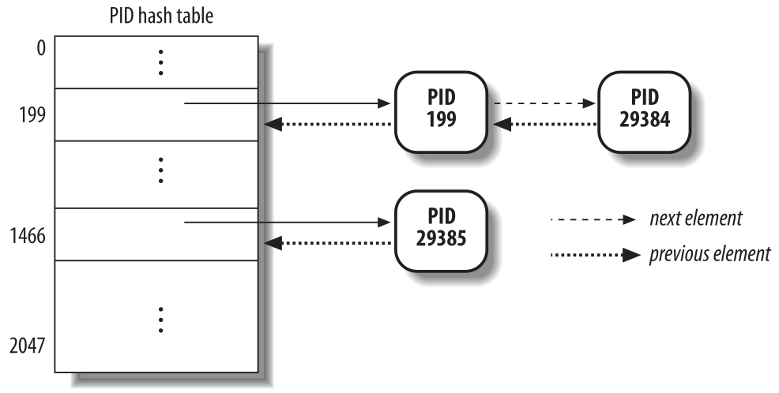

Procesos
========
El concepto de proceso es fundamental para cualquier sistema operativo multiprogramado. Un proceso se define generalmente como una instancia de un programa en ejecución; por lo tanto, si 16 usuarios están ejecutando el editor nano a la vez, hay 16 procesos separados (aunque pueden compartir el mismo código ejecutable). Los procesos a menudo se denominan tareas o hilos en el código fuente de Linux.

Analizamos las propiedades estáticas de los procesos y luego describimos cómo el núcleo realiza el cambio de procesos. También describimos cómo se pueden crear y destruir los procesos. Veremos cómo Linux admite aplicaciones multiproceso; como mencionamos anteriormente, se basa en los llamados procesos livianos (LWP - Light Weight Process).

Procesos, procesos livianos e hilos
-----------------------------------

El término “proceso” se utiliza a menudo con varios significados diferentes. Nosotros nos ceñimos a la definición habitual de los libros de texto sobre sistemas operativos: un *proceso* es una instancia de un programa en ejecución. Se puede pensar en él como la colección de estructuras de datos que describe completamente hasta qué punto ha progresado la ejecución del programa.

Los procesos son como los seres humanos: se crean, tienen una vida más o menos significativa, generan opcionalmente uno o más procesos hijos y, finalmente, mueren.

Desde el punto de vista del núcleo, el propósito de un proceso es actuar como una entidad a la que se asignan recursos del sistema (tiempo de CPU, memoria, etc.).

Cuando se crea un proceso, es casi idéntico a su padre. Recibe una copia (lógica) del espacio de direcciones del padre y ejecuta el mismo código que el padre, comenzando en la siguiente instrucción después de la llamada al sistema de creación del proceso. Aunque el padre y el hijo pueden compartir las páginas que contienen el código del programa (texto), tienen copias separadas de los datos (pila y heap), de modo que los cambios del hijo a una ubicación de memoria son invisibles para el padre (y viceversa).

Mientras que los núcleos Unix anteriores empleaban este modelo simple, los sistemas Unix modernos no lo hacen. Admiten *aplicaciones multiproceso*: programas de usuario que tienen muchos flujos de ejecución relativamente independientes que comparten una gran parte de las estructuras de datos de la aplicación. En tales sistemas, un proceso se compone de varios *hilos de usuario* (o simplemente *hilos*), cada uno de los cuales representa un flujo de ejecución del proceso. Hoy en día, la mayoría de las aplicaciones multiproceso se escriben utilizando conjuntos estándar de funciones de biblioteca llamadas bibliotecas pthread (hilos POSIX).

Las versiones anteriores del núcleo Linux no ofrecían soporte para aplicaciones multiproceso. Desde el punto de vista del núcleo, una aplicación multiproceso era simplemente un proceso normal. Los múltiples flujos de ejecución de una aplicación multiproceso se creaban, manejaban y planificaban completamente en modo usuario, generalmente por medio de una biblioteca *pthread* compatible con POSIX.

Sin embargo, esta implementación de aplicaciones multiprocesos no es muy satisfactoria. Por ejemplo, supongamos que un programa de ajedrez utiliza dos hilos: uno de ellos controla el tablero gráfico, esperando los movimientos del jugador humano y mostrando los movimientos de la computadora, mientras que el otro hilo analiza el siguiente movimiento de la partida. Mientras el primer hilo espera el movimiento humano, el segundo hilo debe ejecutarse continuamente, aprovechando así el tiempo  que el jugador humano usa para pensar su próxima jugada. Sin embargo, si el programa de ajedrez está pensado con un solo flujo de ejecución (un solo proceso), el primer hilo no puede simplemente esperar una acción del usuario (haciendo una llamada al sistema para esperar); de ser así, el segundo hilo también se bloquea. En cambio, el primer hilo debe emplear técnicas sofisticadas no bloqueantes para garantizar que el proceso siga siendo ejecutable.

Linux utiliza *procesos livianos* para ofrecer un mejor soporte para aplicaciones multiproceso. Básicamente, dos procesos livianos pueden compartir algunos recursos, como el espacio de direcciones, los archivos abiertos, etc. Siempre que uno de ellos modifica un recurso compartido, el otro ve inmediatamente el cambio. Por supuesto, los dos procesos deben sincronizarse al acceder al recurso compartido.

Una forma sencilla de implementar aplicaciones multiproceso es asociar un proceso liviano a cada hilo. De esta forma, los hilos pueden acceder al mismo conjunto de estructuras de datos de la aplicación simplemente compartiendo el mismo espacio de direcciones de memoria, el mismo conjunto de archivos abiertos, etc.; al mismo tiempo, el núcleo puede programar cada hilo de forma independiente para que uno pueda permanecer inactivo mientras el otro permanece en ejecución.

Descriptor de proceso
---------------------

Para gestionar procesos, el núcleo debe tener una idea clara de lo que hace cada proceso. Debe saber, por ejemplo, la prioridad del proceso, si se está ejecutando en una CPU o está bloqueado por un evento, qué espacio de direcciones se le ha asignado, qué archivos se le permite direccionar, etc. Ésta es la función del *descriptor de proceso*, una estructura de tipo *task_struct* cuyos campos contienen toda la información relacionada con un único proceso. Como repositorio de tanta información, el descriptor de proceso es bastante complejo. Además de una gran cantidad de campos que contienen atributos de proceso, el descriptor de proceso contiene varios punteros a otras estructuras de datos que, a su vez, contienen punteros a otras estructuras. La siguiente figura describe esquemáticamente el descriptor de proceso de Linux.

    Figura 1 - Descriptor de procesos de Linux

Estados de un proceso
*********************

Como su nombre lo indica, el campo *state* del descriptor de proceso describe lo que está sucediendo actualmente con el proceso. Consiste en un vector de indicadores, cada uno de los cuales describe un posible estado del proceso. En la versión actual de Linux, estos estados son mutuamente excluyentes y, por lo tanto, siempre se establece exactamente un indicador de estado; los indicadores restantes se borran. Los siguientes son los posibles estados del proceso:

TASK_RUNNING
    El proceso se está ejecutando en una CPU o esperando a ser ejecutado.

TASK_INTERRUPTIBLE
    El proceso está suspendido (durmiendo) hasta que alguna condición se vuelva verdadera. Generar una interrupción de hardware, liberar un recurso del sistema que el proceso está esperando o entregar una señal son ejemplos de condiciones que podrían despertar el proceso (poner su estado nuevamente en TASK_RUNNING).

TASK_UNINTERRUPTIBLE
    Como TASK_INTERRUPTIBLE, excepto que entregar una señal al proceso dormido deja su estado sin cambios. Este estado de proceso rara vez se usa. Sin embargo, es valioso bajo ciertas condiciones específicas en las que un proceso debe esperar hasta que ocurra un evento dado sin ser interrumpido. Por ejemplo, este estado se puede utilizar cuando un proceso abre un archivo de dispositivo y el controlador del dispositivo correspondiente comienza a buscar un dispositivo de hardware correspondiente. El controlador de dispositivo no debe interrumpirse hasta que se complete el sondeo, o el dispositivo de hardware podría quedar en un estado impredecible.

TASK_STOPPED
    La ejecución del proceso se ha detenido; el proceso entra en este estado después de recibir una señal SIGSTOP, SIGTSTP, SIGTTIN o SIGTTOU.

TASK_TRACED
    La ejecución del proceso ha sido detenida por un depurador. Cuando un proceso está siendo monitoreado por otro (como cuando un depurador ejecuta una llamada al sistema ptrace() para monitorear un programa de prueba), cada señal puede poner el proceso en el estado TASK_TRACED.

Se pueden almacenar dos estados adicionales del proceso tanto en el campo de estado como en el campo *exit_state* del descriptor de proceso; como sugiere el nombre del campo, un proceso alcanza uno de estos dos estados solo cuando finaliza su ejecución:

EXIT_ZOMBIE
    La ejecución del proceso finaliza, pero el proceso padre aún no ha emitido una llamada al sistema wait4() o waitpid() para devolver información sobre el proceso muerto. Antes de que se emita la llamada similar a wait(), el núcleo no puede descartar los datos contenidos en el descriptor del proceso muerto porque el padre podría necesitarlos.

EXIT_DEAD
    El estado final: el proceso está siendo eliminado por el sistema porque el proceso padre acaba de emitir una llamada al sistema wait4() o waitpid() para él. Cambiar su estado de EXIT_ZOMBIE a EXIT_DEAD evita condiciones de carrera debido a otros hilos de ejecución que ejecutan llamadas similares a wait() en el mismo proceso.

El valor del campo de estado generalmente se establece con una asignación simple. Por ejemplo:

    p->state = TASK_RUNNING;

Identificando un proceso
************************

Como regla general, cada contexto de ejecución que se puede planificar de forma independiente debe tener su propio descriptor de proceso; por lo tanto, incluso los procesos livianos, que comparten una gran parte de sus estructuras de datos del núcleo, tienen sus propias estructuras task_struct.

La estricta correspondencia uno a uno entre el proceso y el descriptor de proceso hace que la dirección de 32 bits de la estructura task_struct sea un medio útil para que el núcleo identifique los procesos. Estas direcciones se conocen como *punteros de descriptor de proceso*. La mayoría de las referencias a procesos que hace el núcleo se realizan a través de punteros de descriptor de proceso.

Por otro lado, los sistemas operativos tipo Unix permiten a los usuarios identificar los procesos por medio de un número llamado *identificador de proceso* (o *PID*), que se almacena en el campo *pid* del descriptor de proceso. Los PID se numeran secuencialmente: el PID de un proceso recién creado es normalmente el PID del proceso creado anteriormente incrementado en uno. Por supuesto, existe un límite superior en los valores de PID; cuando el núcleo alcanza dicho límite, debe comenzar a reciclar los PID inferiores, que no se utilizan (procesos que ya no existen y a los cuales se les asignó esos PIDs). Por defecto, el número máximo de PID es 32.767 (PID_MAX_DEFAULT - 1); el administrador del sistema puede reducir este límite escribiendo un valor menor en el archivo /proc/sys/kernel/pid_max.

Al reciclar números de PID, el núcleo debe administrar un mapa de bits *pidmap_array* que indique cuáles son los PID actualmente asignados y cuáles están libres. Debido a que un marco de página contiene 32.768 bits, en arquitecturas de 32 bits el mapa de bits pidmap_array se almacena en una sola página. Sin embargo, en arquitecturas de 64 bits, se pueden agregar páginas adicionales al mapa de bits cuando el núcleo asigna un número de PID demasiado grande para el tamaño actual del mapa de bits. Estas páginas nunca se liberan.

Linux asocia un PID diferente con cada proceso o proceso liviano del sistema (como veremos más adelante, hay una pequeña excepción en los sistemas multiprocesador). Este enfoque permite la máxima flexibilidad, porque cada contexto de ejecución del sistema puede identificarse de forma única.

Por otro lado, los programadores de Unix esperan que los hilos del mismo grupo tengan un PID común. Por ejemplo, debería ser posible enviar una señal que especifique un PID que afecte a todos los hilos del grupo. De hecho, el estándar POSIX 1003.1c establece que todos los hilos de una aplicación multiproceso deben tener el mismo PID.

Para cumplir con este estándar, Linux hace uso de *grupos de hilos*. El identificador compartido por los hilos es el PID del líder del grupo de hilos, es decir, el PID del primer proceso liviano del grupo; se almacena en el campo tgid de los descriptores de proceso. La llamada al sistema getpid() devuelve el valor de tgid relativo al proceso actual en lugar del valor de pid, por lo que todos los hilos de una aplicación multiproceso comparten el mismo identificador. La mayoría de los procesos pertenecen a un grupo de hilos que consta de un solo miembro; como líderes del grupo de hilos, tienen el campo tgid igual al campo pid, por lo que la llamada al sistema getpid() funciona de manera habitual para este tipo de proceso.

Más adelante, le mostraremos cómo es posible derivar el puntero al descriptor de proceso de manera eficiente a partir de su PID. La eficiencia es importante porque muchas llamadas al sistema como kill() usan el PID para indicar el proceso afectado.

Manejo de descriptores de procesos
>>>>>>>>>>>>>>>>>>>>>>>>>>>>>>>>>>

Los procesos son entidades dinámicas cuya vida útil varía desde unos pocos milisegundos hasta meses. Por lo tanto, el núcleo debe ser capaz de manejar muchos procesos al mismo tiempo, y los descriptores de proceso se almacenan en la memoria dinámica en lugar de en el área de memoria asignada permanentemente al núcleo. Para cada proceso, Linux empaqueta dos estructuras de datos diferentes en una única área de memoria por proceso: una pequeña estructura de datos vinculada al descriptor de proceso, a saber, la estructura *thread_info*, y la *pila de procesos de modo núcleo*. La longitud de esta área de memoria es normalmente de 8.192 bytes (dos marcos de página). Por razones de eficiencia, el núcleo almacena el área de memoria de 8 KB en dos marcos de página consecutivos con el primer marco de página alineado a un múltiplo de 2\ :sup:`13`; esto puede resultar un problema cuando hay poca memoria dinámica disponible, porque la memoria libre puede llegar a fragmentarse en gran medida. Por lo tanto, en la arquitectura 80×86, el núcleo puede configurarse en el momento de la compilación de modo que el área de memoria que incluye la pila y la estructura thread_info ocupe un único marco de página (4096 bytes).

Anteriormente aprendimos que un proceso en modo núcleo accede a una pila contenida en el segmento de datos del núcleo, que es diferente de la pila utilizada por el proceso en modo usuario. Debido a que las hilos del núcleo hacen poco uso de la pila, sólo se requieren unos pocos bytes de la pila del núcleo. Por lo tanto, 8 KB es espacio suficiente para la pila y la estructura thread_info. Sin embargo, cuando la pila y la estructura thread_info están contenidas en un único marco de página, el núcleo utiliza pilas adicionales para evitar los desbordamientos causados ​​por interrupciones y excepciones profundamente anidadas.

La siguiente figura muestra cómo se almacenan las dos estructuras de datos en el área de memoria de 2 páginas (8 KB). La estructura thread_info se encuentra al principio del área de memoria y la pila crece hacia abajo desde el final. La figura también muestra que la estructura thread_info y la estructura task_struct están vinculadas entre sí por medio de los campos *task* y *thread_info*, respectivamente.

    Figura 2 - Estructura *thread_info* y la *pila de kernel del proceso* en dos marcos de página

El registro *esp* es el puntero de pila de la CPU, que se utiliza para direccionar la ubicación superior de la pila. En sistemas 80×86, la pila comienza al final y crece hacia el principio del área de memoria. Inmediatamente después de cambiar del modo usuario al modo núcleo, la pila del núcleo de un proceso siempre está vacía y, por lo tanto, el registro esp apunta al byte inmediatamente posterior a la pila.

El valor del esp disminuye tan pronto como se escriben datos en la pila. Debido a que la estructura thread_info tiene 52 bytes de longitud, la pila del núcleo puede expandirse hasta 8140 bytes.

El lenguaje C permite que la estructura thread_info y la pila del núcleo de un proceso se representen convenientemente por medio de la siguiente instrucción union:

..  code-block:: c

    union thread_union {
        struct thread_info thread_info;
        unsigned long stack[2048]; /* 1024 for 4KB stacks */
    };

La estructura thread_info que se muestra en la figura se almacena a partir de la dirección 0x015fa000, y la pila se almacena a partir de la dirección 0x015fc000. El valor del registro esp apunta a la parte superior actual de la pila en 0x015fa878.

Identificando el proceso actual (*current*)
>>>>>>>>>>>>>>>>>>>>>>>>>>>>>>>>>>>>>>>>>>>

La estrecha asociación entre la estructura *thread_info* y la pila del modo kernel que acabamos de describir ofrece un beneficio clave en términos de eficiencia: el kernel puede obtener fácilmente la dirección de la estructura thread_info del proceso que se está ejecutando actualmente en una CPU a partir del valor del registro *esp*. De hecho, si la estructura *thread_union* tiene una longitud de 8 KB (2\ :sup:`13` bytes), el kernel enmascara los 13 bits menos significativos de *esp* para obtener la dirección base de la estructura *thread_info*; por otro lado, si la estructura *thread_union* tiene una longitud de 4 KB, el kernel enmascara los 12 bits menos significativos de *esp*. Esto se hace mediante la función *current_thread_info()*, que produce instrucciones en lenguaje ensamblador como las siguientes:

..  code-block:: ASM

    movl $0xffffe000,%ecx /* or 0xfffff000 for 4KB stacks */
    andl %esp,%ecx
    movl %ecx,p

Después de ejecutar estas tres instrucciones, *p* contiene el puntero de la estructura *thread_info* del proceso que se está ejecutando en la CPU que ejecuta la instrucción.

Con mayor frecuencia, el kernel necesita la dirección del descriptor del proceso en lugar de la dirección de la estructura *thread_info*. Para obtener el puntero del descriptor de proceso del proceso que se está ejecutando actualmente en una CPU, el núcleo hace uso de la macro *current*, que es esencialmente equivalente a *current_thread_info()->task* y produce instrucciones en lenguaje ensamblador como las siguientes:

..  code-block:: ASM

    movl $0xffffe000,%ecx /* or 0xfffff000 for 4KB stacks */
    andl %esp,%ecx
    movl (%ecx),p

Debido a que el campo *task* está en el desplazamiento 0 en la estructura *thread_info*, después de ejecutar estas tres instrucciones *p* contiene el puntero del descriptor de proceso del proceso que se está ejecutando en la CPU.

La macro *current* aparece a menudo en el código del núcleo como un prefijo a los campos del descriptor de proceso. Por ejemplo, *current->pid* devuelve el ID del proceso que se está ejecutando actualmente en la CPU. Otra ventaja de almacenar el descriptor de proceso con la pila surge en sistemas multiprocesador: el proceso actual correcto para cada procesador de hardware se puede derivar simplemente comprobando la pila, como se mostró anteriormente. Las versiones anteriores de Linux no almacenaban la pila del núcleo y el descriptor de proceso juntos. En su lugar, se vieron obligados a introducir una variable estática global llamada *current* para identificar el descriptor de proceso del proceso en ejecución. En sistemas multiprocesador, era necesario definir *current* como una matriz: un elemento para cada CPU disponible.

La lista de procesos
>>>>>>>>>>>>>>>>>>>>

El primer ejemplo de una lista enlazada que examinaremos es la lista de procesos, una lista que enlaza todos los descriptores de procesos existentes. Cada estructura *task_struct* incluye un campo *tasks* cuyos campos prev y next apuntan, respectivamente, al elemento *task_struct* anterior y al siguiente.

La cabecera de la lista de procesos es el descriptor task_struct *init_task*; es el descriptor de proceso del llamado *proceso 0* o *swapper*. El campo *task->prev* de *init_task* apunta al campo *de tareas *task* del descriptor de proceso insertado en último lugar en la lista.

Las macros SET_LINKS y REMOVE_LINKS se utilizan para insertar y eliminar un descriptor de proceso en la lista de procesos, respectivamente. Estas macros también se encargan de la relación de parentesco del proceso.

Las listas de procesos TASK_RUNNING
>>>>>>>>>>>>>>>>>>>>>>>>>>>>>>>>>>>

Cuando se busca un nuevo proceso para ejecutar en una CPU, el núcleo tiene que considerar sólo los procesos ejecutables (es decir, los procesos en el estado TASK_RUNNING).

Las versiones anteriores de Linux ponían todos los procesos ejecutables en la misma lista llamada cola de ejecución (*runqueue*). Como sería demasiado costoso mantener la lista ordenada según las prioridades de los procesos, los planificadores anteriores se veían obligados a escanear toda la lista para seleccionar el “mejor” proceso ejecutable.

Linux 2.6 implementa la cola de ejecución de forma diferente. El objetivo es permitir que el planificador seleccione el mejor proceso ejecutable en tiempo constante, independientemente del número de procesos ejecutables.

El truco utilizado para lograr la aceleración del planificador consiste en dividir la cola de ejecución en muchas listas de procesos ejecutables, una lista por prioridad de proceso. Cada descriptor *task_struct* incluye un campo *run_list* de tipo *list_head*. Si la prioridad del proceso es igual a k (un valor que oscila entre 0 y 139), el campo *run_list* vincula el descriptor del proceso a la lista de procesos ejecutables que tienen prioridad k. Además, en un sistema multiprocesador, cada CPU tiene su propia cola de ejecución, es decir, su propio conjunto de listas de procesos. Este es un ejemplo clásico de cómo hacer que las estructuras de datos sean más complejas para mejorar el rendimiento: para hacer que las operaciones del planificador sean más eficientes, ¡la lista de cola de ejecución se ha dividido en 140 listas diferentes!

Como veremos, el núcleo debe preservar una gran cantidad de datos para cada cola de ejecución en el sistema; sin embargo, las principales estructuras de datos de una cola de ejecución son las listas de descriptores de procesos que pertenecen a la cola de ejecución; todas estas listas se implementan mediante una única estructura de datos *prio_array_t*, cuyos campos se muestran en la Tabla 3-2.

+-----------------------+-----------+---------------------------------------------------------------+
| Tipo                  | Campo     | Descripción                                                   |
+=======================+===========+===============================================================+
| int                   | nr_active | El número de descriptores de procesos enlazados a la lista    |
+-----------------------+-----------+---------------------------------------------------------------+
| unsigned long[5]      | bitmap    | Bit de prioridad                                              |
+-----------------------+-----------+---------------------------------------------------------------+
| struct list_head[140] | queue     | 140 cabeceras de listas de prioridades                        |
+-----------------------+-----------+---------------------------------------------------------------+

Relaciones entre procesos
*************************

Los procesos creados por un programa tienen una relación padre/hijo. Cuando un proceso crea varios hijos, estos hijos tienen relaciones de hermanos. Se deben introducir varios campos en un descriptor de proceso para representar estas relaciones; se enumeran en la siguiente tabla con respecto a un proceso P dado. Los procesos 0 y 1 son creados por el núcleo; como veremos más adelante en el capítulo, el proceso 1 (init) es el ancestro de todos los demás procesos.

+-------------------+-----------------------------------------------------------------------+
| Campo             | Descripción                                                           |
+===================+=======================================================================+
| real_parent       | Apunta al descriptor de proceso del proceso que creó P o al descriptor|
|                   | del proceso 1 (init) si el proceso padre ya no existe. (Por lo tanto, |
|                   | cuando un usuario inicia un proceso en segundo plano y sale del shell,| 
|                   | el proceso en segundo plano se convierte en el proceso hijo de init). |
+-------------------+-----------------------------------------------------------------------+
| parent            | Apunta al padre actual de P (este es el proceso al que se debe enviar |
|                   | una señal cuando el proceso hijo finaliza); su valor suele coincidir  |
|                   | con el de real_parent. Ocasionalmente puede diferir, como cuando otro |
|                   | proceso emite una llamada al sistema ptrace() solicitando que se le   |
|                   | permita monitorear P.                                                 |
+-------------------+-----------------------------------------------------------------------+
| children          | El encabezado de la lista que contiene todos los hijos creados por P. |
+-------------------+-----------------------------------------------------------------------+
| sibling           | Los punteros a los elementos siguientes y anteriores en la lista de   |
|                   | procesos hermanos, aquellos que tienen el mismo padre que P.          |
+-------------------+-----------------------------------------------------------------------+

La siguiente figura ilustra las relaciones padre/hijo de un grupo de procesos. El proceso P0 creó sucesivamente P1, P2 y P3. El proceso P3, a su vez, creó el proceso P4. Además, existen otras relaciones entre procesos: un proceso puede ser líder de un grupo de procesos o de una sesión de inicio de sesión, puede ser líder de un grupo de hilos y también puede rastrear la ejecución de otros procesos.

    Figura 3 - Relaciones de paternidad entre cinco procesos

La tabla pidhash y las listas encadenadas
>>>>>>>>>>>>>>>>>>>>>>>>>>>>>>>>>>>>>>>>>

En varias circunstancias, el núcleo debe ser capaz de derivar el puntero del descriptor de proceso correspondiente a un PID. Esto ocurre, por ejemplo, al dar servicio a la llamada del sistema kill(). Cuando el proceso P1 desea enviar una señal a otro proceso, P2, invoca la llamada del sistema kill() especificando el PID de P2 como parámetro. El núcleo deriva el puntero del descriptor de proceso del PID y luego extrae el puntero a la estructura de datos que registra las señales pendientes del descriptor de proceso de P2.

Es posible escanear la lista de procesos secuencialmente y verificar los campos pid de los descriptores de proceso, pero es bastante ineficiente. Para acelerar la búsqueda, se han introducido cuatro tablas hash. ¿Por qué múltiples tablas hash? Simplemente porque el descriptor de proceso incluye campos que representan diferentes tipos de PID, y cada tipo de PID requiere su propia tabla hash.

Como explica cada curso básico de informática, una función hash no siempre asegura una correspondencia uno a uno entre los PID y los índices de tabla. Se dice que dos PID diferentes que hacen hash en el mismo índice de tabla están en *colisión*.

Linux utiliza el *encadenamiento* para manejar PIDs en colisión; cada entrada de la tabla es la cabecera de una lista doblemente enlazada de descriptores de procesos en colisión. La figura ilustra una tabla hash de PID con dos listas. Los procesos que tienen PIDs 2.890 y 29.384 hacen hash en el elemento 200 de la tabla, mientras que el proceso que tiene PID 29.385 hace hash en el elemento 1.466 de la tabla.

El hash con encadenamiento es preferible a una transformación lineal de PIDs a índices de tabla porque en cualquier instancia dada, el número de procesos en el sistema es usualmente muy inferior a 32.768 (el número máximo de PIDs permitidos). Sería un desperdicio de almacenamiento definir una tabla que consista en 32.768 entradas, si, en cualquier instancia dada, la mayoría de dichas entradas no se utilizan.

    Figura 4 - Una tabla hash PID simple y listas encadenadas

Las estructuras de datos utilizadas en las tablas hash PID son bastante sofisticadas, porque deben mantener un registro de las relaciones entre los procesos. Como ejemplo, supongamos que el núcleo debe recuperar todos los procesos que pertenecen a un grupo de hilos determinado, es decir, todos los procesos cuyo campo tgid es igual a un número determinado. Al buscar en la tabla hash el número de grupo de hilos dado, se obtiene sólo un descriptor de proceso, es decir, el descriptor del líder del grupo de hilos. Para recuperar rápidamente los demás procesos del grupo, el núcleo debe mantener una lista de procesos para cada grupo de hilos. La misma situación surge cuando se buscan los procesos que pertenecen a una sesión de inicio de sesión determinada o que pertenecen a un grupo de procesos determinado.

Las estructuras de datos de las tablas hash PID resuelven todos estos problemas, porque permiten la definición de una lista de procesos para cualquier número PID incluido en una tabla hash. La estructura de datos principal es una matriz de cuatro estructuras pid incrustadas en el campo pids del descriptor de proceso; los campos de la estructura pid se muestran en la tabla.

+-----------------------+-----------+---------------------------------------------------------------+
| Tipo                  | Nombre    | Descripción                                                   |
+=======================+===========+===============================================================+
| int                   | nr        | El número de PID                                              |
+-----------------------+-----------+---------------------------------------------------------------+
| struct hlist_node     | pid_chain | Los enlaces a los elementos siguientes y anteriores en la     |
|                       |           | lista de la cadena hash                                       |
+-----------------------+-----------+---------------------------------------------------------------+
| struct list_head      | pid_list  | El encabezado de la lista por PID                             |
+-----------------------+-----------+---------------------------------------------------------------+

La siguiente figura muestra un ejemplo basado en la tabla hash PIDTYPE_TGID (tabla de grupo de hilos). La segunda entrada de la matriz *pid_hash* almacena la dirección de la tabla hash, es decir, la matriz de estructuras *hlist_head* que representan las cabeceras de las listas de la cadena. En la lista de la cadena con raíz en la entrada 71 de la tabla hash, hay dos descriptores de proceso correspondientes a los números PID 246 y 4.351 (las líneas de doble flecha representan un par de punteros hacia delante y hacia atrás). Los números PID se almacenan en el campo *nr* de la estructura pid incrustada en el descriptor de proceso (por cierto, debido a que el número del grupo de hilos coincide con el PID de su líder, estos números también se almacenan en el campo pid de los descriptores de proceso).

    Figura 5 - Las tablas hash PID

Consideremos la lista por PID del grupo de hilos 4.351: la cabecera de la lista se almacena en el campo *pid_list* del descriptor de proceso incluido en la tabla hash, mientras que los enlaces a los elementos siguiente y anterior de la lista por PID también se almacenan en el campo pid_list de cada elemento de la lista.

Cómo se organizan los procesos
******************************

Las listas de colas de ejecución (*runqueue*) agrupan todos los procesos en un estado TASK_RUNNING. Cuando se trata de agrupar procesos en otros estados, los diversos estados requieren diferentes tipos de tratamiento, con Linux optando por una de las opciones que se muestran en la siguiente lista.

- Los procesos en un estado TASK_STOPPED, EXIT_ZOMBIE o EXIT_DEAD no están vinculados en listas específicas. No hay necesidad de agrupar procesos en ninguno de estos tres estados, porque los procesos detenidos, zombis y muertos solo se acceden a través de PID o a través de listas vinculadas de los procesos secundarios para un padre en particular.
- Los procesos en un estado TASK_INTERRUPTIBLE o TASK_UNINTERRUPTIBLE se subdividen en muchas clases, cada una de las cuales corresponde a un evento específico. En este caso, el estado del proceso no proporciona suficiente información para recuperar el proceso rápidamente, por lo que es necesario introducir listas adicionales de procesos. Estas se denominan *colas de espera* (*wait queues*) y se analizan a continuación.

Colas de espera (wait queues)
>>>>>>>>>>>>>>>>>>>>>>>>>>>>>

Las colas de espera tienen varios usos en el núcleo, particularmente para el manejo de interrupciones, la sincronización de procesos y el cronometraje. Debido a que estos temas se tratan en posteriormente, aquí solo diremos que un proceso a menudo debe esperar a que ocurra algún evento, como que finalice una operación de disco, se libere un recurso del sistema o transcurra un intervalo de tiempo fijo. Las colas de espera implementan esperas condicionales en eventos: un proceso que desea esperar un evento específico se coloca en la cola de espera adecuada y cede el control. Por lo tanto, una cola de espera representa un conjunto de procesos dormidos, que son despertados por el núcleo cuando alguna condición se vuelve verdadera.

Las colas de espera se implementan como listas doblemente enlazadas cuyos elementos incluyen punteros a descriptores de procesos. Cada cola de espera se identifica por una *cabecera de cola de espera*, una estructura de datos de tipo *wait_queue_head_t*:

..  code-block:: c

    struct __wait_queue_head {
            spinlock_t lock;
            struct list_head task_list;
    };
    typedef struct __wait_queue_head wait_queue_head_t;

Debido a que las colas de espera son modificadas por manejadores de interrupciones así como por funciones principales del núcleo, las listas doblemente enlazadas deben estar protegidas de accesos concurrentes, que podrían inducir resultados impredecibles. La sincronización se logra mediante el candado *lock* en la cabecera de la cola de espera. El campo *task_list* es la cabecera de la lista de procesos en espera.

Los elementos de una lista de cola de espera son de tipo *wait_queue_t*:

.. code-block:: c

    struct __wait_queue {
        unsigned int flags;
        struct task_struct * task;
        wait_queue_func_t func;
        struct list_head task_list;
    };
    typedef struct __wait_queue wait_queue_t;

Cada elemento en la lista de cola de espera representa un proceso inactivo, que está esperando que ocurra algún evento; su dirección de descriptor se almacena en el campo *task*. El campo *task_list* contiene los punteros que vinculan este elemento a la lista de procesos que esperan el mismo evento.

Sin embargo, no siempre es conveniente despertar *todos* los procesos inactivos en una cola de espera. Por ejemplo, si dos o más procesos están esperando que se libere acceso exclusivo a algún recurso, tiene sentido despertar solo un proceso en la cola de espera. Este proceso toma el recurso, mientras que los otros procesos continúan durmiendo. (Esto evita un problema conocido como la “manada atronadora”, con la que múltiples procesos se despiertan solo para competir por un recurso al que puede acceder uno de ellos, con el resultado de que los procesos restantes deben volver a dormirse una vez más).

Por lo tanto, hay dos tipos de procesos dormidos: los *procesos exclusivos* (indicados por el valor 1 en el campo *flags* del elemento de cola de espera correspondiente) son despertados selectivamente por el núcleo, mientras que los *procesos no exclusivos* (indicados por el valor 0 en el campo *flags*) siempre son despertados por el núcleo cuando ocurre el evento. Un proceso que espera un recurso que se puede otorgar a un solo proceso a la vez es un proceso exclusivo típico. Los procesos que esperan un evento que puede afectar a cualquiera de ellos son no exclusivos. Considere, por ejemplo, un grupo de procesos que están esperando la terminación de un grupo de transferencias de bloques de disco: tan pronto como se completan las transferencias, todos los procesos en espera deben ser despertados. Como veremos a continuación, el campo *func* de un elemento de la cola de espera se utiliza para especificar cómo deben despertarse los procesos que duermen en la cola de espera.

Manejo de colas de espera
>>>>>>>>>>>>>>>>>>>>>>>>>

Se puede definir una nueva cabecera de cola de espera utilizando la macro DECLARE_WAIT_QUEUE_HEAD(name), que declara estáticamente una nueva variable de cabecera de cola de espera llamada *name* e inicializa sus campos *lock* y *task_list*.

La función *init_waitqueue_entry(q,p)* inicializa una estructura *wait_queue_t* *q* de la siguiente manera:

..  code-block:: c

    q->flags = 0;
    q->task = p;
    q->func = default_wake_function;

El proceso no exclusivo *p* será despertado por *default_wake_function()*, que es un contenedor simple para la función *try_to_wake_up()* que veremos posteriormente.

Alternativamente, la macro DEFINE_WAIT declara una nueva variable *wait_queue_t* y la inicializa con el descriptor del proceso que se está ejecutando actualmente en la CPU y la dirección de la función de despertar *autoremove_wake_function()*. Esta función invoca *default_wake_function()* para despertar el proceso dormido y luego elimina el elemento de la cola de espera de la lista de colas de espera. Finalmente, un programador de núcleo puede definir una función de despertar personalizada inicializando el elemento de la cola de espera con la función *init_waitqueue_func_entry()*.

Una vez que se define un elemento, debe insertarse en una cola de espera. La función *add_wait_queue()* inserta un proceso no exclusivo en la primera posición de una lista de cola de espera. La función *add_wait_queue_exclusive()* inserta un proceso exclusivo en la última posición de una lista de cola de espera. La función *remove_wait_queue()* elimina un proceso de una lista de cola de espera. La función *waitqueue_active()* verifica si una lista de cola de espera dada está vacía.

Un proceso que desee esperar una condición específica puede invocar cualquiera de las funciones que se muestran en la siguiente lista.

- La función *sleep_on()* opera sobre el proceso actual:

    ..  code-block:: c

        void sleep_on(wait_queue_head_t *wq)
        {
            wait_queue_t wait;
            init_waitqueue_entry(&wait, current);
            current->state = TASK_UNINTERRUPTIBLE;
            add_wait_queue(wq,&wait); /* wq apunta a la cabecera de la cola de espera */
            schedule();
            remove_wait_queue(wq, &wait);
        }

    La función establece el estado del proceso actual en TASK_UNINTERRUPTIBLE y lo inserta en la cola de espera especificada. Luego invoca al planificador, que reanuda la ejecución de otro proceso. Cuando se despierta el proceso dormido, el planificador reanuda la ejecución de la función *sleep_on()*, que elimina el proceso de la cola de espera.
- La función *interrumpible_sleep_on()* es idéntica a *sleep_on()*, excepto que establece el estado del proceso actual en TASK_INTERRUPTIBLE en lugar de establecerlo en TASK_UNINTERRUPTIBLE, de modo que el proceso también puede ser despertado al recibir una señal.
- Las funciones *sleep_on_timeout()* e *interrumpible_sleep_on_timeout()* son similares a las anteriores, pero también permiten al llamador definir un intervalo de tiempo después del cual el proceso será despertado por el núcleo. Para ello, invocan la función *schedule_timeout()* en lugar de *schedule()*.
- Las funciones *prepare_to_wait()*, *prepare_to_wait_exclusive()* y *finish_wait()*, introducidas en Linux 2.6, ofrecen otra forma de poner el proceso actual a dormir en una cola de espera. Normalmente, se utilizan de la siguiente manera:

    ..  code-block:: c

        DEFINE_WAIT(wait);
        prepare_to_wait_exclusive(&wq, &wait, TASK_INTERRUPTIBLE);
               /* wq es la cabecera de la cola de espera */
        ...
        if (!condition)
            schedule();
        finish_wait(&wq, &wait);

    Las funciones *prepare_to_wait()* y *prepare_to_wait_exclusive()* establecen el estado del proceso en el valor pasado como tercer parámetro, luego establecen el indicador exclusivo en el elemento de la cola de espera respectivamente en 0 (no exclusivo) o 1 (exclusivo) y, finalmente, insertan el elemento de la cola de espera *wait* en la lista de la cabecera de la cola de espera *wq*.

    Tan pronto como el proceso se despierta, ejecuta la función *finish_wait()*, que establece nuevamente el estado del proceso a TASK_RUNNING (solo en caso de que la condición de despertar se vuelva verdadera antes de invocar schedule()), y elimina el elemento de la cola de espera de la lista de colas de espera (a menos que esto ya haya sido hecho por la función de despertar).

- Las macros *wait_event* y *wait_event_interruptible* ponen al proceso que llama a dormir en una cola de espera hasta que se verifique una condición dada. Por ejemplo, la macro *wait_ event(wq,condition)* produce esencialmente el siguiente fragmento:

    ..  code-block:: c

        DEFINE_WAIT(_ _wait);
        for (;;) {
            prepare_to_wait(&wq, &_ _wait, TASK_UNINTERRUPTIBLE);
            if (condition)
                break;
            schedule();
        }
        finish_wait(&wq, &_ _wait);

Algunos comentarios sobre las funciones mencionadas en la lista anterior: las funciones similares a *sleep_on()-nn* no se pueden usar en la situación común donde uno tiene que probar una condición y poner atómicamente el proceso a dormir cuando la condición no se verifica; por lo tanto, debido a que son una fuente bien conocida de condiciones de carrera, se desaconseja su uso.

Además, para insertar un proceso exclusivo en una cola de espera, el núcleo debe hacer uso de la función *prepare_to_wait_exclusive()*; cualquier otra función auxiliar inserta el proceso como no exclusivo. Finalmente, a menos que se utilicen DEFINE_WAIT o *finish_wait()*, el núcleo debe eliminar el elemento de la cola de espera de la lista después de que se haya despertado el proceso en espera.

El núcleo despierta los procesos en las colas de espera, poniéndolos en el estado TASK_RUNNING, por medio de una de las siguientes macros: *wake_up*, *wake_up_nr*, *wake_up_all*, *wake_up_interruptible*, *wake_up_interruptible_nr*, *wake_up_interruptible_all*, *wake_up_interruptible_sync* y *wake_up_locked*. Se puede entender lo que hace cada una de estas nueve macros a partir de su nombre:

- Todas las macros tienen en cuenta los procesos dormidos en la cola TASK_INT. Estado ERRUPTIBLE; si el nombre de la macro no incluye la cadena “interrumpible”, también se consideran los procesos inactivos en el estado TASK_UNINTERRUPTIBLE.
- Todas las macros despiertan todos los procesos no exclusivos que tienen el estado requerido.
- Las macros cuyo nombre incluye la cadena “*nr*” despiertan una cantidad dada de procesos exclusivos que tienen el estado requerido; este número es un parámetro de la macro. Las macros cuyos nombres incluyen la cadena “*all*” despiertan todos los procesos exclusivos que tienen el estado requerido. Finalmente, las macros cuyos nombres no incluyen “*nr*” o “*all*” despiertan exactamente un proceso exclusivo que tiene el estado requerido.
- Las macros cuyos nombres no incluyen la cadena “*sync*” verifican si la prioridad de alguno de los procesos despertados es mayor que la de los procesos que se están ejecutando actualmente en los sistemas e invocan *schedule()* si es necesario. Estas verificaciones no las realiza la macro cuyo nombre incluye la cadena “*sync*”; como resultado, la ejecución de un proceso de alta prioridad puede demorarse ligeramente.
- La macro *wake_up_locked* es similar a *wake_up*, excepto que se llama cuando el spin lock en *wait_queue_head_t* ya está retenido.

Por ejemplo, la macro *wake_up* es esencialmente equivalente al siguiente fragmento de código:

..  code-block:: c

    void wake_up(wait_queue_head_t *q)
    {
        struct list_head *tmp;
        wait_queue_t *curr;
        list_for_each(tmp, &q->task_list) {
            curr = list_entry(tmp, wait_queue_t, task_list);
            if (curr->func(curr, TASK_INTERRUPTIBLE|TASK_UNINTERRUPTIBLE, 0, NULL) && curr->flags)
            break;
        }
    }

La macro *list_for_each* escanea todos los elementos en la lista doblemente *enlazada q->task_list*, es decir, todos los procesos en la cola de espera. Para cada elemento, la macro *list_entry* calcula la dirección de la variable *wait_queue_t* correspondiente. El campo *func* de esta variable almacena la dirección de la función de activación, que intenta activar el proceso identificado por el campo *task* del elemento de la cola de espera. Si un proceso se ha activado de manera efectiva (la función devolvió 1) y si el proceso es exclusivo (*curr->flags* igual a 1), el bucle termina. Dado que todos los procesos no exclusivos están siempre al principio de la lista doblemente enlazada y todos los procesos exclusivos están al final, la función siempre despierta los procesos no exclusivos y luego despierta un proceso exclusivo, si existe alguno.

Cambio de proceso
-----------------

Para controlar la ejecución de los procesos, el núcleo debe poder suspender la ejecución del proceso que se está ejecutando en la CPU y reanudar la ejecución de algún otro proceso suspendido previamente. Esta actividad se conoce con los nombres de *cambio de proceso*, *cambio de tarea* o *cambio de contexto*. A continuación se describen los elementos del cambio de proceso en Linux.

Contexto de hardware
********************
Aunque cada proceso puede tener su propio espacio de direcciones, todos los procesos tienen que compartir los registros de la CPU. Por lo tanto, antes de reanudar la ejecución de un proceso, el núcleo debe asegurarse de que cada uno de esos registros esté cargado con el valor que tenía cuando se suspendió el proceso.

El conjunto de datos que se deben cargar en los registros antes de que el proceso reanude su ejecución en la CPU se denomina *contexto de hardware*. El contexto de hardware es un subconjunto del contexto de ejecución del proceso, que incluye toda la información necesaria para la ejecución del proceso. En Linux, una parte del contexto de hardware de un proceso se almacena en el descriptor de proceso, mientras que la parte restante se guarda en la pila del núcleo.

En la descripción que sigue, asumiremos que la variable local *prev* se refiere al descriptor de proceso del proceso que está saliendo y *next* se refiere al que está ingresando para reemplazarlo. Por lo tanto, podemos definir un cambio de proceso como la actividad que consiste en guardar el contexto de hardware de *prev* y reemplazarlo con el contexto de hardware de *next*. Debido a que los cambios de proceso ocurren con bastante frecuencia, es importante minimizar el tiempo empleado en guardar y cargar contextos de hardware.

Las versiones anteriores de Linux aprovechaban el soporte de hardware ofrecido por la arquitectura 80×86 y realizaban un cambio de proceso a través de una instrucción *far jmp** al selector del Descriptor de Segmento de Estado de Tarea del siguiente proceso. Mientras se ejecuta la instrucción, la CPU realiza un cambio de contexto de hardware guardando automáticamente el contexto de hardware anterior y cargando uno nuevo. Pero Linux 2.6 utiliza software para realizar un cambio de proceso por las siguientes razones:

- El cambio paso a paso realizado a través de una secuencia de instrucciones *mov* (instrucción en lenguaje ensamblador) permite un mejor control sobre la validez de los datos que se están cargando. En particular, es posible verificar los valores de los registros de segmentación *ds* y *es*, que podrían haber sido falsificados por un usuario malintencionado. Este tipo de verificación no es posible cuando se utiliza una sola instrucción *far jmp*.
- La cantidad de tiempo requerida por el enfoque anterior y el nuevo es aproximadamente la misma. Sin embargo, no es posible optimizar un cambio de contexto de hardware, mientras que podría haber espacio para mejorar el código de cambio actual.

El cambio de proceso ocurre solo en modo kernel. El contenido de todos los registros utilizados por un proceso en modo usuario ya se ha guardado en la pila del núcleo antes de realizar el cambio de proceso. Esto incluye el contenido del par *ss* y *esp* que especifica la dirección del puntero de la pila del modo usuario.

Creando procesos
----------------
Los sistemas operativos Unix dependen en gran medida de la creación de procesos para satisfacer las solicitudes de los usuarios. Por ejemplo, el shell crea un nuevo proceso que ejecuta otra copia del shell cada vez que el usuario introduce un comando.

Los sistemas Unix tradicionales tratan todos los procesos de la misma manera: los recursos que posee el proceso padre se duplican en el proceso hijo. Este enfoque hace que la creación de procesos sea muy lenta e ineficiente, porque requiere copiar todo el espacio de direcciones del proceso padre. El proceso hijo rara vez necesita leer o modificar todos los recursos heredados del padre; en muchos casos, inmediatamente emite *execve()* y borra el espacio de direcciones que se copió con tanto cuidado.

Los núcleos Unix modernos resuelven este problema introduciendo tres mecanismos diferentes:

- La técnica *Copy On Write* permite que tanto el padre como el hijo lean las mismas páginas físicas. Siempre que cualquiera de ellos intenta escribir en una página física, el núcleo copia su contenido en una nueva página física que se asigna al proceso de escritura.
- Los *procesos ligeros* o *lightweight process* permiten que tanto el padre como el hijo compartan muchas estructuras de datos del núcleo por proceso, como las tablas de paginación (y, por lo tanto, todo el espacio de direcciones del modo de usuario), las tablas de archivos abiertos y las disposiciones de señales.
- La llamada al sistema *vfork()* crea un proceso que comparte el espacio de direcciones de memoria de su padre. Para evitar que el padre sobrescriba los datos que necesita el hijo, la ejecución del padre se bloquea hasta que el hijo salga o ejecute un nuevo programa.

Hilos del núcleo
****************
Los sistemas Unix tradicionales delegan algunas tareas críticas a procesos que se ejecutan de forma intermitente, incluyendo el vaciado de cachés de disco, el intercambio de páginas no utilizadas, el servicio de conexiones de red, etc. De hecho, no es eficiente realizar estas tareas de forma estrictamente lineal; tanto sus funciones como los procesos del usuario final obtienen una mejor respuesta si se programan en segundo plano. Debido a que algunos de los procesos del sistema se ejecutan sólo en modo kernel, los sistemas operativos modernos delegan sus funciones a los *hilos del kernel*, que no están sobrecargados con el contexto innecesario del modo usuario. En Linux, los hilos del kernel difieren de los procesos regulares en las siguientes formas:

- Los hilos del kernel se ejecutan sólo en modo kernel, mientras que los procesos regulares se ejecutan alternativamente en modo kernel y en modo usuario.
- Debido a que los hilos del kernel se ejecutan sólo en modo kernel, utilizan sólo un conjunto de direcciones lineales (mayores que PAGE_OFFSET). Los procesos regulares, por otro lado, utilizan los cuatro gigabytes de direcciones lineales, ya sea en modo usuario o en modo kernel.

Proceso 0
>>>>>>>>>

El antecesor de todos los procesos, llamado *proceso 0*, el *proceso inactivo* o, por razones históricas, el *proceso intercambiador* o *swapper*, es un hilo del núcleo creado desde cero durante la fase de inicialización de Linux. Este proceso ancestro utiliza las siguientes estructuras de datos asignadas estáticamente (las estructuras de datos para todos los demás procesos se asignan dinámicamente):

- Un descriptor de proceso almacenado en la variable init_task, que se inicializa mediante la macro INIT_TASK.
- Un descriptor thread_info y una pila de modo de núcleo almacenada en la variable init_thread_union e inicializada por la macro INIT_THREAD_INFO.
- Las siguientes tablas, a las que apunta el descriptor de proceso:
    - init_mm
    - init_fs
    - init_files
    - init_signals
    - init_sighand

La función *start_kernel()* inicializa todas las estructuras de datos que necesita el núcleo, habilita las interrupciones y crea otro hilo del núcleo, llamado *proceso 1* (más comúnmente conocido como el *proceso init*):

..  code-block:: c

    kernel_thread(init, NULL, CLONE_FS|CLONE_SIGHAND);

El hilo del núcleo recién creado tiene PID 1 y comparte todas las estructuras de datos del núcleo por proceso con el proceso 0. Cuando lo selecciona el planificador, el proceso *init* comienza a ejecutar la función *init()*.

Después de haber creado el proceso *init*, el proceso 0 ejecuta la función *cpu_idle()*, que esencialmente consiste en ejecutar repetidamente la instrucción de lenguaje ensamblador *hlt* con las interrupciones habilitadas. El planificador selecciona el proceso 0 solo cuando no hay otros procesos en el estado TASK_RUNNING.

En sistemas multiprocesador hay un proceso 0 para cada CPU. Inmediatamente después del encendido, el BIOS de la computadora inicia una sola CPU mientras deshabilita las otras. El proceso *swapper* que se ejecuta en la CPU 0 inicializa las estructuras de datos del núcleo, luego habilita las otras CPU y crea los procesos de *swapper* adicionales por medio de la función *copy_process()*, pasándole el valor 0 como el nuevo PID. Además, el núcleo establece el campo *cpu* del descriptor *thread_info* de cada proceso bifurcado en el índice de CPU adecuado.

Proceso 1
>>>>>>>>>
El hilo del núcleo creado por el proceso 0 ejecuta la función *init()*, que a su vez completa la inicialización del núcleo. Luego, *init()* invoca la llamada al sistema *execve()* para cargar el programa ejecutable *init*. Como resultado, el hilo del núcleo *init* se convierte en un proceso regular que tiene su propia estructura de datos del núcleo por proceso. El proceso *init* permanece activo hasta que se apaga el sistema, porque crea y monitorea la actividad de todos los procesos que implementan las capas externas del sistema operativo.

Destrucción de procesos
-----------------------
La mayoría de los procesos “mueren” en el sentido de que terminan la ejecución del código que se supone que debían ejecutar. Cuando esto ocurre, el núcleo debe recibir una notificación para que pueda liberar los recursos que posee el proceso; esto incluye memoria, archivos abiertos y cualquier otro elemento, como los semáforos.

La forma habitual de que un proceso termine es invocar la función de biblioteca *exit()*, que libera los recursos asignados por la biblioteca C, ejecuta cada función registrada por el programador y termina invocando una llamada al sistema que expulsa al proceso del sistema. El programador puede insertar la función de biblioteca *exit()* de forma explícita. Además, el compilador de C siempre inserta una llamada a la función *exit()* justo después de la última declaración de la función *main()*.

Alternativamente, el núcleo puede obligar a que muera todo un grupo de hilos. Esto suele ocurrir cuando un proceso del grupo ha recibido una señal que no puede manejar o ignorar o cuando se ha generado una excepción de CPU irrecuperable en el modo kernel mientras el kernel se estaba ejecutando en nombre del proceso.

Terminación de proceso
**********************
En Linux 2.6 hay dos llamadas al sistema que terminan una aplicación en modo usuario:

- La llamada al sistema *exit_group()*, que termina un grupo de hilos completo, es decir, una aplicación multiproceso completa. La función principal del núcleo que implementa esta llamada al sistema se llama *do_group_exit()*. Esta es la llamada al sistema que debe ser invocada por la función de la biblioteca C *exit()*.
- La llamada al sistema *_exit()*, que termina un solo proceso, independientemente de cualquier otro proceso en el grupo de hilos de la víctima. La función principal del núcleo que implementa esta llamada al sistema se llama *do_exit()*. Esta es la llamada al sistema invocada, por ejemplo, por la función *pthread_exit()* de la biblioteca.

Remoción de procesos
********************
El sistema operativo Unix permite que un proceso consulte al núcleo para obtener el PID de su proceso padre o el estado de ejecución de cualquiera de sus hijos. Un proceso puede, por ejemplo, crear un proceso hijo para realizar una tarea específica y luego invocar una función de biblioteca similar a *wait()* para verificar si el hijo ha terminado. Si el hijo ha terminado, su código de terminación le dirá al proceso padre si la tarea se ha llevado a cabo con éxito.

Para cumplir con estas opciones de diseño, los núcleos Unix no pueden descartar datos incluidos en un campo de descriptor de proceso justo después de que el proceso termine. Pueden hacerlo solo después de que el proceso padre haya emitido una llamada al sistema *wait()* que haga referencia al proceso terminado. Por eso se ha introducido el estado EXIT_ZOMBIE: aunque el proceso está técnicamente muerto, su descriptor debe guardarse hasta que se notifique al proceso padre.

¿Qué sucede si los procesos padres terminan antes que sus hijos? En tal caso, el sistema podría inundarse de procesos zombies cuyos descriptores de proceso permanecerían para siempre en la memoria RAM. Como se mencionó anteriormente, este problema se resuelve obligando a todos los procesos huérfanos a convertirse en hijos del proceso *init*. De esta manera, el proceso *init* destruirá a los procesos zombies mientras verifica la terminación de uno de sus procesos hijos legítimos a través de una llamada al sistema *wait()*.

