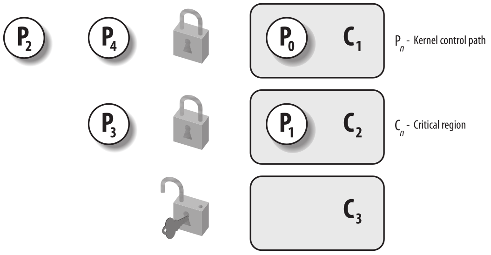
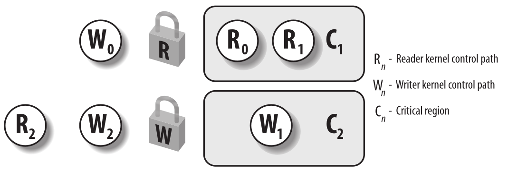

Sincronización de kernel
========================

Se podría pensar en el núcleo como un servidor que responde a las solicitudes; estas solicitudes pueden provenir de un proceso que se ejecuta en una CPU o de un dispositivo externo que emite una solicitud de interrupción. Hacemos esta analogía para subrayar que partes del núcleo no se ejecutan en serie, sino de forma intercalada. Por lo tanto, pueden dar lugar a condiciones de carrera, que deben controlarse mediante técnicas de sincronización adecuadas.

Comenzamos revisando cuándo y en qué medida las solicitudes del núcleo se ejecutan de forma intercalada. Luego presentamos las primitivas de sincronización básicas implementadas por el núcleo y describimos cómo se aplican en los casos más comunes. Finalmente, ilustramos algunos ejemplos prácticos.

Cómo el núcleo atiende las solicitudes
--------------------------------------
Para comprender mejor cómo se ejecuta el código del núcleo, veremos al núcleo como un camarero que debe satisfacer dos tipos de solicitudes: las emitidas por los clientes y las emitidas por un número limitado de jefes diferentes. La política adoptada por el camarero es la siguiente:

1. Si un jefe llama mientras el camarero está inactivo, el camarero empieza a atender al jefe.
2. Si un jefe llama mientras el camarero está atendiendo a un cliente, el camarero deja de atender al cliente y empieza a atender al jefe.
3. Si un jefe llama mientras el camarero está atendiendo a otro jefe, el camarero deja de atender al primer jefe y empieza a atender al segundo. Cuando termina de atender al nuevo jefe, reanuda la atención del anterior.
4. Uno de los jefes puede inducir al camarero a que deje al cliente que está siendo atendido en ese momento. Después de atender la última petición de los jefes, el camarero puede decidir dejar temporalmente a su cliente y recoger a uno nuevo.

Los servicios realizados por el camarero corresponden al código ejecutado cuando la CPU está en Modo Kernel. Si la CPU está ejecutándose en Modo Usuario, el camarero se considera inactivo.

Las peticiones del jefe corresponden a interrupciones, mientras que las peticiones del cliente corresponden a llamadas del sistema o excepciones lanzadas por procesos del modo usuario. Como veremos en detalle en Llamadas al Sistema, los procesos del modo usuario que quieren solicitar un servicio del núcleo deben emitir una instrucción apropiada (en el 80×86, un int $0x80 o una instrucción sysenter). Tales instrucciones lanzan una excepción que fuerza a la CPU a cambiar del modo usuario al modo núcleo. En adelante, generalmente llamaremos “excepciones” tanto a las llamadas del sistema como a las excepciones habituales.

El lector cuidadoso ya ha asociado las tres primeras reglas con la anidación de rutas de control del núcleo descritas en “Ejecución anidada de manejadores de excepciones e interrupciones” en Interrupciones y Excepciones. La cuarta regla corresponde a una de las nuevas características más interesantes incluidas en el núcleo Linux 2.6, a saber, la apropiatividad del núcleo.

Apropiatividad del kernel
*************************
Es sorprendentemente difícil dar una buena definición de apropiatividad (preempción) del núcleo. Como primer intento, podríamos decir que un núcleo es *preemptivo* si un cambio de proceso puede ocurrir mientras el proceso reemplazado está ejecutando una función del núcleo, es decir, mientras se ejecuta en modo núcleo. Desafortunadamente, en Linux (así como en cualquier otro sistema operativo real) las cosas son mucho más complicadas:

- Tanto en núcleos preemptivos como no preemptivos, un proceso que se ejecuta en modo núcleo puede renunciar voluntariamente a la CPU, por ejemplo porque tiene que dormir esperando algún recurso. Llamaremos a este tipo de cambio de proceso un *cambio de proceso planificado*. Sin embargo, un núcleo preemptivo difiere de un núcleo no preemptivo en la forma en que un proceso que se ejecuta en modo núcleo reacciona a eventos asincrónicos que podrían inducir un cambio de proceso, por ejemplo, un manejador de interrupciones que despierta un proceso de mayor prioridad. Llamaremos a este tipo de cambio de proceso un *cambio de proceso forzado*.
- Todos los cambios de proceso son realizados por la macro *switch_to*. En los núcleos tanto preemptivos como no preemptivos, un cambio de proceso ocurre cuando un proceso ha terminado algún hilo de actividad del núcleo y se invoca el planificador. Sin embargo, en los núcleos no preemptivos, el proceso actual no puede ser reemplazado a menos que esté a punto de cambiar al modo de usuario.

Por lo tanto, la característica principal de un núcleo preemptivo es que un proceso que se ejecuta en modo de núcleo puede ser reemplazado por otro proceso mientras está en medio de una función del núcleo.

Demos un par de ejemplos para ilustrar la diferencia entre núcleos preemptivos y no preemptivos.

Mientras el proceso A ejecuta un manejador de excepciones (necesariamente en modo de núcleo), un proceso B de mayor prioridad se vuelve ejecutable. Esto podría suceder, por ejemplo, si se produce una IRQ y el manejador correspondiente despierta al proceso B. Si el núcleo es preemptivo, un cambio de proceso forzado reemplaza el proceso A por B. El manejador de excepciones queda sin terminar y se reanudará solo cuando el planificador seleccione nuevamente el proceso A para su ejecución. Por el contrario, si el núcleo no es preemptivo, no se produce ningún cambio de proceso hasta que el proceso A termine de ejecutar el manejador de excepciones o ceda voluntariamente la CPU.

Para otro ejemplo, considere un proceso que ejecuta un manejador de excepciones y cuyo quantum de tiempo expira. Si el núcleo es preemptivo, el proceso puede ser reemplazado inmediatamente; sin embargo, si el núcleo no es preemptivo, el proceso continúa ejecutándose hasta que termine de ejecutar el manejador de excepciones o ceda voluntariamente la CPU.

La principal motivación para hacer que un núcleo sea preemptivo es reducir la latencia de despacho de los procesos del Modo Usuario, es decir, el retraso entre el momento en que se vuelven ejecutables y el momento en que realmente comienzan a ejecutarse. Los procesos que realizan tareas programadas a tiempo (como controladores de hardware externos, monitores ambientales, reproductores de películas, etc.) realmente se benefician de la preempción del núcleo, porque reduce el riesgo de ser retrasados ​​por otro proceso que se ejecuta en el Modo Núcleo.

Para que el kernel de Linux 2.6 sea preemptivo no fue necesario un cambio drástico en el diseño del kernel con respecto a las versiones anteriores del kernel que no lo eran. Como se describe en la sección “Retorno desde interrupciones y excepciones” en el Capítulo 4, la preempción del kernel se desactiva cuando el campo *preempt_count* en el descriptor *thread_info* al que hace referencia la macro *current_thread_info()* es mayor que cero. El campo codifica tres contadores diferentes, por lo que es mayor que cero cuando ocurre cualquiera de los siguientes casos:

1. El kernel está ejecutando una rutina de servicio de interrupción.
2. Las funciones diferibles están desactivadas (siempre es cierto cuando el kernel está ejecutando un softirq o tasklet).
3. La preempción del kernel se ha desactivado explícitamente estableciendo el contador de preempción en un valor positivo.

Las reglas anteriores nos indican que el núcleo puede ser interrumpido únicamente cuando está ejecutando un manejador de excepciones (en particular, una llamada al sistema) y la interrumpción del núcleo no ha sido deshabilitada explícitamente. Además, la CPU local debe tener habilitadas las interrupciones locales, de lo contrario no se realiza la interrumpción del núcleo.

Unas pocas macros simples enumeradas en la siguiente tabla se ocupan del contador de interrumpciones en el campo *prempt_count*. La macro *preempt_enable()* disminuye el contador de interrumpciones y luego verifica si el indicador TIF_NEED_RESCHED está establecido. En este caso, hay una solicitud de cambio de proceso pendiente, por lo que la macro invoca la función *preempt_schedule()*, que esencialmente ejecuta el siguiente código:

..  code-block:: c

    if (!current_thread_info->preempt_count && !irqs_disabled()) {
        current_thread_info->preempt_count = PREEMPT_ACTIVE;
        schedule();
        current_thread_info->preempt_count = 0;
    }

La función comprueba si las interrupciones locales están habilitadas y si el campo *preempt_count* de *current* es cero; si ambas condiciones son verdaderas, invoca *schedule()* para seleccionar otro proceso para ejecutar. Por lo tanto, la preempción del núcleo puede ocurrir cuando se termina una ruta de control del núcleo (normalmente, un manejador de interrupciones), o cuando un manejador de excepciones vuelve a habilitar la preempción del núcleo por medio de *preempt_enable()*. La preempción del núcleo también puede ocurrir cuando se habilitan las funciones diferibles. Concluiremos esta sección notando que la preempción del núcleo introduce una sobrecarga no despreciable. Por esa razón, Linux 2.6 presenta una opción de configuración del núcleo que permite a los usuarios habilitar o deshabilitar la preempción del núcleo al compilarlo.

Cuando la sincronización es necesaria
*************************************
Al inicio se introdujeron los conceptos de condición de carrera y región crítica para los procesos. Las mismas definiciones se aplican a las rutas de control del núcleo. Una condición de carrera puede ocurrir cuando el resultado de un cálculo depende de cómo se anidan dos o más rutas de control del núcleo intercaladas. Una *región crítica* es una sección de código que debe ser ejecutada completamente por la ruta de control del núcleo que ingresa a ella antes de que otra ruta de control del núcleo pueda ingresar a ella.

El intercalado de rutas de control del núcleo complica la vida de los programadores del núcleo: deben aplicar un cuidado especial para identificar las regiones críticas en los manejadores de excepciones, manejadores de interrupciones, funciones diferibles e hilos del núcleo. Una vez que se ha creado una región crítica, la ruta de control del núcleo está dentro de esa región.

Supongamos, por ejemplo, que dos manejadores de interrupciones diferentes necesitan acceder a la misma estructura de datos que contiene varias variables miembro relacionadas, por ejemplo, un búfer y un entero que indica su longitud. Todas las instrucciones que afectan la estructura de datos deben colocarse en una sola región crítica. Si el sistema incluye una sola CPU, la región crítica se puede implementar deshabilitando las interrupciones mientras se accede a la estructura de datos compartida, porque la anidación de rutas de control del núcleo solo puede ocurrir cuando las interrupciones están habilitadas.

Por otro lado, si solo las rutinas de servicio de las llamadas del sistema acceden a la misma estructura de datos, y si el sistema incluye una sola CPU, la región crítica se puede implementar de manera bastante simple deshabilitando la apropiatividad (preempción) del núcleo mientras se accede a la estructura de datos compartida.

Como es de esperar, las cosas son más complicadas en los sistemas multiprocesador. Muchas CPUs pueden ejecutar código del núcleo al mismo tiempo, por lo que los programadores del núcleo no pueden asumir que se puede acceder de manera segura a una estructura de datos solo porque la preempción del núcleo está deshabilitada y la estructura de datos nunca es abordada por una interrupción, excepción o manejador de softirq. Veremos en las siguientes secciones que el núcleo ofrece una amplia gama de diferentes técnicas de sincronización. Depende de los diseñadores del núcleo resolver cada problema de sincronización seleccionando la técnica más eficiente.

Cuando la sincronización no es necesaria
****************************************
Algunas opciones de diseño ya discutidas simplifican un poco la sincronización de las rutas de control del núcleo. Recordémoslas brevemente:

- Todos los manejadores de interrupciones reconocen la interrupción en el PIC y también deshabilitan la línea IRQ. No pueden ocurrir más ocurrencias de la misma interrupción hasta que el manejador termine.
- Los manejadores de interrupciones, softirqs y tasklets son no preemptables y no bloqueantes, por lo que no pueden suspenderse por un intervalo de tiempo largo. En el peor de los casos, su ejecución se retrasará ligeramente, porque otras interrupciones ocurren durante su ejecución (ejecución anidada de rutas de control del núcleo). • Una ruta de control del núcleo que realiza el manejo de interrupciones no puede ser interrumpida por una ruta de control del núcleo que ejecuta una función diferible o una rutina de servicio de llamada del sistema.
- Los softirqs y tasklets no pueden intercalarse en una CPU dada.
- El mismo tasklet no puede ejecutarse simultáneamente en varias CPU.

Cada una de las opciones de diseño anteriores puede verse como una restricción que puede explotarse para codificar algunas funciones del núcleo más fácilmente. A continuación se presentan algunos ejemplos de posibles simplificaciones:
- Los manejadores de interrupciones y los tasklets no necesitan codificarse como funciones reentrantes. 
- Las variables por CPU a las que acceden únicamente softirqs y tasklets no requieren sincronización.
- Una estructura de datos a la que accede únicamente un tipo de tasklet no requiere sincronización.

En adelante describimos qué hacer cuando es necesaria la sincronización, es decir, cómo prevenir la corrupción de datos debido a accesos inseguros a estructuras de datos compartidas.

Primitivas de sincronización
----------------------------
Ahora examinamos cómo se pueden intercalar las rutas de control del núcleo evitando al mismo tiempo las condiciones de carrera entre los datos compartidos. La siguiente tabla enumera las técnicas de sincronización utilizadas por el núcleo de Linux. La columna “Ámbito” indica si la técnica de sincronización se aplica a todas las CPU del sistema o a una sola CPU. Por ejemplo, la desactivación de interrupciones locales se aplica a una sola CPU (las demás CPUs del sistema no se ven afectadas); por el contrario, una operación atómica afecta a todas las CPUs del sistema (las operaciones atómicas en varias CPU no se pueden intercalar mientras se accede a la misma estructura de datos).

+---------------------------+-----------------------------------------------+-------------------+
|Técnica                    |Descripción                                    |Alcance            |
+===========================+===============================================+===================+
|Variables por CPU          |Duplica estructuras de datos entre las CPUs    |Todas las CPUs     |
+---------------------------+-----------------------------------------------+-------------------+
|Operaciones atómicas       |Instrucción de escritura-modificación-escritura|Todas las CPUs     |
|                           |atómica                                        |                   |
+---------------------------+-----------------------------------------------+-------------------+
|Barrera de memoria         |Evita reordenamiento de instrucciones          |CPU Local o todas  |
|                           |                                               |las CPUs           |
+---------------------------+-----------------------------------------------+-------------------+
|Spin Lock                  |Bloqueo con espera ocupada                     |Todas las CPUs     |
+---------------------------+-----------------------------------------------+-------------------+
|Semáforo                   |Bloqueo con espera bloqueante (duerme)         |Todas las CPUs     |
+---------------------------+-----------------------------------------------+-------------------+
|Secklocks                  |Bloqueo basado en un contador de acceso        |Todas las CPUs     |
+---------------------------+-----------------------------------------------+-------------------+
|Deshabilitación de         |Prohibe el manejo de interrupciones en una     |CPU Local          |
|interrupciones locales     |sola CPU                                       |                   |
+---------------------------+-----------------------------------------------+-------------------+
|Desactivación de softirq   |Prohibe el manejo de funciones diferibles      |CPU Local          |
|local                      |en una sola CPU                                |                   |
+---------------------------+-----------------------------------------------+-------------------+
|Read-Copy-Update (RCU)     |Acceso sin bloqueos a estructuras de datos     |Todas las CPUs     |
|                           |compartidas a través de punteros               |                   |
+---------------------------+-----------------------------------------------+-------------------+

Analicemos ahora brevemente cada técnica de sincronización.

Variables por CPU
*****************
La mejor técnica de sincronización consiste en diseñar el núcleo de forma que se evite la necesidad de sincronización en primer lugar. Como veremos, de hecho, cada primitiva de sincronización explícita tiene un costo de rendimiento significativo.

La técnica de sincronización más simple y eficiente consiste en declarar las variables del núcleo como variables por CPU. Básicamente, *una variable por CPU* es un vector de estructuras de datos, un elemento por cada CPU en el sistema.

Una CPU no debe acceder a los elementos del vector correspondientes a las otras CPU; por otro lado, puede leer y modificar libremente su propio elemento sin temor a condiciones de carrera, porque es la única CPU autorizada a hacerlo. Esto también significa, sin embargo, que las variables por CPU se pueden usar solo en casos particulares, básicamente, cuando tiene sentido dividir lógicamente los datos entre las CPUs del sistema.

Los elementos del vector por CPU se alinean en la memoria principal de modo que cada estructura de datos caiga en una línea diferente de la caché de hardware. Por lo tanto, los accesos concurrentes al vector por CPU no resultan en el esnifeo (snooping) y la invalidación de la línea de caché, que son operaciones costosas en términos de rendimiento del sistema.

Si bien las variables por CPU brindan protección contra accesos concurrentes desde varias CPU, no brindan protección contra accesos desde funciones asincrónicas (controladores de interrupciones y funciones diferibles). En estos casos, se requieren primitivas de sincronización adicionales.

Además, las variables por CPU son propensas a condiciones de carrera causadas por la preempción (apropiatividad) del núcleo, tanto en sistemas monoprocesador como multiprocesador. Como regla general, una ruta de control del núcleo debe acceder a una variable por CPU con la preempción (apropiatividad) del núcleo deshabilitada. Solo considere, por ejemplo, lo que sucedería si una ruta de control del núcleo obtiene la dirección de su copia local de una variable por CPU, y luego se suspende y se mueve a otra CPU: la dirección aún se refiere al elemento de la CPU anterior.

Operaciones atómicas
********************
Varias instrucciones del lenguaje ensamblador son del tipo “lectura-modificación-escritura”, es decir, acceden a una ubicación de memoria dos veces, la primera vez para leer el valor antiguo y la segunda para escribir un valor nuevo.

Supongamos que dos rutas de control del núcleo que se ejecutan en dos CPUs intentan “leer-modificar-escribir” la misma ubicación de memoria al mismo tiempo ejecutando operaciones no atómicas. Al principio, ambas CPUs intentan leer la misma ubicación, pero el árbitro de memoria (un circuito de hardware que serializa los accesos a los chips de RAM) interviene para conceder acceso a una de ellas y retrasar la otra. Sin embargo, cuando se ha completado la primera operación de lectura, la CPU retrasada lee exactamente el mismo valor (antiguo) de la ubicación de memoria. Ambas CPUs intentan entonces escribir el mismo valor (nuevo) en la ubicación de memoria; nuevamente, el árbitro de memoria serializa el acceso al bus de memoria y, finalmente, ambas operaciones de escritura tienen éxito. Sin embargo, el resultado global es incorrecto porque ambas CPUs escriben el mismo valor (nuevo). Por lo tanto, las dos operaciones intercaladas de “lectura-modificación-escritura” actúan como una sola.

La forma más fácil de evitar condiciones de carrera debido a las instrucciones de “lectura-modificación-escritura” es asegurar que dichas operaciones sean atómicas a nivel de chip. Cada una de estas operaciones debe ejecutarse en una sola instrucción sin ser interrumpida en el medio y evitando accesos a la misma ubicación de memoria por otras CPUs. Estas *operaciones atómicas* muy pequeñas se pueden encontrar en la base de otros mecanismos más flexibles para crear regiones críticas.

Repasemos las instrucciones de 80 × 86 según esa clasificación:

- Las instrucciones de lenguaje ensamblador que realizan accesos de memoria alineados cero o uno son atómicas. [#]_
- Las instrucciones de lenguaje ensamblador de lectura-modificación-escritura (como *inc* o *dec*) que leen datos de la memoria, los actualizan y escriben el valor actualizado de nuevo en la memoria son atómicas si ningún otro procesador ha tomado el bus de memoria después de la lectura y antes de la escritura. El robo de bus de memoria nunca ocurre en un sistema monoprocesador.
- Las instrucciones de lectura-modificación-escritura en lenguaje ensamblador cuyo código de operación tiene como prefijo el byte de bloqueo (0xf0) son atómicas incluso en un sistema multiprocesador. Cuando la unidad de control detecta el prefijo, "bloquea" el bus de memoria hasta que finaliza la instrucción. Por lo tanto, otros procesadores no pueden acceder a la ubicación de memoria mientras se ejecuta la instrucción bloqueada.
- Las instrucciones en lenguaje ensamblador cuyo código de operación tiene como prefijo un byte *rep* (0xf2, 0xf3, que obliga a la unidad de control a repetir la misma instrucción varias veces) no son atómicas. La unidad de control verifica si hay interrupciones pendientes antes de ejecutar una nueva iteración.

Cuando escribe código C, no puede garantizar que el compilador use una instrucción atómica para una operación como a=a+1 o incluso para a++. De este modo, el núcleo Linux proporciona un tipo especial *atomic_t* (un contador de acceso atómico) y algunas funciones especiales que actúan sobre las variables *atomic_t* y se implementan como instrucciones únicas y atómicas en lenguaje ensamblador. En los sistemas multiprocesador, cada una de estas instrucciones tiene como prefijo un byte de bloqueo.

Optimización y barreras de memoria
**********************************
Cuando se utilizan compiladores optimizadores, nunca se debe dar por sentado que las instrucciones se ejecutarán en el orden exacto en el que aparecen en el código fuente. Por ejemplo, un compilador puede reordenar las instrucciones en lenguaje ensamblador de tal manera que optimice el uso de los registros. Además, las CPUs modernas suelen ejecutar varias instrucciones en paralelo y pueden reordenar los accesos a memoria. Este tipo de reordenamiento puede acelerar enormemente el programa.

Sin embargo, cuando se trabaja con sincronización, se debe evitar reordenar las instrucciones. Las cosas se complicarían rápidamente si una instrucción colocada después de una primitiva de sincronización se ejecuta antes que la propia primitiva de sincronización. Por lo tanto, todas las primitivas de sincronización actúan como barreras de optimización y de memoria.

Una primitiva de *barrera de optimización* garantiza que el compilador no mezcle las instrucciones en lenguaje ensamblador correspondientes a las instrucciones en C colocadas antes de la primitiva con las instrucciones en lenguaje ensamblador correspondientes a las instrucciones en C colocadas después de la primitiva. En Linux, la macro *barrier()*, que se expande en

.. code-block:: asm

    asm volatile(""::: "memory")

actúa como una barrera de optimización. La instrucción *asm* le indica al compilador que inserte un fragmento de lenguaje ensamblador (vacío, en este caso). La palabra clave *volatile* prohíbe al compilador reorganizar la instrucción asm con las otras instrucciones del programa. La palabra clave *memory* obliga al compilador a asumir que todas las ubicaciones de memoria en RAM han sido cambiadas por la instrucción de lenguaje ensamblador; por lo tanto, el compilador no puede optimizar el código utilizando los valores de las ubicaciones de memoria almacenadas en los registros de la CPU antes de la instrucción asm. Observe que la barrera de optimización no garantiza que la CPU no mezcle las ejecuciones de las instrucciones de lenguaje ensamblador; este es un trabajo para una barrera de memoria.

Una primitiva de *barrera de memoria* garantiza que las operaciones colocadas antes de la primitiva finalicen antes de comenzar las operaciones colocadas después de la primitiva. Por lo tanto, una barrera de memoria es como un cortafuegos que no puede ser atravesado por una instrucción de lenguaje ensamblador.

En los procesadores 80×86, se dice que los siguientes tipos de instrucciones en lenguaje ensamblador son “serializantes” porque actúan como barreras de memoria:

- Todas las instrucciones que operan en puertos de E/S
- Todas las instrucciones prefijadas por el byte de bloqueo (consulte la sección “Operaciones atómicas”)
- Todas las instrucciones que escriben en registros de control, registros del sistema o registros de depuración (por ejemplo, *cli* y *sti*, que cambian el estado del indicador IF en el registro eflags)
- Las instrucciones en lenguaje ensamblador *lfence*, *sfence* y *mfence*, que se han introducido en el microprocesador Pentium 4 para implementar de manera eficiente barreras de memoria de lectura, barreras de memoria de escritura y barreras de memoria de lectura-escritura, respectivamente.
- Unas cuantas instrucciones especiales en lenguaje ensamblador; entre ellas, la instrucción *iret* que termina un manejador de interrupciones o excepciones.

Linux utiliza algunas primitivas de barrera de memoria, que se muestran en la Tabla 5-6. Estas primitivas actúan también como barreras de optimización, porque debemos asegurarnos de que el compilador no mueva las instrucciones del lenguaje ensamblador alrededor de la barrera. Las “barreras de memoria de lectura” actúan sólo en instrucciones que leen desde la memoria, mientras que las “barreras de memoria de escritura” actúan sólo en instrucciones que escriben en la memoria. Las barreras de memoria pueden ser útiles tanto en sistemas multiprocesador como monoprocesador. Las primitivas smp_xxx() se utilizan siempre que la barrera de memoria deba evitar condiciones de carrera que podrían ocurrir sólo en sistemas multiprocesador; en sistemas monoprocesador, no hacen nada. Las otras barreras de memoria se utilizan para evitar que ocurran condiciones de carrera tanto en sistemas monoprocesador como multiprocesador.

Las implementaciones de las primitivas de barrera de memoria dependen de la arquitectura del sistema. En un microprocesador de 80×86, la macro rmb() normalmente se expande a asm volátil("lfence") si la CPU admite la instrucción de lenguaje ensamblador lfence, o a asm volátil("lock;addl $0,0(%%esp)":::"memory") en caso contrario. La instrucción asm inserta un fragmento de lenguaje ensamblador en el código generado por el compilador y actúa como una barrera de optimización. La instrucción de lenguaje ensamblador lock; addl $0,0(%%esp) agrega cero a la ubicación de memoria en la parte superior de la pila; la instrucción es inútil por sí misma, pero el prefijo lock hace que la instrucción sea una barrera de memoria para la CPU.

La macro wmb() es en realidad más simple porque se expande en barrier(). Esto se debe a que los microprocesadores Intel existentes nunca reordenan los accesos a la memoria de escritura, por lo que no hay necesidad de insertar una instrucción de lenguaje ensamblador serializadora en el código. La macro, sin embargo, prohíbe al compilador mezclar las instrucciones.

Observe que en los sistemas multiprocesador, todas las operaciones atómicas descritas en la sección anterior “Operaciones atómicas” actúan como barreras de memoria porque utilizan el byte de bloqueo.

..  [#] Un elemento de datos está alineado en la memoria cuando su dirección es un múltiplo de su tamaño en bytes. Por ejemplo, la dirección de un entero corto alineado debe ser un múltiplo de dos, mientras que la dirección de un entero alineado debe ser un múltiplo de cuatro. En términos generales, un acceso a la memoria no alineado no es atómico.

Spin Lock
*********
Una técnica de sincronización ampliamente utilizada es el *candado*. Cuando una ruta de control del núcleo debe acceder a una estructura de datos compartida o entrar en una región crítica, necesita adquirir un “candado” para ello. Un recurso protegido por un mecanismo de bloqueo es bastante similar a un recurso confinado en una habitación cuya puerta está cerrada con llave cuando alguien está dentro. Si una ruta de control del núcleo desea acceder al recurso, intenta “abrir la puerta” adquiriendo el candado. Solo lo logra si el recurso está libre. Entonces, mientras quiera usar el recurso, la puerta permanece bloqueada. Cuando la ruta de control del núcleo libera el bloqueo, la puerta se desbloquea y otra ruta de control del núcleo puede entrar en la habitación.

La figura 1 ilustra el uso de candados. Cinco rutas de control del núcleo (P0, P1, P2, P3 y P4) intentan acceder a dos regiones críticas (C1 y C2). La ruta de control del núcleo P0 está dentro de C1, mientras que P2 y P4 esperan para entrar en ella. Al mismo tiempo, P1 está dentro de C2, mientras que P3 espera para entrar en ella. Observe que P0 y P1 podrían ejecutarse simultáneamente. El candado para la región crítica C3 está abierto porque ninguna ruta de control del núcleo necesita entrar en él.

    Figura 1 - Protegiendo regiones críticas con varios candados

Los *candados de giro* o *spin locks* son un tipo especial de candado diseñado para funcionar en un entorno multiprocesador. Si la ruta de control del núcleo encuentra el spin lock *“abierto”*, adquiere el candado y continúa su ejecución. Por el contrario, si la ruta de control del núcleo encuentra el candado *“cerrado”* por una ruta de control del núcleo que se ejecuta en otra CPU, simplemente *“gira”*, ejecutando repetidamente un bucle de instrucciones ajustado, hasta que se libera el bloqueo.

El bucle de instrucciones de los spin locks representa una *“espera ocupada”*. La ruta de control del núcleo en espera sigue ejecutándose en la CPU, incluso si no tiene nada que hacer además de perder tiempo. Sin embargo, los spin locks suelen ser convenientes, porque muchos recursos del núcleo están bloqueados durante una fracción de milisegundos solamente; por lo tanto, sería mucho más lento liberar la CPU y volver a adquirirla más tarde.

Como regla general, la preempción (apropiatividad) del núcleo está deshabilitada en todas las regiones críticas protegidas por spin locks. En el caso de un sistema monoprocesador, los candados en sí mismos son inútiles, y las primitivas de spin locks solo deshabilitan o habilitan la preempción del núcleo. Tenga en cuenta que la preempción del núcleo aún está habilitada durante la fase de espera ocupada (*busy wait*), por lo que un proceso que espera que se libere un spin lock podría ser reemplazado por un proceso de mayor prioridad.

En Linux, cada spin lock está representado por una estructura *spinlock_t* que consta de dos campos:

*slock*
    Codifica el estado del spin lock: el valor 1 corresponde al estado desbloqueado, mientras que cada valor negativo y 0 denotan el estado bloqueado
*break_lock*
    Indicador que señala que un proceso está ocupado esperando el bloqueo (presente solo si el núcleo admite tanto SMP como preempción del núcleo)

La macro spin_lock con preempción del núcleo
>>>>>>>>>>>>>>>>>>>>>>>>>>>>>>>>>>>>>>>>>>>>
Analicemos en detalle la macro *spin_lock*, que se utiliza para adquirir un spin lock. La siguiente descripción se refiere a un núcleo preemptivo para un sistema SMP. La macro toma la dirección *slp* del spin lock como su parámetro y ejecuta las siguientes acciones:

1. Invoca *preempt_disable()* para deshabilitar la preempción del núcleo.
2. Invoca la función *_raw_spin_trylock()*, que realiza una operación atómica de prueba y configuración en el campo *slock* del spin lock; esta función ejecuta primero algunas instrucciones equivalentes al siguiente fragmento de lenguaje ensamblador:

    ..  code-block:: asm

        movb $0, %al
        xchgb %al, slp->slock

 La instrucción de lenguaje ensamblador *xchg* intercambia atómicamente el contenido del registro *%al* de 8 bits (que almacena cero) con el contenido de la ubicación de memoria a la que apunta *slp->slock*. La función luego devuelve el valor 1 si el valor anterior almacenado en el spin lock (en %al después de la instrucción xchg) era positivo, el valor 0 en caso contrario.

3. Si el valor anterior del spin lock era positivo, la macro termina: la ruta de control del núcleo ha adquirido el spin lock.
4. De lo contrario, la ruta de control del núcleo falló en adquirir el spin lock, por lo que la macro debe realizar un ciclo hasta que el spin lock sea liberado por una ruta de control del núcleo que se ejecuta en alguna otra CPU. Invoca *preempt_enable()* para deshacer el aumento del contador de preempción realizado en el paso 1. Si la preempción del núcleo se habilitó antes de ejecutar la macro *spin_lock*, otro proceso ahora puede reemplazar este proceso mientras espera el spin lock.
5. Si el campo *break_lock* es igual a cero, lo establece en uno. Al marcar este campo, el proceso que posee el candado y se ejecuta en otra CPU puede saber si hay otros procesos esperando el candado. Si un proceso mantiene un spin lock durante mucho tiempo, puede decidir liberarlo prematuramente para permitir que otro proceso que espera el mismo spin lock progrese.
6. Ejecuta el ciclo de espera:

    ..  code-block:: c

        while (spin_is_locked(slp) && slp->break_lock)
            cpu_relax();

 La macro *cpu_relax()* se reduce a una instrucción de lenguaje ensamblador *pausa*. Esta instrucción se ha introducido en el modelo Pentium 4 para optimizar la ejecución de bucles de spin locks. Al introducir un pequeño retraso, se acelera la ejecución del código que sigue al candado y se reduce el consumo de energía. La instrucción *pausa* es compatible con versiones anteriores de microprocesadores 80×86 porque corresponde a la instrucción *rep;nop*, es decir, a una no operación.

7. Salta de nuevo al paso 1 para intentar una vez más obtener el spin lock.

La macro spin_lock sin preempción del núcleo
>>>>>>>>>>>>>>>>>>>>>>>>>>>>>>>>>>>>>>>>>>>>
Si no se ha seleccionado la opción de preempción (apropiatividad) del núcleo cuando se compiló el núcleo, la macro *spin_lock* es bastante diferente de la descrita anteriormente. En este caso, la macro produce un fragmento de lenguaje ensamblador que es esencialmente equivalente a la siguiente espera ocupada ajustada:

.. code-block:: asm

    1: lock; decb slp->slock
       jns 3f
    2: pause
       cmpb $0,slp->slock
       jle 2b
       jmp 1b
    3:

La instrucción de lenguaje ensamblador *decb* disminuye el valor del spin lock; la instrucción es atómica porque tiene como prefijo el byte *lock*. A continuación, se realiza una prueba en el indicador de signo. Si está limpio, significa que el spin lock se estableció en 1 (desbloqueado), por lo que la ejecución normal continúa en la etiqueta 3 (el sufijo *f* denota el hecho de que la etiqueta es hacia *"adelante"* (*forward*); aparece en una línea posterior del programa). De lo contrario, se ejecuta el bucle cerrado en la etiqueta 2 (el sufijo *b* denota una etiqueta hacia *"atrás"*) hasta que el spin lock asuma un valor positivo. Luego, la ejecución se reinicia desde la etiqueta 1, ya que no es seguro continuar sin verificar si otro procesador ha tomado el bloqueo.

La macro spin_unlock
>>>>>>>>>>>>>>>>>>>>
La macro *spin_unlock* libera un spin lock adquirido previamente; esencialmente ejecuta la instrucción en lenguaje ensamblador:

..  code-block:: asm

    movb $1, slp->slock

y luego invoca *preempt_enable()* (si no se admite la preempción del núcleo, *preempt_enable()* no hace nada). Observe que el byte de bloqueo (lock) no se usa porque los accesos de escritura en la memoria siempre se ejecutan atómicamente por los microprocesadores 80×86 actuales.

Spin Locks de Lectura/Escritura
*******************************
Los *candados de lectura/escritura* se han introducido para aumentar la cantidad de concurrencia dentro del núcleo. Permiten que varias rutas de control del núcleo lean simultáneamente la misma estructura de datos, siempre que ninguna ruta de control del núcleo la modifique. Si una ruta de control del núcleo desea escribir en la estructura, debe adquirir la versión de escritura del candado de lectura/escritura, que otorga acceso exclusivo al recurso. Por supuesto, permitir lecturas concurrentes en estructuras de datos mejora el rendimiento del sistema.

La figura 2 ilustra dos regiones críticas (C1 y C2) protegidas por bloqueos de lectura/escritura. Las rutas de control del núcleo R0 y R1 están leyendo las estructuras de datos en C1 al mismo tiempo, mientras que W0 está esperando para adquirir el bloqueo para escribir. La ruta de control del núcleo W1 está escribiendo las estructuras de datos en C2, mientras que tanto R2 como W2 están esperando para adquirir el bloqueo para leer y escribir, respectivamente.

    Figura 2 - Spin Locks de Lectura/Escritura

Cada candado de lectura/escritura es una estructura *rwlock_t*; su campo *lock* es un campo de 32 bits que codifica dos piezas distintas de información:

- Un contador de 24 bits que denota el número de rutas de control del núcleo que actualmente *leen* la estructura de datos protegida. El valor de este contador se almacena en los bits 0 a 23 del campo.
- Un indicador de desbloqueo (*unlock*) que se establece cuando no hay ninguna ruta de control del núcleo leyendo o escribiendo, y se borra en caso contrario. Este indicador de desbloqueo se almacena en el bit 24 del campo.

Observe que el campo *lock* almacena el número 0x01000000 si el spin lock está inactivo (indicador de desbloqueo establecido y sin lectores), el número 0x00000000 si se ha adquirido para escritura (indicador de desbloqueo borrado y sin lectores) y cualquier número en la secuencia 0x00ffffff, 0x00ffffffe, y así sucesivamente, si se ha adquirido para lectura por uno, dos o más procesos (indicador de desbloqueo borrado y el número de lectores accediendo). Al igual que la estructura *spinlock_t*, la estructura *rwlock_t* también incluye un campo *break_lock*.

La macro *rwlock_init* inicializa el campo *lock* de un spinlock de lectura/escritura a 0x01000000 (desbloqueado) y el campo *break_lock* a cero.

Obtención y liberación de un bloqueo para lectura
>>>>>>>>>>>>>>>>>>>>>>>>>>>>>>>>>>>>>>>>>>>>>>>>>
La macro *read_lock*, aplicada a la dirección *rwlp* (Read Write Lock Pointer) de un spinlock de lectura/escritura, es similar a la macro *spin_lock* descrita en la sección anterior. Si se seleccionó la opción de preempción del núcleo cuando se compiló el núcleo, la macro realiza las mismas acciones que las de *spin_lock()*, con solo una excepción: para adquirir efectivamente el spinlock de lectura/escritura en el paso 2, la macro ejecuta la función *_raw_read_trylock()*:

..  code-block:: c

    int _raw_read_trylock(rwlock_t *lock)
    {
        atomic_t *count = (atomic_t *)lock->lock;
        atomic_dec(count);
        if (atomic_read(count) >= 0)
            return 1;
        atomic_inc(count);
        return 0;
    }

Se accede al campo *lock* (el contador *lock* de lectura/escritura) mediante operaciones atómicas. Sin embargo, tenga en cuenta que la función completa no actúa atómicamente sobre el contador: por ejemplo, el contador podría cambiar después de haber probado su valor con la declaración *if* y antes de devolver 1. No obstante, la función funciona correctamente: de hecho, la función devuelve 1 solo si el contador no era cero o negativo antes del decremento, porque el contador es igual a 0x01000000 para ningún propietario, 0x00ffffff para un lector y 0x00000000 para un escritor.

Si la opción de preempción del núcleo no se ha seleccionado cuando se compiló el núcleo, la macro *read_lock* produce el siguiente código en lenguaje ensamblador:

..  code-block:: asm

        movl $rwlp->lock,%eax
        lock; subl $1,(%eax)
        jns 1f
        call __read_lock_failed
    1:

donde *__read_lock_failed()* es la siguiente función en lenguaje ensamblador:

..  code-block:: asm

    __read_lock_failed:
        lock; incl (%eax)
    1: pause
        cmpl $1,(%eax)
        js 1b
        lock; decl (%eax)
        js __read_lock_failed
        ret

La macro *read_lock* disminuye atómicamente el valor del spin lock en 1, aumentando así el número de lectores. El spin lock se adquiere si la operación de decremento produce un valor no negativo; de lo contrario, se invoca la función *__read_lock_failed()*. La función aumenta atómicamente el campo *lock* para deshacer la operación de decremento realizada por la macro *read_lock*, y luego se repite hasta que el campo se vuelve positivo (mayor o igual a 1). A continuación, *__read_lock_failed()* intenta obtener el spin lock nuevamente (otra ruta de control del núcleo podría adquirir el spin lock para escribir justo después de la instrucción *cmpl*).

Liberar el candado de lectura es bastante simple, porque la macro *read_unlock* simplemente debe aumentar el contador en el campo *lock* con la instrucción en lenguaje ensamblador:

..  code-block:: asm

    lock; incl rwlp->lock

para disminuir el número de lectores, y luego invoca *preempt_enable()* para volver a habilitar la preempción del núcleo.

Obtener y liberar un bloqueo para escritura
>>>>>>>>>>>>>>>>>>>>>>>>>>>>>>>>>>>>>>>>>>>
La macro *write_lock* se implementa de la misma forma que *spin_lock()* y *read_lock()*. Por ejemplo, si se admite la preempción del núcleo, la función deshabilita la preempción del núcleo e intenta tomar el candado de inmediato invocando *_raw_write_trylock()*. Si esta función devuelve 0, el candado ya estaba tomado, por lo que la macro vuelve a habilitar la preempción del núcleo e inicia un bucle de espera ocupado (*busy wait*), como se explicó en la descripción de *spin_lock()* anteriormente.

La función *_raw_write_trylock()* se muestra a continuación:

..  code-block:: c

    int _raw_write_trylock(rwlock_t *lock)
    {
        atomic_t *count = (atomic_t *)lock->lock;
        if (atomic_sub_and_test(0x01000000, count))
            return 1;
        atomic_add(0x01000000, count);
        return 0;
    }

La función *_raw_write_trylock()* resta 0x01000000 del valor del spin lock de lectura/escritura, borrando así el indicador de desbloqueo (bit 24). Si la operación de resta produce cero (sin lectores), se adquiere el candado y la función devuelve 1; de lo contrario, la función agrega *atómicamente* 0x01000000 al valor del spin lock para deshacer la operación de resta.

Una vez más, liberar el candado de escritura es mucho más simple porque la macro *write_unlock* debe simplemente establecer el indicador de desbloqueo en el campo *lock* con la instrucción en lenguaje ensamblador:

..  code-block:: asm

    lock; addl $0x01000000,rwlp

y luego invocar *preempt_enable()*.

